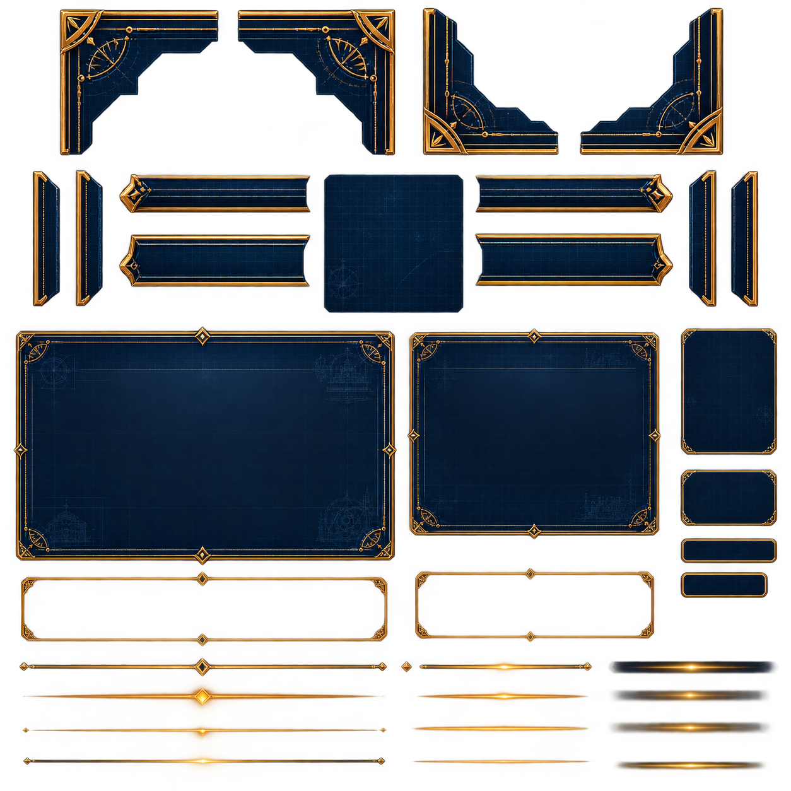
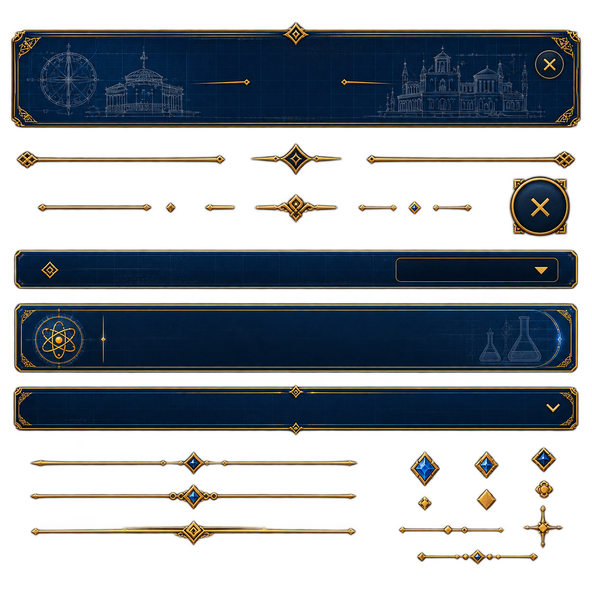
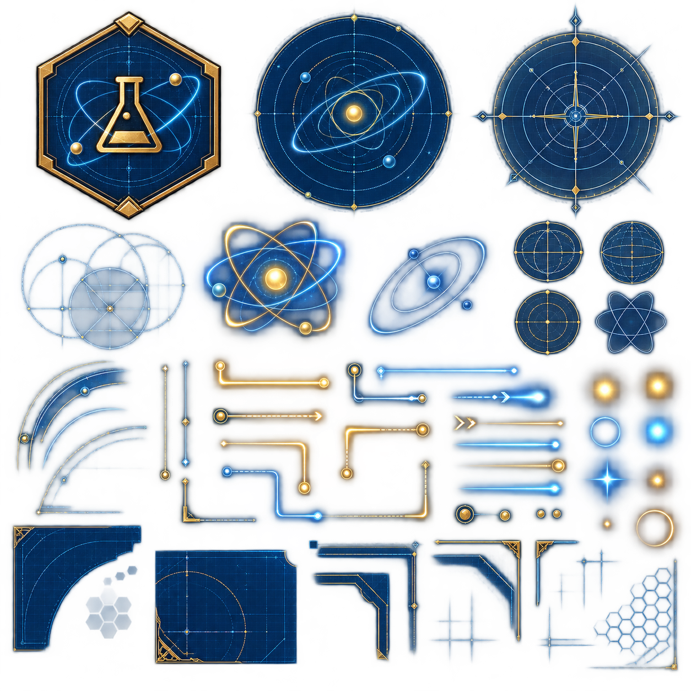
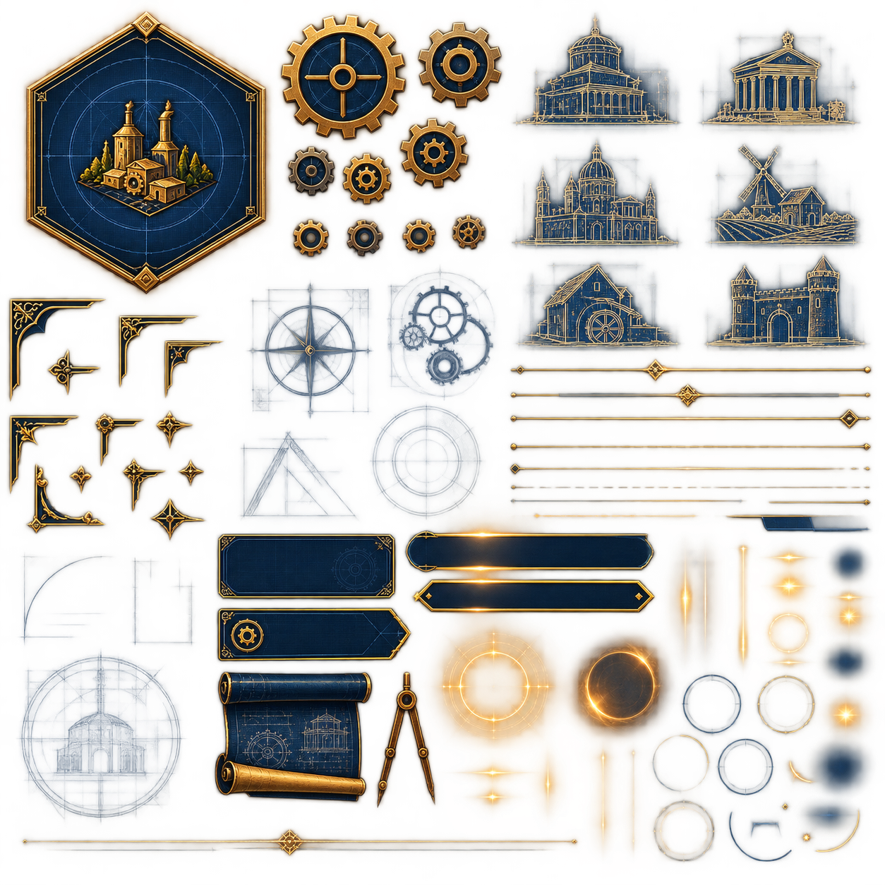
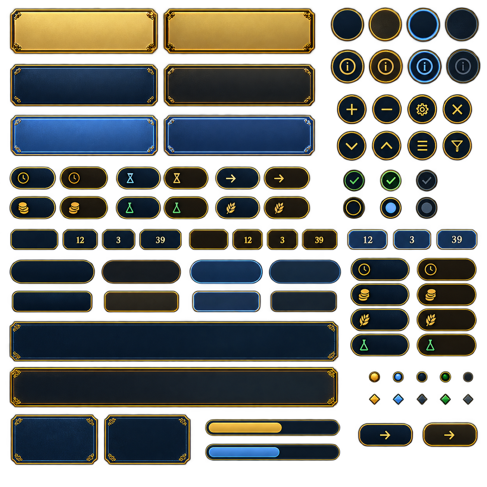

# UI WebP coordinate atlases

Five lossless WebP sheets preserve the source artwork at its original `1254 × 1254` resolution. They are intentionally **not imported by the game or homepage yet**: there is no `pubspec.yaml`, runtime-manifest, loader, or homepage-build entry for this directory.

The FreeTexturePacker JSON Hash files (`1.json`, `3.json`, `4.json`, `5.json`,
and `6.json`) are the source of truth for coordinates. Coordinates use a
top-left origin and integer pixels. A rectangle is `[x, y, width, height]`; its
right and bottom edges are exclusive. Every crop is taken directly from the
full-resolution sheet without scaling or rotation. Bounds are the minimal
pixel-aligned rectangle around source pixels whose alpha is above 1%
(`alpha >= 3/255`), with no padding.
The atlas maps **263 UI regions** across all sheets.

Coordinate trimming command:

```sh
dart run assets/ui/auto_trim_coordinates.dart
```

The command uses ImageMagick to recalculate every JSON frame from the WebP
alpha channel. Run it with `--check` to verify the JSON maps without writing
changes.

Each frame name matches its local preview filename, no frame is rotated, and
the extracted pixel-tight crop is treated as the complete source sprite. Each
frame includes the default centered pivot used by FreeTexturePacker.
The coordinate tables below are generated documentation mirrors, never inputs
to atlas tooling. Synchronize them after changing JSON coordinates:

```sh
dart run assets/ui/sync_readme_from_atlas_json.dart
```

Run the command with `--check` to verify that every README row still mirrors
the JSON source of truth.

Conversion command:

```sh
cwebp -lossless -exact -z 6 source.png -o sheet.webp
```

## Local preview crops

Run `./build_preview.sh` from this directory to crop every frame read directly
from the FreeTexturePacker JSON files into
`preview/<sheet>/<region>.webp`. Crops are lossless, retain transparency, and
are generated only for local review. The `preview/` directory is ignored by Git
and excluded from repository asset verification.

## Sheet 1



- File: `1.webp`
- Resolution: `1254 × 1254`
- Regions: `33`
- SHA-256: `c0bd9a3193d358ca845e63031f2739544cea1599ab539d45bb3472487a018f91`

| Region | x | y | width | height |
| --- | ---: | ---: | ---: | ---: |
| `corner.top.left.outer` | 89 | 12 | 264 | 241 |
| `corner.top.left.inner` | 371 | 12 | 258 | 238 |
| `corner.top.right.inner` | 662 | 8 | 226 | 248 |
| `corner.top.right.outer` | 916 | 1 | 240 | 254 |
| `rail.vertical.left.outer` | 49 | 268 | 49 | 221 |
| `rail.vertical.left.inner` | 112 | 265 | 53 | 223 |
| `toolbar.left` | 187 | 272 | 308 | 68 |
| `button.left` | 185 | 369 | 311 | 95 |
| `panel.square` | 511 | 273 | 227 | 226 |
| `toolbar.right` | 751 | 272 | 320 | 68 |
| `button.right` | 750 | 367 | 318 | 91 |
| `rail.vertical.right.inner` | 1090 | 265 | 52 | 224 |
| `rail.vertical.right.outer` | 1156 | 268 | 49 | 223 |
| `panel.large` | 17 | 515 | 614 | 396 |
| `panel.medium` | 640 | 515 | 411 | 341 |
| `panel.right.tall` | 1075 | 514 | 161 | 210 |
| `panel.right.small` | 1076 | 739 | 160 | 97 |
| `button.right.small.a` | 1077 | 851 | 159 | 55 |
| `button.right.small.b` | 1076 | 899 | 144 | 51 |
| `button.wide.left` | 31 | 901 | 590 | 130 |
| `button.wide.right` | 655 | 898 | 390 | 123 |
| `divider.left.1` | 28 | 1040 | 588 | 38 |
| `divider.right.1` | 659 | 1043 | 287 | 34 |
| `shadow.right.1` | 963 | 1045 | 273 | 30 |
| `divider.left.2` | 35 | 1069 | 577 | 77 |
| `divider.right.2` | 660 | 1069 | 277 | 53 |
| `shadow.right.2` | 963 | 1090 | 261 | 27 |
| `divider.left.3` | 50 | 1138 | 550 | 46 |
| `divider.right.3` | 650 | 1142 | 287 | 28 |
| `shadow.right.3` | 961 | 1139 | 265 | 29 |
| `divider.left.4` | 34 | 1185 | 579 | 51 |
| `divider.right.4` | 651 | 1200 | 289 | 22 |
| `shadow.right.4` | 971 | 1204 | 247 | 20 |

## Sheet 3



- File: `3.webp`
- Resolution: `1254 × 1254`
- Regions: `26`
- SHA-256: `7087b6f72d0e201f7b731b4f961fc548ff0e31a67e160f946d019220eb1385bd`

| Region | x | y | width | height |
| --- | ---: | ---: | ---: | ---: |
| `banner.architecture` | 19 | 43 | 1218 | 230 |
| `divider.long.left` | 32 | 316 | 448 | 44 |
| `divider.center` | 528 | 301 | 200 | 73 |
| `divider.long.right` | 773 | 317 | 448 | 45 |
| `divider.small.left` | 77 | 428 | 247 | 22 |
| `diamond.gold.left` | 347 | 426 | 28 | 28 |
| `divider.short.left` | 431 | 429 | 70 | 21 |
| `divider.ornate.center` | 537 | 408 | 183 | 67 |
| `divider.short.right.blue` | 756 | 431 | 89 | 20 |
| `diamond.blue` | 862 | 424 | 33 | 34 |
| `divider.short.right` | 914 | 430 | 89 | 21 |
| `button.close` | 1076 | 370 | 136 | 135 |
| `selector` | 26 | 525 | 1201 | 90 |
| `banner.science` | 26 | 637 | 1202 | 156 |
| `accordion` | 24 | 812 | 1206 | 113 |
| `divider.blue.1` | 61 | 953 | 700 | 55 |
| `gem.blue.large` | 866 | 953 | 68 | 80 |
| `gem.blue.medium` | 1002 | 953 | 57 | 64 |
| `gem.dark` | 1123 | 945 | 59 | 59 |
| `divider.blue.2` | 60 | 1023 | 698 | 83 |
| `gem.small` | 883 | 1047 | 34 | 37 |
| `diamond.gold` | 1007 | 1033 | 47 | 51 |
| `ornament.vertical` | 1105 | 1066 | 92 | 99 |
| `divider.gold` | 62 | 1099 | 694 | 59 |
| `divider.gold.short` | 842 | 1110 | 229 | 27 |
| `divider.blue.short` | 880 | 1134 | 262 | 64 |

## Sheet 4



- File: `4.webp`
- Resolution: `1254 × 1254`
- Regions: `46`
- SHA-256: `d1bd7d86d44064d3a484dbf0076f73d6d4abf534e5d2f949ea3a5555c98ad6b7`

| Region | x | y | width | height |
| --- | ---: | ---: | ---: | ---: |
| `badge.science` | 58 | 14 | 378 | 389 |
| `dial.atom` | 424 | 9 | 442 | 382 |
| `dial.compass` | 850 | 1 | 390 | 396 |
| `sphere.grid.large` | 32 | 403 | 316 | 241 |
| `atom.glow` | 344 | 391 | 312 | 240 |
| `orbit.blue` | 654 | 417 | 245 | 210 |
| `sphere.grid.small.top` | 926 | 397 | 139 | 123 |
| `globe.small` | 1082 | 395 | 130 | 128 |
| `sphere.grid.small.bottom` | 921 | 519 | 141 | 134 |
| `atom.outline.small` | 1072 | 522 | 146 | 129 |
| `arc.radar` | 21 | 645 | 242 | 260 |
| `rail.vertical.gold` | 279 | 649 | 41 | 234 |
| `rail.vertical.blue` | 319 | 644 | 38 | 214 |
| `connector.gold.top` | 369 | 636 | 248 | 89 |
| `connector.gold.middle` | 375 | 727 | 228 | 57 |
| `connector.gold.lower` | 354 | 779 | 239 | 133 |
| `connector.blue.top` | 609 | 619 | 202 | 131 |
| `connector.gold.middle.right` | 579 | 714 | 232 | 117 |
| `connector.gold.lower.right` | 569 | 794 | 225 | 157 |
| `connector.blue.lower.left` | 374 | 819 | 262 | 146 |
| `connector.gold.u` | 318 | 894 | 498 | 87 |
| `line.blue.arrow` | 784 | 688 | 243 | 64 |
| `line.gold.arrow` | 784 | 714 | 284 | 102 |
| `line.blue.solid` | 784 | 788 | 287 | 39 |
| `line.gold.solid` | 784 | 826 | 262 | 80 |
| `line.blue.lower` | 784 | 859 | 292 | 87 |
| `orb.gold.large` | 794 | 894 | 102 | 86 |
| `orb.gold.medium` | 869 | 906 | 92 | 75 |
| `orb.gold.small.left` | 944 | 906 | 77 | 75 |
| `orb.gold.small.right` | 999 | 894 | 77 | 87 |
| `glow.gold.top.left` | 1054 | 639 | 107 | 122 |
| `glow.gold.top.right` | 1144 | 639 | 100 | 127 |
| `glow.blue.ring` | 1054 | 736 | 107 | 109 |
| `glow.blue.dot` | 1144 | 734 | 99 | 112 |
| `glow.star` | 1054 | 819 | 107 | 112 |
| `glow.gold.dot` | 1144 | 819 | 95 | 90 |
| `glow.gold.small` | 1076 | 926 | 57 | 55 |
| `glow.gold.ring` | 1144 | 904 | 106 | 102 |
| `corner.panel.large` | 15 | 945 | 246 | 244 |
| `panel.square` | 272 | 979 | 299 | 231 |
| `rail.horizontal` | 534 | 949 | 252 | 92 |
| `corner.panel.center` | 539 | 984 | 252 | 223 |
| `corner.panel.right` | 774 | 972 | 181 | 224 |
| `rail.vertical.right` | 959 | 972 | 102 | 131 |
| `star.blue` | 774 | 1074 | 178 | 132 |
| `honeycomb` | 1075 | 1009 | 164 | 213 |

## Sheet 5



- File: `5.webp`
- Resolution: `1254 × 1254`
- Regions: `73`
- SHA-256: `e85e7bf6efa2efacf59e87461e2f2672eaac14596fff2cf673138e221478687d`

| Region | x | y | width | height |
| --- | ---: | ---: | ---: | ---: |
| `badge.settlement` | 10 | 0 | 379 | 420 |
| `gear.large` | 390 | 14 | 194 | 190 |
| `gear.medium` | 584 | 25 | 162 | 136 |
| `gear.small.a` | 401 | 204 | 79 | 83 |
| `gear.small.b` | 480 | 208 | 81 | 91 |
| `gear.small.c` | 561 | 161 | 111 | 114 |
| `gear.lower.a` | 409 | 304 | 64 | 67 |
| `gear.lower.b` | 483 | 302 | 65 | 68 |
| `gear.lower.c` | 558 | 274 | 72 | 96 |
| `gear.lower.d` | 629 | 298 | 65 | 62 |
| `building.dome` | 720 | 12 | 251 | 178 |
| `building.temple` | 989 | 33 | 235 | 178 |
| `building.cathedral` | 719 | 191 | 259 | 180 |
| `building.mill` | 994 | 195 | 235 | 161 |
| `building.workshop` | 699 | 362 | 274 | 141 |
| `building.castle` | 990 | 355 | 246 | 153 |
| `bracket.top.left` | 0 | 399 | 158 | 178 |
| `flourish.top.left` | 39 | 490 | 122 | 75 |
| `bracket.top.middle` | 160 | 434 | 141 | 131 |
| `bracket.top.right` | 224 | 476 | 98 | 93 |
| `bracket.middle.left` | 0 | 578 | 121 | 148 |
| `pin` | 79 | 580 | 112 | 131 |
| `flourish.small` | 144 | 559 | 102 | 107 |
| `diamond.top` | 214 | 577 | 65 | 65 |
| `flourish.tall` | 14 | 614 | 116 | 148 |
| `diamond.small` | 74 | 621 | 62 | 85 |
| `pin.ornate` | 169 | 637 | 67 | 125 |
| `diamond.middle` | 184 | 614 | 97 | 117 |
| `diamond.large` | 206 | 698 | 90 | 73 |
| `blueprint.disc.top.left` | 314 | 395 | 232 | 216 |
| `blueprint.disc.top.right` | 564 | 368 | 162 | 182 |
| `blueprint.disc.bottom.left` | 337 | 630 | 73 | 96 |
| `blueprint.disc.bottom.right` | 499 | 554 | 227 | 225 |
| `diagram.quarter` | 23 | 781 | 101 | 137 |
| `diagram.column` | 174 | 827 | 40 | 56 |
| `blueprint.dome` | 89 | 993 | 57 | 64 |
| `divider.right.1` | 694 | 503 | 546 | 39 |
| `divider.right.2` | 718 | 543 | 520 | 36 |
| `divider.right.3` | 719 | 579 | 519 | 34 |
| `divider.right.4` | 719 | 623 | 519 | 28 |
| `divider.right.5` | 719 | 624 | 519 | 23 |
| `divider.right.6` | 718 | 650 | 482 | 30 |
| `divider.right.7` | 694 | 700 | 373 | 21 |
| `divider.right.8` | 694 | 699 | 545 | 52 |
| `shadow.right` | 1009 | 722 | 230 | 40 |
| `card` | 284 | 734 | 284 | 122 |
| `card.arrow` | 303 | 855 | 298 | 90 |
| `pill.rounded` | 549 | 729 | 397 | 102 |
| `pill.arrow` | 559 | 799 | 387 | 102 |
| `scroll` | 296 | 945 | 235 | 199 |
| `compass` | 530 | 945 | 89 | 206 |
| `glow.circle` | 614 | 879 | 185 | 188 |
| `eclipse` | 799 | 885 | 153 | 168 |
| `beam.vertical` | 951 | 755 | 37 | 193 |
| `glow.gold.top.left` | 994 | 729 | 117 | 112 |
| `glow.gold.top.middle` | 1074 | 750 | 117 | 90 |
| `glow.blue.top.right` | 1164 | 765 | 76 | 66 |
| `glow.gold.middle.left` | 1014 | 809 | 86 | 112 |
| `glow.gold.middle` | 1074 | 809 | 109 | 50 |
| `glow.gold.middle.right` | 1164 | 830 | 86 | 76 |
| `glow.gold.lower.left` | 994 | 889 | 117 | 112 |
| `glow.dark.lower` | 1074 | 889 | 174 | 211 |
| `glow.blue.lower.right` | 1164 | 905 | 80 | 70 |
| `ring.blue.top` | 960 | 950 | 106 | 91 |
| `ring.gold.top` | 1061 | 951 | 105 | 94 |
| `ring.gold.middle.left` | 902 | 1009 | 109 | 119 |
| `ring.blue.middle` | 1011 | 1044 | 91 | 90 |
| `ring.gold.middle.right` | 1084 | 1009 | 137 | 147 |
| `ring.gold.bottom.left` | 911 | 1127 | 105 | 99 |
| `ring.blue.bottom` | 1022 | 1149 | 107 | 77 |
| `ring.dark.bottom.right` | 1133 | 1131 | 74 | 45 |
| `beam.bottom` | 799 | 1025 | 142 | 197 |
| `divider.bottom` | 25 | 1170 | 804 | 49 |

## Sheet 6



- File: `6.webp`
- Resolution: `1254 × 1254`
- Regions: `85`
- SHA-256: `475eca23299774941be8bfc61bd6d53e8e009f97a4d28d4a0a8a7444904800f9`

| Region | x | y | width | height |
| --- | ---: | ---: | ---: | ---: |
| `banner.gold.light` | 20 | 17 | 394 | 127 |
| `banner.gold.dark` | 413 | 17 | 405 | 128 |
| `circle.empty.navy` | 848 | 17 | 95 | 95 |
| `circle.empty.gold` | 943 | 16 | 98 | 97 |
| `circle.empty.blue` | 1041 | 17 | 99 | 95 |
| `circle.empty.dark` | 1139 | 17 | 98 | 94 |
| `banner.navy.light` | 22 | 161 | 396 | 116 |
| `banner.navy.dark` | 415 | 161 | 403 | 117 |
| `circle.info.navy` | 848 | 124 | 96 | 97 |
| `circle.info.gold` | 944 | 123 | 99 | 100 |
| `circle.info.blue` | 1043 | 124 | 100 | 99 |
| `circle.info.dark` | 1143 | 123 | 97 | 98 |
| `banner.blue.light` | 23 | 288 | 398 | 117 |
| `banner.blue.dark` | 414 | 288 | 404 | 117 |
| `circle.plus` | 865 | 240 | 86 | 82 |
| `circle.minus` | 953 | 240 | 86 | 82 |
| `circle.settings` | 1042 | 240 | 86 | 83 |
| `circle.close` | 1136 | 240 | 84 | 82 |
| `circle.down` | 864 | 334 | 86 | 83 |
| `circle.up` | 953 | 334 | 83 | 83 |
| `circle.menu` | 1045 | 334 | 83 | 83 |
| `circle.filter` | 1136 | 334 | 83 | 82 |
| `pill.time.blue` | 22 | 424 | 129 | 69 |
| `pill.time.dark` | 149 | 424 | 132 | 72 |
| `pill.hourglass.blue` | 295 | 423 | 123 | 74 |
| `pill.hourglass.dark` | 418 | 423 | 128 | 71 |
| `pill.arrow.blue` | 545 | 423 | 130 | 73 |
| `pill.arrow.dark` | 674 | 424 | 128 | 72 |
| `pill.coin.blue` | 22 | 499 | 129 | 69 |
| `pill.coin.dark` | 150 | 496 | 133 | 71 |
| `pill.flask.blue` | 294 | 496 | 124 | 71 |
| `pill.flask.dark` | 417 | 497 | 128 | 70 |
| `pill.wheat.blue` | 545 | 496 | 130 | 71 |
| `pill.wheat.dark` | 669 | 496 | 133 | 71 |
| `status.check.a` | 881 | 434 | 65 | 72 |
| `status.check.b` | 975 | 434 | 65 | 71 |
| `status.check.neutral` | 1064 | 434 | 66 | 71 |
| `status.empty` | 881 | 500 | 67 | 66 |
| `status.blue` | 975 | 504 | 63 | 62 |
| `status.neutral` | 1066 | 504 | 63 | 62 |
| `counter.blue.empty` | 24 | 586 | 131 | 60 |
| `counter.blue.12` | 157 | 586 | 100 | 60 |
| `counter.blue.3` | 257 | 587 | 97 | 59 |
| `counter.blue.39` | 353 | 585 | 118 | 61 |
| `counter.dark.empty` | 482 | 585 | 112 | 61 |
| `counter.dark.12` | 609 | 584 | 112 | 62 |
| `counter.dark.3` | 704 | 583 | 107 | 63 |
| `counter.dark.39` | 794 | 584 | 127 | 62 |
| `counter.selected.12` | 887 | 582 | 119 | 64 |
| `counter.selected.3` | 1004 | 582 | 112 | 63 |
| `counter.selected.39` | 1114 | 583 | 122 | 62 |
| `button.large.blue.a` | 21 | 662 | 226 | 78 |
| `button.large.dark.a` | 258 | 665 | 209 | 75 |
| `button.large.selected.a` | 483 | 665 | 197 | 75 |
| `button.large.blue.dark.a` | 689 | 665 | 192 | 74 |
| `button.large.blue.b` | 27 | 740 | 214 | 67 |
| `button.large.dark.b` | 239 | 739 | 225 | 68 |
| `button.large.selected.b` | 491 | 739 | 184 | 68 |
| `button.large.blue.dark.b` | 691 | 739 | 179 | 67 |
| `resource.time.blue` | 900 | 660 | 159 | 67 |
| `resource.time.dark` | 1070 | 661 | 160 | 66 |
| `resource.coin.blue` | 900 | 726 | 159 | 65 |
| `resource.coin.dark` | 1070 | 726 | 160 | 65 |
| `resource.wheat.blue` | 899 | 791 | 159 | 65 |
| `resource.wheat.dark` | 1069 | 791 | 162 | 65 |
| `resource.flask.blue` | 899 | 855 | 159 | 66 |
| `resource.flask.dark` | 1070 | 856 | 161 | 65 |
| `panel.wide.blue` | 17 | 821 | 858 | 115 |
| `panel.wide.dark` | 21 | 940 | 853 | 114 |
| `token.round.gold` | 949 | 953 | 32 | 35 |
| `token.round.blue` | 1008 | 953 | 35 | 36 |
| `token.round.navy` | 1070 | 952 | 34 | 37 |
| `token.round.green` | 1128 | 952 | 37 | 36 |
| `token.round.dark` | 1190 | 954 | 31 | 33 |
| `token.diamond.gold` | 947 | 1013 | 34 | 31 |
| `token.diamond.blue` | 1009 | 1013 | 33 | 31 |
| `token.diamond.navy` | 1070 | 1013 | 34 | 32 |
| `token.diamond.green` | 1130 | 1013 | 34 | 31 |
| `token.diamond.dark` | 1190 | 1013 | 32 | 31 |
| `panel.card.blue` | 24 | 1060 | 234 | 143 |
| `panel.card.dark` | 263 | 1058 | 234 | 145 |
| `progress.gold` | 525 | 1076 | 354 | 50 |
| `progress.blue` | 526 | 1139 | 353 | 50 |
| `button.arrow.blue` | 918 | 1086 | 148 | 69 |
| `button.arrow.dark` | 1085 | 1082 | 150 | 73 |
