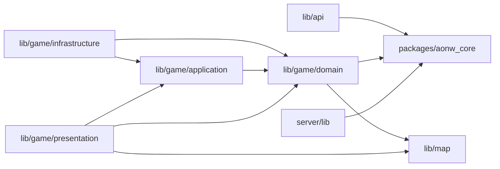

# Age of New Worlds Docs

This folder contains durable project documentation for contributors, operators,
and release work.

If you are new to the codebase, start with the architecture section below, then
use the document index as a map. Gameplay documents describe current behavior
unless they explicitly say they are historical logs.

## Public Links

- Website: [aonw.net](https://aonw.net/)
- Devlog: [ernest.dev](https://ernest.dev)
- GitHub: [ernestwisniewski/aonw](https://github.com/ernestwisniewski/aonw)
- iOS: [App Store](https://apps.apple.com/pl/app/age-of-new-worlds/id6781790591)
- Windows/macOS: [Steam](https://store.steampowered.com/app/4833240/Age_of_New_Worlds/)
- Android (soon)

## Architecture

- `packages/aonw_core/` contains Dart-only game rules, protocol models, and
  computer-opponent planning code shared by the client and server.
- `lib/game/domain/` contains client-side domain aggregates that still belong to
  the Flutter app boundary, especially save-state and UI-facing reducers.
- `lib/game/application/` owns use cases and ports. It depends on domain
  contracts, not Flutter widgets or persistence details.
- `lib/game/infrastructure/` implements persistence, transport, clocks, ids, and
  other adapters behind application ports.
- `lib/game/presentation/` owns Riverpod providers, Flutter UI, Flame rendering,
  view models, and user-facing formatting.
- `server/lib/` contains the Serverpod backend: endpoints, Auth Core adapters,
  multiplayer services, ORM-backed persistence, and realtime streams.

Architecture boundaries are enforced by
`test/architecture/layer_boundaries_test.dart`. When a cross-layer dependency is
intentional, update this document and the architecture test in the same change.

## Document Index

### Release And Operations

- [Build And Deploy Runbook](build-and-deploy.md) - local builds, release
  packaging, server deploys, web deploys, and store build commands.
- [Multiplayer Protocol](multiplayer-protocol.md) - client/server protocol
  boundaries, generated Serverpod surfaces, and live stream invariants.

### Multiplayer And Backend

- [Multiplayer TestFlight Readiness](multiplayer-testflight.md) - staging setup,
  production API targeting, and multiplayer readiness checks for TestFlight.
- [Multiplayer Scale-Out Contract](multiplayer-scale-out.md) - expectations and
  constraints for scaling multiplayer services.
- [Multiplayer Serverpod Smoke And Alerts](multiplayer-chaos-alerts.md) -
  smoke-test coverage, failure modes, and alerting expectations.
- [Serverpod Insights Runbook](serverpod-insights-runbook.md) - operational
  checks for Serverpod Insights and related health endpoints.
- [Serverpod Social Auth Setup](serverpod-social-auth-setup.md) - Google, Apple,
  and Steam auth configuration for the backend.
- [PostgreSQL Backup And Restore](postgres-backup.md) - database backup,
  restore, and recovery procedures.

### Game Design

Documents under `game-design/` cover gameplay systems, balance, UX flow, and
rendering behavior:

- [Asset Icon Rendering](game-design/asset-icon-rendering.md) - shared icon
  rendering rules for gameplay assets.
- [Balance Telemetry](game-design/balance-telemetry.md) - telemetry hooks and
  balancing signals.
- [Combat Feedback](game-design/combat-feedback.md) - audiovisual and UI
  feedback for combat moments.
- [Combat Preview](game-design/combat-preview.md) - forecast behavior and
  presentation for attacks.
- [Event Notifications and Popups](game-design/event-notifications-and-popups.md)
  - notification behavior, popup layering, and activity feedback.
- [Map Display Preferences](game-design/map-display-preferences.md) - player
  display toggles and map visualization options.
- [Map Validation](game-design/map-validation.md) - bundled map validation
  rules and failure handling.
- [Mobile QoL Automation](game-design/mobile-qol-automation.md) - mobile-first
  turn flow and automation quality-of-life notes.
- [Objective Chain](game-design/objective-chain.md) - objective progression and
  guidance structure.
- [Pace Profiles](game-design/pace-profiles.md) - pacing presets and expected
  game rhythm.
- [Per-System ETA](game-design/per-system-eta.md) - turn ETA display behavior
  for research, production, and growth.
- [Resource Value Cards](game-design/resource-value-cards.md) - resource
  presentation and valuation cards.
- [Scoring and Outcomes](game-design/scoring-and-outcomes.md) - scoring,
  victory, and end-state behavior.
- [Turn Flow and Action Focus](game-design/turn-flow-and-action-focus.md) -
  turn progression, action focus, and next-action behavior.
- [Yield Unification](game-design/yield-unification.md) - yield model
  consolidation across city, tile, and resource systems.

### Assets And Publishing

- [Asset Templates](templates/README.md) - source templates for generated or
  exported game art in `templates/`.
- [Marketing Assets](marketing/README.md) - App Store, Play Store, and brand
  collateral in `marketing/`.

## Contribution Notes

- Keep generated files such as `*.g.dart`, `*.freezed.dart`, localization
  output, and Serverpod protocol output in sync with their sources.
- Keep generated build artifacts, editor state, local environment files, and
  machine-specific output out of the repository.
- Avoid committing operating-system files, asset-export sidecars, local
  environment files, or signing material.
- Prefer small comments that explain intent, invariants, or cross-layer
  contracts. Avoid comments that restate the next expression.

Run `make check` before handoff. Run `make serverpod-ops-check` before backend
deployments when Docker and the Serverpod CLI are available.
