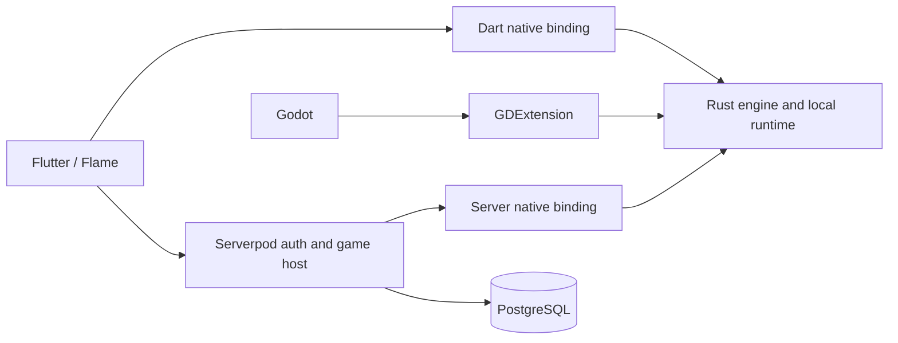

# Developer documentation

This directory documents contracts that are easy to misuse or expensive to rediscover. It is not a second copy of the codebase: catalogs, generated schemas, command lists, and current benchmark output belong in code and tests.

## Start here

| Task | Read first |
| --- | --- |
| Set up the project | [`../CONTRIBUTING.md`](../CONTRIBUTING.md) |
| Understand the repository | This page |
| Change gameplay rules | [`adr/README.md`](adr/README.md) and [`game-design/README.md`](game-design/README.md) |
| Change multiplayer | [`multiplayer-protocol.md`](multiplayer-protocol.md) |
| Work on the engine or a client | [`../engine/README.md`](../engine/README.md), [`../clients/README.md`](../clients/README.md), and [`rust-engine-persistence.md`](rust-engine-persistence.md) |
| Change tests or quality gates | [`static-analysis.md`](static-analysis.md), [`test-coverage.md`](test-coverage.md), [`architecture-budgets.md`](architecture-budgets.md), [`mutation-testing.md`](mutation-testing.md), [`critical-e2e.md`](critical-e2e.md), [`multiplayer-protocol.md`](multiplayer-protocol.md) |
| Release or operate the backend | [`build-and-deploy.md`](build-and-deploy.md) |

## Current architecture

Rust owns all gameplay rules and authoritative state. Local clients and the
Serverpod host consume the same current contracts through dedicated native
boundaries:

```mermaid
flowchart LR
  Flutter["Flutter / Flame"] --> LocalBoundary["Dart native binding"]
  Godot["Godot"] --> GodotBoundary["GDExtension"]
  LocalBoundary --> Rust["Rust engine and local runtime"]
  GodotBoundary --> Rust
  Flutter --> Serverpod["Serverpod auth and game host"]
  Serverpod --> ServerBoundary["Server native binding"]
  ServerBoundary --> Rust
  Serverpod --> PostgreSQL[(PostgreSQL)]
```

Flutter and Godot own presentation, input, accessibility, camera, and local
animation. Serverpod owns authentication, authorization, transactions,
persistence, delivery, reconnect, and operational concerns. None of those
layers may reimplement game rules or canonical state transitions.

## Where code belongs

| Path | Responsibility |
| --- | --- |
| `engine/crates/` | Rust domain, content, contracts, engine, local/server runtimes, projections, AI, and native adapters. |
| `clients/aonw_flutter/lib/` | Flutter application, infrastructure, presentation, Flame viewport, auth, and multiplayer flow. |
| `clients/aonw_godot/game/` | Godot application, infrastructure, and presentation. |
| `clients/aonw_godot/editor/` | Map Workbench application and editor integration. |
| `packages/aonw_rust_client/` | Dart API for the local Rust runtime. |
| `packages/aonw_server_native/` | Dart API for the Serverpod Rust host boundary. |
| `packages/aonw_server_client/` | Generated current auth and game protocol client. |
| `server/lib/src/` | Authentication, game transactions, recipient persistence and delivery, maintenance, and observability. |
| `content/` | Versioned logical maps and scenarios. |

A presentation widget may calculate layout and animation. It must not decide whether a command is legal, recalculate authoritative movement, or invent a different economy value.

## Common commands

| Purpose | Command |
| --- | --- |
| Install the pinned workspace | `make bootstrap` |
| Rust engine quality gate | `make rust-engine-quality-check` |
| Flutter client gate | `make flutter-client-check` |
| Godot client and native adapter gate | `make godot-check` |
| Server gate | `make server-test` |
| Start local API and seed accounts | `make local-start` |
| Start API plus Flutter Web | `make local` |
| Local multiplayer smoke | `make local-multiplayer-smoke` |
| PostgreSQL-backed server smoke | `tool/run_postgres_smoke.sh` |
| Complete release qualification | `make release-check` |

## Architecture decisions

ADRs record constraints that should survive refactors. Read the index before
changing state ownership, command boundaries, multiplayer protocol,
deployment identity, roads, strategic resources, or a native trust boundary.

- [`adr/0003-command-boundaries.md`](adr/0003-command-boundaries.md): UI intent, player commands, trusted system commands, and events are different types.
- [`adr/0004-versioned-multiplayer-protocol.md`](adr/0004-versioned-multiplayer-protocol.md): functional compatibility, transient wire schemas, and durable schemas are versioned separately.
- [`adr/0005-immutable-deployment.md`](adr/0005-immutable-deployment.md): immutable deployment promotion and promotion workflow transition controls.
- [`adr/0006-transport-infrastructure.md`](adr/0006-transport-infrastructure.md): transport and traversal ownership for the online stack.
- [`adr/0007-strategic-resource-stockpiles.md`](adr/0007-strategic-resource-stockpiles.md): strategic resources are production-gated and tracked for compatibility.
- [`../engine/README.md`](../engine/README.md): current engine ownership, workspace boundaries, and release qualification.

## Runbooks and policies

### Development quality

- [`static-analysis.md`](static-analysis.md): shared analyzer configuration and generated-code boundaries.
- [`test-coverage.md`](test-coverage.md): measured scopes, changed-line gate, and baseline updates.
- [`architecture-budgets.md`](architecture-budgets.md): source census and complexity ratchets.
- [`mutation-testing.md`](mutation-testing.md): focused mutation targets and survivor policy.
- [`performance-benchmarks.md`](performance-benchmarks.md): deterministic workload gates and device-only frame checks.
- [`critical-e2e.md`](critical-e2e.md): local persistence and public multiplayer journeys.

### Multiplayer and operations

- [`multiplayer-protocol.md`](multiplayer-protocol.md): current online contract and rollout checklist.
- [`rust-engine-persistence.md`](rust-engine-persistence.md): current-only save, replay, atomic write, backup, and restore contract.
- [`multiplayer-scale-out.md`](multiplayer-scale-out.md): current single-active-instance limitation.
- [`multiplayer-chaos-alerts.md`](multiplayer-chaos-alerts.md): release smoke and manual failure drills.
- [`multiplayer-testflight.md`](multiplayer-testflight.md): staging and two-device acceptance.
- [`build-and-deploy.md`](build-and-deploy.md): release and deployment commands.
- [`postgres-backup.md`](postgres-backup.md): backup and restore procedure.
- [`data-retention.md`](data-retention.md): automatic retention currently implemented.
- [`serverpod-social-auth-setup.md`](serverpod-social-auth-setup.md): Google, Apple, and Steam provider setup.
- [`linux-steam-runtime.md`](linux-steam-runtime.md): Linux/Steam runtime and packaging contract.

### Product and content

- [`game-design/README.md`](game-design/README.md): index of gameplay and UX contracts.
- [`marketing/README.md`](marketing/README.md): publishing-only artwork.

## Documentation rules

Keep a document when at least one of these is true:

- it explains a boundary that the type system cannot express;
- it records an operational procedure;
- it defines compatibility or rollout rules;
- it documents player-facing behavior shared by several implementations.

Do not paste generated catalogs, current simulation output, or a full class inventory into Markdown. Link to the source and state the invariant instead. Update the relevant document in the same change that alters its contract.
