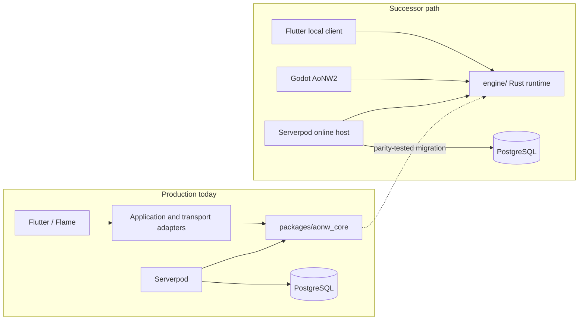

# Developer documentation

This directory documents contracts that are easy to misuse or expensive to rediscover. It is not a second copy of the codebase: catalogs, generated schemas, command lists, and current benchmark output belong in code and tests.

## Start here

| Task | Read first |
| --- | --- |
| Set up the project | [`../CONTRIBUTING.md`](../CONTRIBUTING.md) |
| Understand the repository | This page |
| Change gameplay rules | [`adr/README.md`](adr/README.md) and [`game-design/README.md`](game-design/README.md) |
| Change multiplayer | [`multiplayer-protocol.md`](multiplayer-protocol.md) |
| Work on Rust or Godot | [`rust-engine-migration.md`](rust-engine-migration.md) |
| Change tests or quality gates | [`static-analysis.md`](static-analysis.md), [`test-coverage.md`](test-coverage.md), [`architecture-budgets.md`](architecture-budgets.md), [`mutation-testing.md`](mutation-testing.md), [`critical-e2e.md`](critical-e2e.md), [`multiplayer-protocol.md`](multiplayer-protocol.md) |
| Release or operate the backend | [`build-and-deploy.md`](build-and-deploy.md) |

## Current architecture

The shipping Dart engine and the Rust successor coexist during the strangler migration:

```mermaid
flowchart LR
  subgraph Today["Production today"]
    Flutter["Flutter / Flame"] --> ClientAdapters["Application and transport adapters"]
    ClientAdapters --> DartCore["packages/aonw_core"]
    Serverpod["Serverpod"] --> DartCore
    Serverpod --> PostgreSQL[(PostgreSQL)]
  end

  subgraph Successor["Successor path"]
    FlutterFuture["Flutter local client"] --> RustRuntime["engine/ Rust runtime"]
    Godot["Godot AoNW2"] --> RustRuntime
    ServerpodFuture["Serverpod online host"] --> RustRuntime
    ServerpodFuture --> PostgreSQLFuture[(PostgreSQL)]
  end

  DartCore -. parity-tested migration .-> RustRuntime
```

Until the cutover gates pass:

- `packages/aonw_core/` is the production source of gameplay truth;
- `engine/` is the compatibility port and future owner;
- `clients/aonw2_godot/` is presentation code and must not implement game rules;
- an active save or match uses one primary engine, never a mix of command families.

## Where code belongs

| Path | Responsibility |
| --- | --- |
| `packages/aonw_core/lib/game/` | Authoritative Dart state, rules, commands, events, AI, and simulation. |
| `packages/aonw_core/lib/protocol/` | Shared multiplayer wire models and compatibility constants. |
| `lib/game/application/` | Use cases, ports, and client orchestration. |
| `lib/game/infrastructure/` | Persistence, native, and transport adapters. |
| `lib/game/presentation/` | Flutter, Riverpod, Flame rendering, HUD, and interaction state. |
| `lib/api/` | Authentication, Serverpod sessions, live streams, and network command transport. |
| `server/lib/src/` | Serverpod endpoints, multiplayer lifecycle, persistence, and maintenance. |
| `engine/crates/` | Rust domain, content, contracts, engine, runtime, and thin native adapters. |
| `content/` | Versioned logical maps and scenarios. |
| `clients/aonw2_godot/` | Godot application, infrastructure, presentation, and editor tooling. |

A presentation widget may calculate layout and animation. It must not decide whether a command is legal, recalculate authoritative movement, or invent a different economy value.

## Common commands

| Purpose | Command |
| --- | --- |
| Install the pinned workspace | `make bootstrap` |
| Full Dart/Flutter quality gate | `make ci` |
| Start local API and seed accounts | `make local-start` |
| Start API plus Flutter Web | `make local` |
| Local multiplayer smoke | `make local-multiplayer-smoke` |
| PostgreSQL-backed server smoke | `tool/run_postgres_smoke.sh` |
| Rust workspace gate | `make rust-check` |
| Godot and native adapter gate | `make godot-check` |

## Architecture decisions

ADRs record constraints that should survive refactors. Read the index before changing state ownership, command boundaries, multiplayer compatibility, deployment identity, roads, strategic resources, or Rust migration.

- [`adr/0003-command-boundaries.md`](adr/0003-command-boundaries.md): UI intent, player commands, trusted system commands, and events are different types.
- [`adr/0004-versioned-multiplayer-protocol.md`](adr/0004-versioned-multiplayer-protocol.md): functional compatibility, transient wire schemas, and durable schemas are versioned separately.
- [`adr/0005-immutable-deployment.md`](adr/0005-immutable-deployment.md): immutable deployment promotion and promotion workflow transition controls.
- [`adr/0006-transport-infrastructure.md`](adr/0006-transport-infrastructure.md): transport and traversal ownership for the online stack.
- [`adr/0007-strategic-resource-stockpiles.md`](adr/0007-strategic-resource-stockpiles.md): strategic resources are production-gated and tracked for compatibility.
- [`adr/0008-rust-engine-ownership-and-strangler-migration.md`](adr/0008-rust-engine-ownership-and-strangler-migration.md): Rust becomes the engine through an incremental, parity-tested migration.

## Runbooks and policies

### Development quality

- [`static-analysis.md`](static-analysis.md): shared analyzer configuration and generated-code boundaries.
- [`test-coverage.md`](test-coverage.md): measured scopes, changed-line gate, and baseline updates.
- [`architecture-budgets.md`](architecture-budgets.md): source census and complexity ratchets.
- [`mutation-testing.md`](mutation-testing.md): focused mutation targets and survivor policy.
- [`performance-benchmarks.md`](performance-benchmarks.md): deterministic workload gates and device-only frame checks.
- [`critical-e2e.md`](critical-e2e.md): local persistence and public multiplayer journeys.

### Multiplayer and operations

- [`multiplayer-protocol.md`](multiplayer-protocol.md): current online contract and rollout checklist.
- [`multiplayer-scale-out.md`](multiplayer-scale-out.md): current single-active-instance limitation.
- [`multiplayer-chaos-alerts.md`](multiplayer-chaos-alerts.md): release smoke and manual failure drills.
- [`multiplayer-testflight.md`](multiplayer-testflight.md): staging and two-device acceptance.
- [`build-and-deploy.md`](build-and-deploy.md): release and deployment commands.
- [`postgres-backup.md`](postgres-backup.md): backup and restore procedure.
- [`data-retention.md`](data-retention.md): automatic retention currently implemented.
- [`serverpod-social-auth-setup.md`](serverpod-social-auth-setup.md): Google, Apple, and Steam provider setup.
- [`linux-steam-runtime.md`](linux-steam-runtime.md): Linux/Steam runtime and packaging contract.

### Product and content

- [`game-design/README.md`](game-design/README.md): index of gameplay and UX contracts.
- [`marketing/README.md`](marketing/README.md): publishing-only artwork.

## Documentation rules

Keep a document when at least one of these is true:

- it explains a boundary that the type system cannot express;
- it records an operational procedure;
- it defines compatibility or rollout rules;
- it documents player-facing behavior shared by several implementations.

Do not paste generated catalogs, current simulation output, or a full class inventory into Markdown. Link to the source and state the invariant instead. Update the relevant document in the same change that alters its contract.
