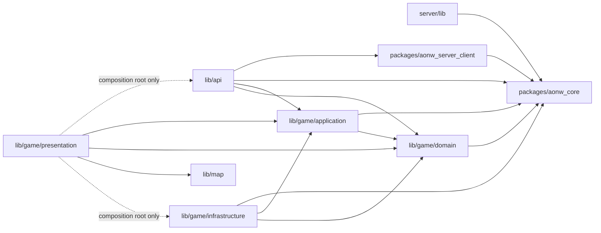
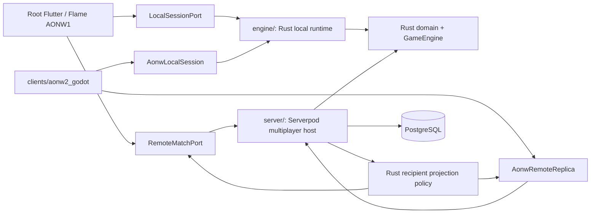

# Age of New Worlds Documentation

This directory contains the durable project documentation for contributors,
operators, release work, and gameplay design. Documents describe current
behavior unless they explicitly call out historical context or future work.

## Start Here

| Need | Read |
| --- | --- |
| Understand the codebase | [Architecture](#architecture), then [Multiplayer Protocol](multiplayer-protocol.md) if networking is involved. |
| Change an architectural contract | [Architecture Decision Records](adr/README.md) before changing ownership, determinism, commands, compatibility, or deployment policy. |
| Refactor or split Dart code | [Architecture Budgets](architecture-budgets.md) for the complete census, role-specific targets, and legacy-debt ratchet. |
| Work on the Rust engine or Godot migration | [Rust Engine Migration Plan](rust-engine-migration.md), then [ADR 0008](adr/0008-rust-engine-ownership-and-strangler-migration.md). |
| Build or release the game | [Build And Deploy Runbook](build-and-deploy.md). |
| Work on tests or coverage | [Test Coverage](test-coverage.md) for line coverage, [Mutation Testing](mutation-testing.md) for critical behavioral assertions, [Performance Benchmarks](performance-benchmarks.md) for deterministic work and frame budgets, and [Critical End-to-End Journeys](critical-e2e.md) for real persistence and network boundaries. |
| Change gameplay balance | [Pace Profiles](game-design/pace-profiles.md), [Scoring and Outcomes](game-design/scoring-and-outcomes.md), and the relevant gameplay-system document. |
| Work on backend operations | [Data Retention](data-retention.md), [PostgreSQL Backup And Restore](postgres-backup.md), and [Serverpod Social Auth Setup](serverpod-social-auth-setup.md). |
| Prepare public assets | [Marketing Assets](marketing/README.md) and [Asset Templates](templates/README.md). |

## Architecture

The table and first diagram in this section describe the current production
repository. The accepted successor architecture is an incremental migration to
a Rust workspace at `engine/`; see
[Rust Engine Migration Plan](rust-engine-migration.md). Until its cutover gates
pass, the current Dart paths remain authoritative and releasable.

| Area | Responsibility |
| --- | --- |
| `packages/aonw_core/` | Authoritative Dart-only game rules, canonical state and snapshots, protocol models, and AI planning. |
| `packages/aonw_server_client/` | Generated, app-independent Serverpod client surface; depends only on the shared core. |
| `lib/game/domain/` | Client session and interaction composition plus transitional compatibility reducers; canonical game rules live in `aonw_core`. |
| `lib/game/application/` | Use cases and ports around persistence, logging, clocks, ids, and transport. |
| `lib/game/infrastructure/` | Persistence, migrations, local transport, and system adapters. |
| `lib/game/presentation/` | Riverpod providers, Flutter UI, Flame rendering, view models, and user-facing formatting. |
| `lib/api/` | Authentication, API facades, session handling, and live transport adapters around the generated client. |
| `lib/map/` | Client map loading/integration, terrain rendering, and editor-facing support; the canonical world model lives in `aonw_core`. |
| `server/lib/` | Serverpod endpoints, Auth Core adapters, multiplayer services, ORM persistence, and realtime streams. |

```mermaid
flowchart LR
  Server["server/lib"]
  Core["packages/aonw_core"]
  Domain["lib/game/domain"]
  Application["lib/game/application"]
  Infrastructure["lib/game/infrastructure"]
  Presentation["lib/game/presentation"]
  Map["lib/map"]
  Api["lib/api"]
  Client["packages/aonw_server_client"]

  Server --> Core
  Client --> Core
  Api --> Client
  Api --> Core
  Api --> Application
  Api --> Domain
  Presentation -. "composition root only" .-> Api
  Presentation --> Application
  Presentation --> Domain
  Presentation --> Map
  Presentation -. "composition root only" .-> Infrastructure
  Application --> Core
  Application --> Domain
  Infrastructure --> Core
  Infrastructure --> Application
  Infrastructure --> Domain
  Domain --> Core
```

Architecture boundaries are enforced by
`test/architecture/layer_boundaries_test.dart`. Presentation may bind concrete
infrastructure repositories and API adapters only in
`lib/game/presentation/providers/session/repository_providers.dart`; other
presentation code depends on application ports. When a cross-layer dependency
is intentional, update this document and the architecture test in the same
change.

### Accepted Successor Architecture

The first Rust code is added directly under `engine/`. Flutter remains at the
repository root during migration; Godot AONW2 is added separately under
`clients/aonw2_godot/`.

```mermaid
flowchart LR
  Flutter["Root Flutter / Flame AONW1"] --> FlutterLocal["LocalSessionPort"]
  Godot["clients/aonw2_godot"] --> GodotLocal["AonwLocalSession"]
  FlutterLocal --> Runtime["engine/: Rust local runtime"]
  GodotLocal --> Runtime
  Runtime --> Rules["Rust domain + GameEngine"]
  Flutter --> FlutterRemote["RemoteMatchPort"]
  Godot --> GodotRemote["AonwRemoteReplica"]
  FlutterRemote --> Server["server/: Serverpod multiplayer host"]
  GodotRemote --> Server
  Server --> Rules
  Server --> Projection["Rust recipient projection policy"]
  Projection --> FlutterRemote
  Projection --> GodotRemote
  Server --> Database[("PostgreSQL")]
```

The Rust engine becomes the single rules implementation only after parity,
save compatibility, platform, shadow, canary, and rollback gates pass. The Dart
`aonw_core` remains in production until then. A live session or match is pinned
to one complete primary engine backend and is never split by command family.

## Architecture Decisions

The architecture table above describes the current repository. Historical and
current target decisions, including supersession, are recorded in the
[ADR index](adr/README.md):

- [historical Dart map and state ownership](adr/0001-map-and-state-ownership.md);
- [the historical Dart deterministic engine location](adr/0002-deterministic-game-engine.md);
- [command boundaries](adr/0003-command-boundaries.md);
- [multiplayer protocol versioning](adr/0004-versioned-multiplayer-protocol.md);
- [immutable deployment promotion](adr/0005-immutable-deployment.md);
- [transport infrastructure ownership](adr/0006-transport-infrastructure.md);
- [strategic resource stockpiles](adr/0007-strategic-resource-stockpiles.md);
- [Rust engine ownership and strangler migration](adr/0008-rust-engine-ownership-and-strangler-migration.md).

An accepted ADR is binding for new code even when its implementation is still
in progress. Do not edit history to change a decision; add a superseding ADR.

## Document Index

### Architecture

| Document | Use It For |
| --- | --- |
| [Architecture Decision Records](adr/README.md) | Durable ownership, determinism, command, compatibility, and deployment decisions. |
| [Rust Engine Migration Plan](rust-engine-migration.md) | Target `engine/` layout, DDD boundaries, Flutter continuity, Godot integration, parity, phases, cutover, and Dart retirement gates. |
| [Multiplayer Protocol](multiplayer-protocol.md) | Current client/server protocol surface and rollout procedure. |
| [Static Analysis](static-analysis.md) | Shared strict analyzer policy, generated-code boundaries, and canonical commands. |
| [Architecture Budgets](architecture-budgets.md) | Repository-wide Dart census, role-specific size/complexity targets, callable AST metrics, and exact legacy-debt ratchet. |
| [Test Coverage](test-coverage.md) | Line-coverage scopes, exact totals, portable coverage floors, historical ratchet, and changed-line gate. |
| [Mutation Testing](mutation-testing.md) | Critical scopes, AST mutation operators, deterministic execution, exact baseline, and survivor ratchet. |
| [Performance Benchmarks](performance-benchmarks.md) | Map, persistence, replay, AI, and renderer workloads; portable stable baseline; diagnostic timings; reference-profile frame budgets. |
| [Critical End-to-End Journeys](critical-e2e.md) | Local create/save/reload and public Serverpod auth/match/command/reconnect gates. |

### Release And Operations

| Document | Use It For |
| --- | --- |
| [Build And Deploy Runbook](build-and-deploy.md) | Local builds, release packaging, server deploys, web deploys, store uploads, and public downloads. |
| [Data Retention](data-retention.md) | Automatic cleanup, data without retention, and backup-lifecycle boundaries. |
| [PostgreSQL Backup And Restore](postgres-backup.md) | Database backup, restore, and recovery procedures. |

### Multiplayer And Backend

| Document | Use It For |
| --- | --- |
| [Multiplayer Protocol](multiplayer-protocol.md) | Client/server protocol boundaries, generated Serverpod surfaces, and stream invariants. |
| [Multiplayer TestFlight Readiness](multiplayer-testflight.md) | Staging setup and mobile multiplayer readiness checks. |
| [Multiplayer Scale-Out Contract](multiplayer-scale-out.md) | Constraints for scaling multiplayer services. |
| [Multiplayer Serverpod Smoke And Alerts](multiplayer-chaos-alerts.md) | Smoke-test coverage, failure modes, and alerting expectations. |
| [Critical End-to-End Journeys](critical-e2e.md) | Canonical real-boundary persistence and multiplayer release journeys. |
| [Serverpod Social Auth Setup](serverpod-social-auth-setup.md) | Google, Apple, and Steam auth configuration. |

### Game Design

| Document | Use It For |
| --- | --- |
| [Asset Icon Rendering](game-design/asset-icon-rendering.md) | Shared icon rendering rules for gameplay assets. |
| [Balance Telemetry](game-design/balance-telemetry.md) | Telemetry hooks, balance signals, and simulation output. |
| [Combat Feedback](game-design/combat-feedback.md) | UI, audio, timing, and notification feedback for combat. |
| [Combat Preview](game-design/combat-preview.md) | Attack forecast behavior and presentation. |
| [Event Notifications and Popups](game-design/event-notifications-and-popups.md) | Notification behavior, popup layering, and activity feedback. |
| [Gamepad Controls](game-design/gamepad-controls.md) | Controller input mapping and in-game manual contract. |
| [Desktop Display Mode](game-design/desktop-display-mode.md) | Desktop full-screen startup, windowed preference, and resize contract. |
| [Map Display Preferences](game-design/map-display-preferences.md) | Player display toggles and map visualization options. |
| [Map Validation](game-design/map-validation.md) | Bundled map validation rules and failure handling. |
| [Mobile QoL Automation](game-design/mobile-qol-automation.md) | Mobile-first turn flow and automation quality-of-life behavior. |
| [Movement and Route Preview](game-design/movement-and-route-preview.md) | Canonical movement costs, partially spent turns, queued paths, and route colors. |
| [Objective Chain](game-design/objective-chain.md) | Objective progression, guidance, and player-facing prompts. |
| [Pace Profiles](game-design/pace-profiles.md) | Pacing presets and expected game rhythm. |
| [Per-System ETA](game-design/per-system-eta.md) | Turn ETA display behavior for research, production, and growth. |
| [Resource Value Cards](game-design/resource-value-cards.md) | Resource presentation and valuation cards. |
| [Scoring and Outcomes](game-design/scoring-and-outcomes.md) | Scoring, victory, and end-state behavior. |
| [Strategic Resource Economy](game-design/strategic-resource-economy.md) | Strategic production, stockpiles, allocation, trade, UI, and AI behavior. |
| [Turn Flow and Action Focus](game-design/turn-flow-and-action-focus.md) | Turn progression, action focus, and next-action behavior. |
| [World Wonders](game-design/world-wonders.md) | Wonder production, race resolution, effects, UI, AI, and serialization. |
| [Yield Unification](game-design/yield-unification.md) | Yield model consolidation across city, tile, and resource systems. |

### Assets And Publishing

| Document | Use It For |
| --- | --- |
| [Asset Templates](templates/README.md) | Source templates for generated or exported game art. |
| [Marketing Assets](marketing/README.md) | Store and brand collateral. |

## Maintenance Notes

- `.fvmrc` is the single Flutter SDK pin for local Make commands and GitHub
  builds; Dart must be the SDK bundled by that Flutter release. Start from
  `make bootstrap`, which resolves every committed workspace lockfile and
  ensures the matching Serverpod CLI without generating tracked code.
- Keep generated files such as `*.g.dart`, `*.freezed.dart`, localization
  output, Serverpod protocol output, and migrations in sync with their sources.
  `make generated-code-check` verifies root and `aonw_core` build-runner output,
  l10n, Serverpod output, and migrations in an isolated snapshot without
  rewriting the active checkout. It runs as part of `make ci` and CI and
  requires the matching Serverpod CLI from `make bootstrap`. When
  it reports drift, use the relevant deliberate regeneration command in
  [CONTRIBUTING.md](../CONTRIBUTING.md), review the diff, and commit it.
- Keep generated build artifacts, editor state, local environment files, and
  machine-specific output out of the repository.
- Avoid committing operating-system files, asset-export sidecars, local
  environment files, signing material, or credentials.
- Update docs when behavior, persistence, APIs, game rules, or release flows
  change.

Run `make ci` before handoff. Run `make serverpod-ops-check` before backend
deployments when Docker and the Serverpod CLI are available.
