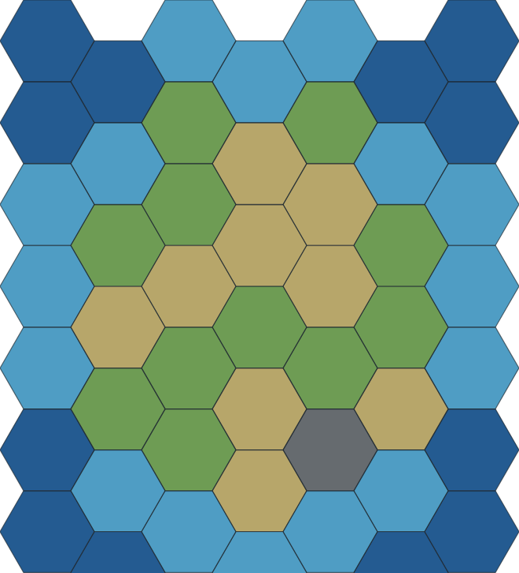
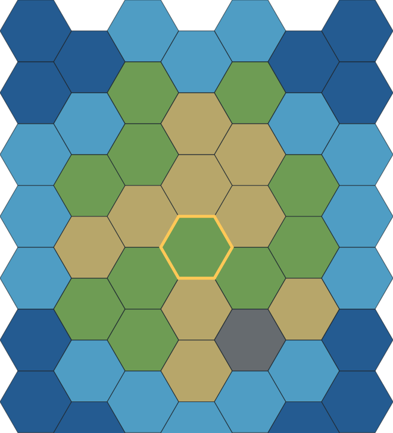
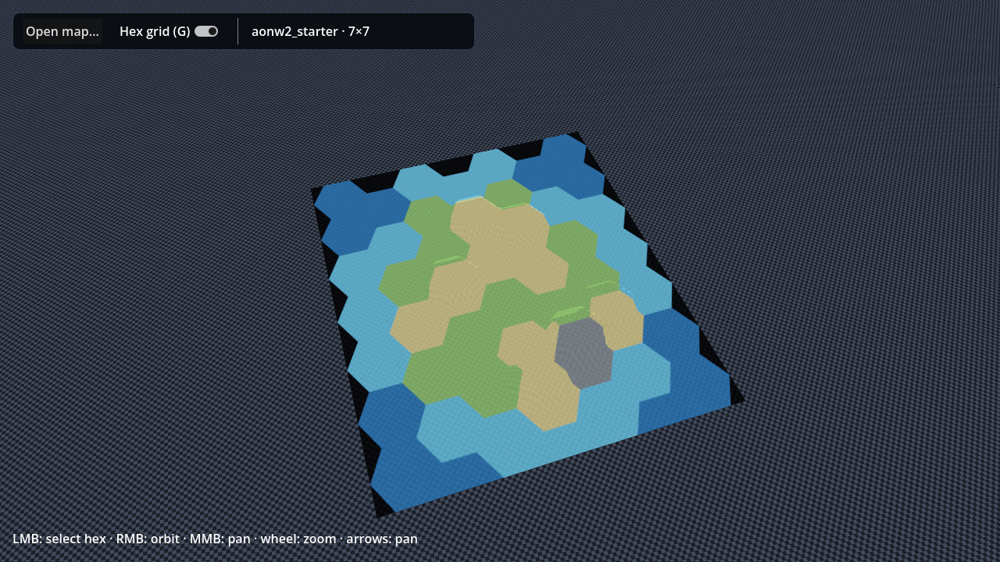
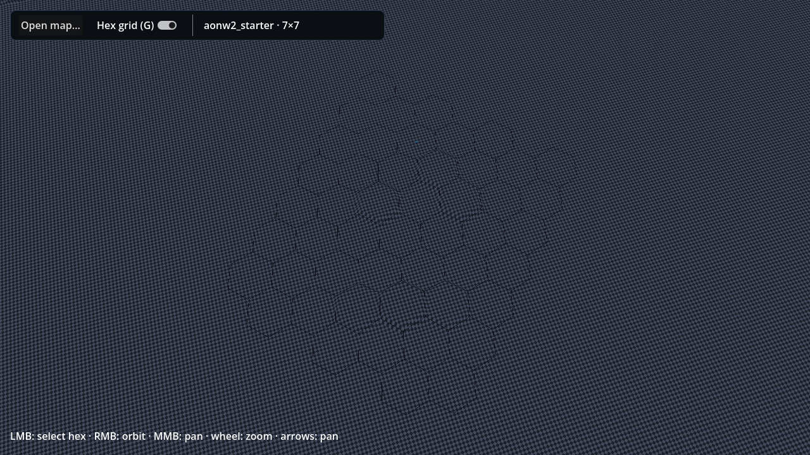

# Stage 1 map acceptance

This package is review evidence for the clients' shared map slice.
It is deliberately separate from client-owned visual goldens and is not a
pixel-parity contract between Flutter and Godot.

## Reproduce

From the repository root:

```sh
make map-stage-1-check
make stage-1-visual-evidence
make flutter-client-check
make godot-check
```

The visual evidence command requires a graphical display for Godot. All
required Godot, Terrain3D, Rust, and Flutter dependencies are supplied by the
normal project bootstrap.

## Flutter evidence

The Flutter captures use the native Rust `inspectMap` response and the bundled
starter map contract.





## Godot evidence

The Godot captures instantiate the real `map_preview.tscn` scene with Terrain3D.
ArrayMesh is used only for the independent reference and grid overlays.





## Semantic result

`make map-stage-1-check` exports both clients' normalized `MapRenderProbe` JSON
and reports:

```text
MapRenderProbe parity: OK (float tolerance 0.0001)
```

The gate compares the starter and Dravonia 40×30 maps, including identity,
ordered tiles, objectives, terrain fields, normalized centers and corners,
neighbors, round trips, viewport transforms, and deterministic picking. A
negative harness test proves that mismatches report the exact JSON path and
values.

## Known limitations

- Only `aonw2_starter` currently has the complete Terrain3D authoring profile;
  other maps are intentionally rejected by the Godot runtime until profiled.
- Visual goldens are client-owned. Cross-client validation is semantic, not
  pixel-based.
- The compiled Terrain3D base carries height only. With the reference hidden,
  the checkerboard denotes terrain awaiting manual texture painting; paint is
  author-owned state and is never inferred from gameplay terrain fields.
- The 40×30 timing and resident-memory limits are diagnostics and do not mask
  semantic failures.
- Godot may print known editor-shutdown RID/resource warnings; the checked log
  policy rejects runtime errors while allowing those existing shutdown lines.
- This package accepts the map and terrain slice only. Starting the next
  units/movement slice remains an explicit owner decision.
