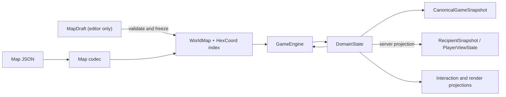

# ADR 0001: Map And State Ownership

- Status: Superseded
- Date: 2026-07-12
- Implementation: In progress
- Superseded by: [ADR 0008](0008-rust-engine-ownership-and-strangler-migration.md)

## Context

Before this migration, the game had parallel representations of the same map
concepts. Mutable `MapData` and immutable `MapDefinition` crossed gameplay,
editor, client, AI, and server boundaries, performed linear tile lookup, and
required point-to-point conversions. Coordinates also appeared as
`HexCoordinate`, `CityHex`, records, and repeated `col`/`row` pairs.

State was similarly split between client `GameState`, persisted
`PersistentGameState`, `GameRuntimeState`, session state, and wire maps. Those
models could drift even when local and multiplayer rules were intended to be
identical, while several snapshot wrappers repeated the event offset.

The editor needs mutation, rendering needs derived caches, and UI interaction
is client-local. Those needs must not make the authoritative world or game
state mutable.

## Decision

`aonw_core` will own one dependency-free coordinate type, one immutable world
map, and one deeply immutable authoritative domain state.

The binding invariants are:

- `HexCoord` is a value object in the world/domain foundation. It depends on no
  map, game, Flutter, Flame, persistence, or Serverpod type.
- `WorldMap` is immutable after construction. It owns dimensions, immutable
  tiles, terrain/resources, and map objectives. It validates duplicate and
  out-of-bounds coordinates once and provides O(1) `tileAtHex(HexCoord)` and
  representation-neutral `MapTileLookup.tileAt(col, row)` lookup.
- `MapDraft` is the only mutable map representation. It belongs to the editor
  boundary and must be validated and frozen before gameplay, AI, persistence,
  or server code can use it.
- `DomainState` is the only authoritative rules-changing game state. Its
  collections and nested values are deeply immutable; updates return a new
  value. Local play, replay, AI, and the server consume the same type.
- Selection, targeting previews, open panels, camera state, animation state,
  and render caches are not part of `DomainState`. They live in explicit
  `InteractionState` or `RenderState` projections owned by client adapters.
- Existing pending actions are classified before migration. Data required for
  deterministic resolution or undo becomes an explicit domain value; prompts,
  pickers, focus, and partially completed UI workflows remain interaction
  state. The current `PendingPlayerAction` hierarchy is not moved wholesale.
- Mutable turn, participant/lifecycle, submission, match-selected rule
  parameters, rule-affecting deadlines/timestamps, and victory state belongs to
  `DomainState`. Snapshot metadata is limited to identity, schema version,
  display labels, ordinary created/saved timestamps, and immutable map/ruleset
  catalog references pinned by version/hash; it cannot become a second
  rules-changing state under a different name.
- `CanonicalGameSnapshot` contains metadata, complete authoritative
  `DomainState`, and the applied event offset exactly once. It is used by local
  and server persistence. An adapter validates its pinned references, resolves
  `WorldMap`/ruleset context, and passes only `snapshot.state` to the engine;
  the snapshot envelope itself is never engine input. A store may index the
  offset but must verify, not duplicate, it; the value is never inferred by
  scanning an event log.
- A multiplayer `RecipientSnapshot` contains metadata, a recipient-scoped
  `PlayerViewState`, and the visible offset. It is a projection for client sync
  and rendering, may omit hidden domain data, and must never be accepted as a
  canonical snapshot or engine input.
- Persistence and wire codecs translate at the boundary and accept only the
  current supported schema. Historical migration fields do not leak into the
  domain model.
- New parallel map/state models or handwritten point-to-point converters are
  not allowed. A temporary adapter must name the legacy source, the canonical
  target, and its removal condition.

## Consequences

Gameplay and server rules gain one state vocabulary, and indexed map queries
remove repeated linear scans. Deep immutability makes replay, equality, cache
invalidation, background isolates, and deterministic tests safer.

The cost is an incremental migration of many constructors, serializers, and UI
selectors. Large immutable values may require structural sharing and derived
indexes to avoid excessive copying. Editor mutation becomes explicit instead
of being available to gameplay code.

Rejected alternatives:

- keeping `MapData` mutable everywhere preserves accidental coupling and
  prevents trustworthy sharing between isolates;
- keeping separate client and server states requires perpetual parity work;
- placing camera or selection fields in authoritative state makes network and
  replay contracts depend on presentation behavior.

## Migration And Verification

The authoritative roots are now migrated:

- `MapData`, `TileData`, `MapDefinition`, and `WorldMapReadView` are removed;
  editor mutation ends at `MapDraft.freeze`, which produces `WorldMap`;
- `PersistentGameState`, `GameRuntimeState`, `MatchSessionState`, the former
  client `GameState`, and their conversion adapters are removed;
- `DomainState` owns rule and lifecycle data, while `GameClientState` composes
  it with `InteractionState` and renderer caches use `RenderState`;
- `CanonicalGameSnapshot` owns exactly metadata, one `DomainState`, and one
  event offset; `RecipientSnapshot` is a nominal recipient-only projection;
- current save and wire codecs construct the canonical envelope directly.

The implementation remains `In progress` for two explicit reasons. First,
several presentation calculators and rendering layers still accept concrete
`WorldMap` even when a smaller `MapTileLookup`, `MapTraversalView`, or
`MapReadView` port is sufficient. Composition may own `WorldMap`; leaf HUD and
renderer code must be narrowed before the map boundary is complete. Second,
`DomainActionState` still contains the deterministic portions of pending
workflows while matching prompts are projected into `InteractionState`; every
pending subtype still needs a final rules-evidence versus client-workflow
classification before that boundary can be declared complete.

AST architecture tests inventory production sources, including `tool/`, and
reject removed map/state types, adapters, duplicate canonical fields, and
recipient snapshots entering the engine. Contract tests prove defensive map
ownership, O(1) indexed lookup, canonical codec round trips, server roster
validation, and local/server/AI/replay engine parity. Completion requires the
two named exceptions above to reach zero; a raw text search alone is not the
definition of done.

## Related Decisions And Documentation

- [ADR 0008: Rust Engine Ownership And Strangler Migration](0008-rust-engine-ownership-and-strangler-migration.md)
- [Documentation architecture map](../README.md#architecture)
- [Map validation](../game-design/map-validation.md)
