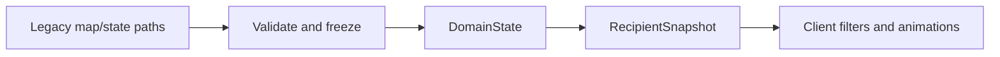

# ADR 0001: Map and state ownership

- Status: Superseded
- Date: 2026-07-12
- Implementation: In progress
- Superseded by: [ADR 0008](0008-rust-engine-ownership-and-strangler-migration.md)

## Context

The Dart game previously used several map, coordinate, runtime, and persisted-state models. Converters and linear tile lookups allowed local play, AI, UI, and multiplayer to drift.

Editors need mutation and renderers need caches, but neither requirement should make authoritative gameplay state mutable.

## Decision

The current Dart architecture has one canonical vocabulary:

- `HexCoord` is the dependency-free coordinate value.
- `WorldMap` is immutable, validates its data once, and provides indexed lookup.
- `MapDraft` is the mutable editor model and must be validated and frozen before gameplay.
- `DomainState` is the authoritative, deeply immutable rules-changing state.
- `InteractionState` owns selection, targeting, panels, and other client workflows.
- `RenderState` owns animation and rendering caches.
- `CanonicalGameSnapshot` contains complete authoritative state and one applied event offset.
- `RecipientSnapshot` contains only player-safe projected state and must never be accepted as canonical engine input.

Rule-affecting turn, participant, deadline, ruleset, and victory data belongs to `DomainState`. Camera state, UI focus, and partially completed presentation workflows do not.

Persistence and wire codecs translate at the boundary. New parallel map/state models or handwritten point-to-point converters are not allowed without a named removal condition.

## Consequences

One state vocabulary improves replay, equality, cache invalidation, deterministic tests, and local/server parity. The editor must convert mutable work into validated immutable content before it reaches the game.

## Migration And Verification

The canonical ownership model is complete for gameplay authority, but two migration-aware checks remain:

- `MapDraft` conversion is currently validated by end-to-end test fixtures and must remain stable for compatibility with old map tooling.
- Receipt and handling of pending interaction artifacts are covered by the state contract tests, and any future canonicalization change must preserve deterministic replay.

## Related Decisions And Documentation

- [ADR 0008-rust-engine-ownership-and-strangler-migration](0008-rust-engine-ownership-and-strangler-migration.md)
- [ADRs index](README.md)

## Rejected alternatives:

The alternatives below were considered but not selected:
- A single mutable state object for both editor and gameplay.
- Multiple authoritative map models with per-surface conversion.
- Persistence that stores rendering-only cache entries inside authoritative snapshots.

ADR 0008 supersedes the physical owner: these language-neutral invariants remain, but Rust is the target implementation.

## Verification

Architecture tests reject retired types, duplicate canonical fields, recipient snapshots entering the engine, and alternative authoritative state paths. Contract tests cover map ownership, indexed lookup, codecs, and local/server/AI/replay parity.
