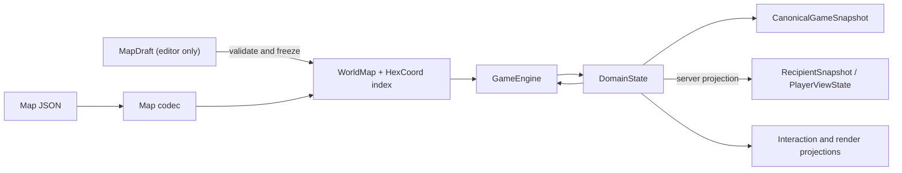

# ADR 0001: Map And State Ownership

- Status: Accepted
- Date: 2026-07-12
- Implementation: In progress

## Context

The game currently has parallel representations of the same concepts.
`MapData` is mutable for the editor and is also consumed by gameplay, while
`MapDefinition` is an immutable rules-oriented representation used by shared
pipelines and the server. Both perform linear tile lookup and conversion code
exists at application boundaries.
Coordinates also appear as `HexCoordinate`, `CityHex`, records, and repeated
`col`/`row` pairs.

State is similarly split. The Flutter client uses `GameState`, including
selection and other interaction state, while persistence and the server use
`PersistentGameState`. `GameSave` combines save metadata and turn metadata,
and wire snapshots carry separate untyped `save` and `state` maps. These models
can drift even when local and multiplayer rules are intended to be identical.
`SaveSnapshot`, `Snapshot`, and server/wire rows also repeat event offsets, so
there is more than one value that can claim to be the snapshot boundary.

The editor needs mutation, rendering needs derived caches, and UI interaction
is client-local. Those needs must not make the authoritative world or game
state mutable.

## Decision

`aonw_core` will own one dependency-free coordinate type, one immutable world
map, and one deeply immutable authoritative domain state.

The binding invariants are:

- `HexCoord` is a value object in the world/domain foundation. It depends on no
  map, game, Flutter, Flame, persistence, or Serverpod type.
- `WorldMap` is immutable after construction. It owns dimensions, immutable
  tiles, terrain/resources, and map objectives. It validates duplicate and
  out-of-bounds coordinates once and provides O(1) `tileAt(HexCoord)` lookup.
- `MapDraft` is the only mutable map representation. It belongs to the editor
  boundary and must be validated and frozen before gameplay, AI, persistence,
  or server code can use it.
- `DomainState` is the only authoritative rules-changing game state. Its
  collections and nested values are deeply immutable; updates return a new
  value. Local play, replay, AI, and the server consume the same type.
- Selection, targeting previews, open panels, camera state, animation state,
  and render caches are not part of `DomainState`. They live in explicit
  `InteractionState` or `RenderState` projections owned by client adapters.
- Existing pending actions are classified before migration. Data required for
  deterministic resolution or undo becomes an explicit domain value; prompts,
  pickers, focus, and partially completed UI workflows remain interaction
  state. The current `PendingPlayerAction` hierarchy is not moved wholesale.
- Mutable turn, participant/lifecycle, submission, match-selected rule
  parameters, rule-affecting deadlines/timestamps, and victory state belongs to
  `DomainState`. Snapshot metadata is limited to identity, schema version,
  display labels, ordinary created/saved timestamps, and immutable map/ruleset
  catalog references pinned by version/hash; it cannot become a second
  rules-changing state under a different name.
- `CanonicalGameSnapshot` contains metadata, complete authoritative
  `DomainState`, and the applied event offset exactly once. It is used by local
  and server persistence. An adapter validates its pinned references, resolves
  `WorldMap`/ruleset context, and passes only `snapshot.state` to the engine;
  the snapshot envelope itself is never engine input. A store may index the
  offset but must verify, not duplicate, it; the value is never inferred by
  scanning an event log.
- A multiplayer `RecipientSnapshot` contains metadata, a recipient-scoped
  `PlayerViewState`, and the visible offset. It is a projection for client sync
  and rendering, may omit hidden domain data, and must never be accepted as a
  canonical snapshot or engine input.
- Persistence and wire codecs translate at the boundary. Legacy save or map
  shapes are migrated before construction of current domain objects; migration
  fields do not leak into the domain model.
- New parallel map/state models or handwritten point-to-point converters are
  not allowed. A temporary adapter must name the legacy source, the canonical
  target, and its removal condition.

## Consequences

Gameplay and server rules gain one state vocabulary, and indexed map queries
remove repeated linear scans. Deep immutability makes replay, equality, cache
invalidation, background isolates, and deterministic tests safer.

The cost is an incremental migration of many constructors, serializers, and UI
selectors. Large immutable values may require structural sharing and derived
indexes to avoid excessive copying. Editor mutation becomes explicit instead
of being available to gameplay code.

Rejected alternatives:

- keeping `MapData` mutable everywhere preserves accidental coupling and
  prevents trustworthy sharing between isolates;
- keeping separate client and server states requires perpetual parity work;
- placing camera or selection fields in authoritative state makes network and
  replay contracts depend on presentation behavior.

## Migration And Verification

The repository does not yet fully conform. `MapData`, `MapDefinition`,
`GameState`, `PersistentGameState`, and conversions between them are explicit
transitional exceptions. `SaveSnapshot`/`Snapshot` offset duplication and the
mixed domain/interaction content of `GameRuntimeState` are also transitional.

Migrate in this order:

1. introduce `HexCoord` and compatibility adapters;
2. introduce indexed `WorldMap`, then isolate editor mutation in `MapDraft`;
3. introduce `DomainState` and parity fixtures for current client/server state;
4. move interaction and rendering fields out of authoritative state;
5. change persistence to `CanonicalGameSnapshot` and wire sync to an explicit
   `RecipientSnapshot`, each with one verified offset;
6. retain legacy readers until fixture-based migration tests cover supported
   saves, maps, and replays, then remove old models and adapters.

Every migration step must keep existing save fixtures readable, keep bundled
maps valid, pass local/server reducer parity tests, and avoid adding a new
authoritative representation. Architecture tests should reject dependencies
from world/domain types to Flutter, Flame, Serverpod, or adapter packages.

## Related Decisions And Documentation

- [Documentation architecture map](../README.md#architecture)
- [Map validation](../game-design/map-validation.md)
