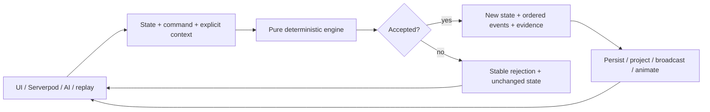

# ADR 0002: Deterministic Game Engine

- Status: Superseded
- Date: 2026-07-12
- Implementation: In progress
- Superseded by: [ADR 0008](0008-rust-engine-ownership-and-strangler-migration.md)

## Context

Local reducers, server resolvers, turn pipelines, replay, and AI once exposed several ways to apply the same rule. Shared helper code did not prevent orchestration from diverging.

## Decision

The current Dart architecture uses one synchronous, side-effect-free engine:

```text
apply(state, domain-or-system-command, explicit context)
  -> accepted or rejected transition
```



The engine:

- performs no filesystem, database, network, clock, logging, localization, Flutter, or Serverpod work;
- receives map, ruleset, actor, command metadata, time, and deterministic entropy explicitly;
- produces equal state, events, evidence, and rejection for equal input;
- returns stable rejection codes and preserves the input state on rejection;
- sorts any iteration order that affects output;
- owns turn and timeout rule transitions through the same public contract.

Adapters authenticate, load, transact, persist, assign offsets, broadcast, log, and project UI effects. AI, replay, and simulations call the same engine rather than private reducers or an approximate mutation path.

## Consequences

The transition function becomes the executable gameplay specification. External inputs are more explicit, and large immutable state may require careful structural sharing.

## Migration And Verification

The Dart result boundary still carries some presentation-oriented evidence and legacy workflow state. These are migration debt, not a second accepted engine contract.

ADR 0008 supersedes the physical implementation owner. Determinism, explicit context, adapter responsibilities, and parity requirements remain binding in Rust.

The command inventory is exhaustive. Architecture and parity tests keep local play, Serverpod, AI, replay, and simulation on the public engine path and reject reintroduction of alternative authoritative pipelines.

## Related Decisions And Documentation

- [ADR 0001: Map and state ownership](0001-map-and-state-ownership.md)
- [ADR 0003: Command boundaries](0003-command-boundaries.md)
- [ADR 0008: Rust engine ownership and strangler migration](0008-rust-engine-ownership-and-strangler-migration.md)
- [Rust engine migration plan](../rust-engine-migration.md)

## Rejected alternatives:

- Keeping separate authoritative reducers for local play, multiplayer, AI, and replay.
- Allowing adapters to supply implicit time, randomness, or actor identity.
- Replacing the production engine in one step before cross-engine parity is proven.
