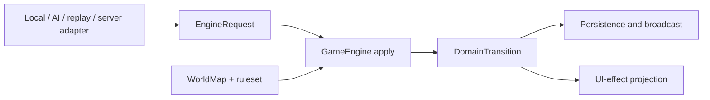

# ADR 0002: Deterministic Game Engine

- Status: Superseded
- Date: 2026-07-12
- Implementation: In progress
- Superseded by: [ADR 0008](0008-rust-engine-ownership-and-strangler-migration.md)

## Context

Local play previously routed authoritative behavior through local reducers,
while multiplayer and simulations also exposed persistent resolvers and turn
pipelines. Although those paths shared many domain rules, their separate
orchestration and state projections allowed behavior to diverge.

This makes local/server divergence possible and complicates replay, AI
simulation, debugging, and tests. The engine also needs time, actor identity,
randomness, map data, and rules, but reading those values from global state or
adapters would make a transition impossible to reproduce.

## Decision

There will be one deterministic `GameEngine` in `aonw_core`. Local play, AI,
replay, simulation, and Serverpod are adapters around that engine rather than
alternative rule implementations.



The engine contract is conceptually:

```text
apply(DomainState, DomainCommand | SystemCommand, EngineContext)
  -> DomainTransition
```

The binding invariants are:

- `GameEngine` is synchronous and side-effect free. It performs no filesystem,
  database, network, clock, logging, localization, Flutter, or Serverpod work.
- `EngineContext` carries every external input needed by rules: immutable
  `WorldMap`, a resolved immutable ruleset/catalog matching the snapshot's
  pinned version/hash, authoritative actor, command tick/id and expected-turn
  metadata, current UTC instant when a rule truly depends on time, and an
  immutable random seed plus any recorded entropy/counter state. The
  authoritative turn, match-selected rule parameters, and rule-affecting
  deadlines remain in `DomainState`; the context never carries an ambient
  mutable random source.
- Equal state, command, and context produce equal next state, domain events,
  and rejection. Iteration order that affects output is explicitly sorted.
- `DomainTransition` contains acceptance/rejection, the resulting state,
  domain events, and a stable rejection reason code. A rejection preserves the
  input state. The result does not contain widgets, localized strings,
  animations, database rows, or transport envelopes.
- Adapters authenticate, load, transact, persist, assign offsets, broadcast,
  log, and project UI effects. They may retry an engine call only with the same
  complete request.
- Turn phases and timeout resolution are domain operations invoked through the
  same engine contract. A server timeout may choose a command/context, but it
  does not own separate turn rules.
- AI searches and simulations use the public engine contract. They do not call
  private reducers or approximate command effects with a second rules engine.
  Heuristic scoring projections may remain approximate when named as such.
- The server remains authoritative for multiplayer ordering and persistence;
  authority does not justify different game rules.

## Consequences

One transition function becomes the executable specification for gameplay.
Parity tests become simple fixture comparisons, replay can reproduce server
behavior, and AI evaluates the same legality and outcomes as a player command.

Adapters become more explicit because all nondeterministic inputs must be
captured before calling the engine. The transition may need optimized immutable
updates for large states. Moving current behavior is risky, so extraction must
be guarded by characterization and parity tests rather than a rewrite.

Rejected alternatives:

- maintaining local and server reducers permanently accepts semantic drift;
- injecting repositories or clocks into reducers hides nondeterminism;
- using server endpoints as the engine prevents offline play, fast AI search,
  and deterministic replay.

## Migration And Verification

The command families are routed through one `GameEngine`, but the exact result
boundary is not complete yet. Some handlers still update persisted interaction
workflow state, and `GameEngineResult` still carries animation-oriented facts
and a snapshot envelope rather than only the next `DomainState` plus ordered
domain facts. Those are explicit transitional exceptions.

The completed portion at the authoritative runtime boundary is:

- every concrete `DomainCommand` is exhaustively assigned to exactly one
  `GameEngine` command family;
- `LocalCommandResolver` and `ServerCommandReducer` authenticate and prepare
  context, then invoke the same engine;
- live AI dispatch, replay, economy simulation, and MCTS simulation execute
  domain commands through that engine;
- simultaneous simulation turns submit `SubmitTurnCommand` through the engine
  instead of invoking economy, movement, fog, or objective processors directly;
- the retired `EndTurnReducer` and `PersistentTurnPipeline` adapter entry points
  no longer exist;
- local reducers and projections own only interaction and presentation state.
  They may refresh selection or targeting after an accepted transition, but
  they do not recalculate authoritative domain outcomes.

Command-family handlers, the canonical turn pipeline, and lower-level domain
processors remain implementation details composed behind `GameEngine`. Their
public types support focused domain tests, but production adapters and runnable
simulation tooling are guarded from calling them as alternative engines.
Heuristic scoring and planning may remain approximate only when they do not
mutate an authoritative substitute state.

Conformance is ratcheted by the exhaustive command inventory and the
family-specific engine contract tests. Additional architecture tests verify
the local/server/AI/replay call sites, prevent direct persistent turn processor
calls, keep retired entry points removed, and keep presentation synchronization
free of fog-of-war and diplomacy recalculation. Fixture and parity suites cover
rejection behavior, turn finalization, canonical snapshot preservation, and
MCTS/world-map execution through the shared engine.

## Related Decisions And Documentation

- [ADR 0008: Rust Engine Ownership And Strangler Migration](0008-rust-engine-ownership-and-strangler-migration.md)
- [ADR 0001: Map And State Ownership](0001-map-and-state-ownership.md)
- [Multiplayer protocol](../multiplayer-protocol.md)
