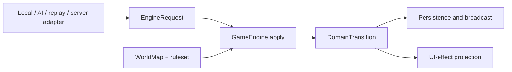

# ADR 0002: Deterministic Game Engine

- Status: Accepted
- Date: 2026-07-12
- Implementation: In progress

## Context

Local play currently routes commands through `GameStateReducer` and
`LocalCommandResolver`. Multiplayer routes them through `ServerCommandReducer`
and a set of persistent resolvers and turn pipelines. The paths share many
domain rules, but orchestration, command routing, state shapes, and turn
finalization are not yet one implementation.

This makes local/server divergence possible and complicates replay, AI
simulation, debugging, and tests. The engine also needs time, actor identity,
randomness, map data, and rules, but reading those values from global state or
adapters would make a transition impossible to reproduce.

## Decision

There will be one deterministic `GameEngine` in `aonw_core`. Local play, AI,
replay, simulation, and Serverpod are adapters around that engine rather than
alternative rule implementations.



The engine contract is conceptually:

```text
apply(DomainState, DomainCommand | SystemCommand, EngineContext)
  -> DomainTransition
```

The binding invariants are:

- `GameEngine` is synchronous and side-effect free. It performs no filesystem,
  database, network, clock, logging, localization, Flutter, or Serverpod work.
- `EngineContext` carries every external input needed by rules: immutable
  `WorldMap`, a resolved immutable ruleset/catalog matching the snapshot's
  pinned version/hash, authoritative actor, command tick/id and expected-turn
  metadata, current UTC instant when a rule truly depends on time, and an
  immutable random seed plus any recorded entropy/counter state. The
  authoritative turn, match-selected rule parameters, and rule-affecting
  deadlines remain in `DomainState`; the context never carries an ambient
  mutable random source.
- Equal state, command, and context produce equal next state, domain events,
  and rejection. Iteration order that affects output is explicitly sorted.
- `DomainTransition` contains acceptance/rejection, the resulting state,
  domain events, and a stable rejection reason code. A rejection preserves the
  input state. The result does not contain widgets, localized strings,
  animations, database rows, or transport envelopes.
- Adapters authenticate, load, transact, persist, assign offsets, broadcast,
  log, and project UI effects. They may retry an engine call only with the same
  complete request.
- Turn phases and timeout resolution are domain operations invoked through the
  same engine contract. A server timeout may choose a command/context, but it
  does not own separate turn rules.
- AI searches and simulations use the public engine contract. They do not call
  private reducers or approximate command effects with a second rules engine.
  Heuristic scoring projections may remain approximate when named as such.
- The server remains authoritative for multiplayer ordering and persistence;
  authority does not justify different game rules.

## Consequences

One transition function becomes the executable specification for gameplay.
Parity tests become simple fixture comparisons, replay can reproduce server
behavior, and AI evaluates the same legality and outcomes as a player command.

Adapters become more explicit because all nondeterministic inputs must be
captured before calling the engine. The transition may need optimized immutable
updates for large states. Moving current behavior is risky, so extraction must
be guarded by characterization and parity tests rather than a rewrite.

Rejected alternatives:

- maintaining local and server reducers permanently accepts semantic drift;
- injecting repositories or clocks into reducers hides nondeterminism;
- using server endpoints as the engine prevents offline play, fast AI search,
  and deterministic replay.

## Migration And Verification

The current `GameStateReducer`, `LocalCommandResolver`,
`ServerCommandReducer`, persistent command resolvers, and turn pipelines are
transitional implementations. New rules must be added to shared core logic and
must not create another adapter-specific reducer.

`MctsSimulatedMovementCommandApplier`,
`MctsSimulatedCombatCommandApplier`,
`MctsSimulatedEconomyCommandApplier`, `MctsSimulatedState.apply`, and
`_EconomySimulationCommandApplier` are also explicit transitional command-effect
implementations. They must not gain new authoritative behavior. Each is removed
when its command family uses `GameEngine`; a remaining heuristic must be named
as a scoring approximation and cannot mutate a substitute authoritative state.

Before moving behavior, add fixture-based parity tests that apply the same
serialized state, command, map, rules, actor, time, and seed through the local
and server paths and compare acceptance, canonical state, and domain events.
Then extract one command family at a time behind `GameEngine`, keeping the
fixture green. Remove an old branch only after replay, AI, local, and server
callers use the shared path.

Verification must include deterministic repeat tests, different-iteration-order
fixtures, command rejection parity, turn-finalization parity, and a guard that
keeps the engine free of adapter/framework imports and direct wall-clock or
random-number access.

## Related Decisions And Documentation

- [ADR 0001: Map And State Ownership](0001-map-and-state-ownership.md)
- [Multiplayer protocol](../multiplayer-protocol.md)
