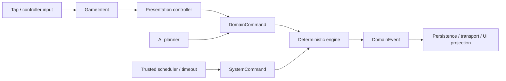

# ADR 0003: Command Boundaries

- Status: Accepted
- Date: 2026-07-12
- Implementation: Implemented

## Context

The old `GameCommand` hierarchy mixed authoritative gameplay with taps, selection, focus, targeting modes, and panel workflow. That made it possible for a Flutter interaction detail to enter replay or multiplayer.

## Decision

Input and output use four distinct categories:

| Type | Responsibility |
| --- | --- |
| `GameIntent` | Presentation input and local interaction state. Never persisted or sent as an authoritative command. |
| `DomainCommand` | Immutable player request to change authoritative state. The only client-originated input accepted by the engine. |
| `SystemCommand` | Trusted deterministic transition such as timeout or forced finalization. Never exposed through the player command endpoint. |
| `DomainEvent` | Accepted domain fact. Not a command, UI effect, or log instruction. |

Actor identity, match id, client request id, tick, expected turn/offset, and authentication evidence belong to the command envelope or context. The server derives the actor from the authenticated session and rejects conflicting payload data.

The domain and trusted command codecs are separate, exhaustive, and fail closed for unknown or partial variants. UI effects are projections of accepted events plus local interaction state.

AI emits normal `DomainCommand` values through the public engine contract.

## Consequences

Replay and multiplayer contain portable authoritative intent, while presentation can change without a wire migration. Trusted server transitions remain auditable instead of masquerading as player input.

Controllers may translate one intent into local state and later into a complete domain command. That two-step interaction is deliberate.

## Migration And Verification

- the umbrella `GameCommand` type remains removed;
- transport, replay, AI, and server player APIs accept `DomainCommand` only;
- timeout history stores `RecordedSystemCommand`;
- architecture tests reject `GameIntent` in transport, event-log, and server boundaries;
- adding a serializable command requires codec round-trip and completeness tests.

## Related Decisions And Documentation

- [ADR 0002: Deterministic game engine](0002-deterministic-game-engine.md)
- [ADR 0004: Versioned multiplayer protocol](0004-versioned-multiplayer-protocol.md)
- [ADR 0008: Rust engine ownership and strangler migration](0008-rust-engine-ownership-and-strangler-migration.md)

## Rejected alternatives:

- Persisting presentation intents as authoritative gameplay commands.
- Exposing trusted system transitions through the player command endpoint.
- Maintaining separate command hierarchies for local play, AI, replay, and multiplayer.
