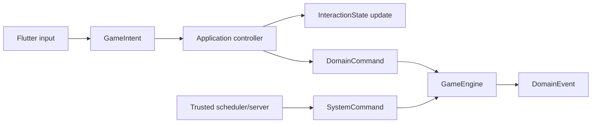

# ADR 0003: Command Boundaries

- Status: Accepted
- Date: 2026-07-12
- Implementation: Complete

## Context

The former sealed `GameCommand` hierarchy represented both authoritative game
changes and client-only interaction. It included movement, production, combat,
and turn commands, but also taps, selection, focus, targeting modes, and panel
workflow. That umbrella made it possible for a Flutter interaction detail to
enter replay or multiplayer paths.

Several commands repeat a player id even when the authenticated server session
already knows the actor. Transport metadata such as match id, tick, turn, and
request id also has different trust and compatibility rules from the domain
intent itself.

## Decision

Input is divided into three explicit categories, and domain events remain a
fourth, output-only category.

The binding invariants are:

- `GameIntent` describes presentation input such as tap, select, focus, open,
  cancel-preview, or targeting-mode changes. It is handled by application/UI
  controllers, may update `InteractionState`, and is never serialized to the
  authoritative event log or multiplayer wire protocol.
- `DomainCommand` is an immutable request to change authoritative
  `DomainState`. It is independent of Flutter, Serverpod, persistence, and
  localization and is the only client-originated command accepted by
  `GameEngine`.
- `SystemCommand` represents a trusted deterministic domain transition such as
  timeout resolution, forced submission, reset, or turn finalization that is
  not a player request. It can be created only by trusted application/server
  services and is distinct from player commands on the wire. Operational jobs
  that do not change `DomainState` remain application work, not system commands.
- `DomainEvent` records an accepted domain fact. It is not a command, UI effect,
  log message, or instruction to an adapter.
- Actor identity, match id, client request id, tick, expected turn/offset, and
  authentication evidence belong to a command envelope/context. The server
  derives actor identity from the authenticated session and rejects a payload
  that conflicts with authoritative context.
- There is one exhaustive domain-command codec in the contracts boundary.
  Unknown types, missing fields, extra unsupported variants, and partial
  mappings fail closed. Mapper completeness and round-trip tests accompany
  every new serializable command.
- A separate exhaustive trusted codec records `SystemCommand`; it is never
  exposed on a player command endpoint. Player history uses
  `RecordedDomainCommand`; trusted server transitions use a tagged
  `RecordedSystemCommand`. Both retain the context needed by their owning
  execution boundary and cannot be decoded as one another.
- UI effects are projections of accepted transitions/events plus local
  interaction state. They do not become domain commands or events merely to
  drive animation.
- AI emits `DomainCommand` through the same public engine contract as a human
  player. It does not bypass validation with private reducer calls.

## Consequences

Replay and multiplayer logs contain only authoritative, portable intent.
Presentation can evolve without changing the wire protocol, and trusted system
actions become auditable instead of being disguised as player input. Actor
spoofing checks have one clear boundary.

Controllers sometimes translate one `GameIntent` into a local interaction
update and later a `DomainCommand`. The type system now prevents transport,
codec, and event-log APIs from accepting that intent directly.

Rejected alternatives:

- one tagged union with an expanding serializer allowlist keeps presentation
  and authority coupled;
- serializing every user gesture creates unstable, non-portable replay data;
- trusting player ids embedded in command bodies duplicates authentication and
  invites confused-deputy bugs.

## Migration And Verification

The migration is complete:

- the `GameCommand` declaration no longer exists;
- `GameIntent` and `DomainCommand` are independent sealed roots;
- `CommandTransport`, `CommandCodec`, replay, AI, MCTS, and server player APIs
  accept `DomainCommand` only;
- client intent resolution lives before the transport boundary;
- the worker picker uses dedicated choose/confirm intents and emits a complete
  authoritative worker command only on confirmation;
- timeout finalization and participant kicks use the independent
  `SystemCommand` root and trusted codec;
- new local log entries are `RecordedDomainCommand`; historical intent records
  decode only as non-dispatchable tombstones;
- server timeout history stores `RecordedSystemCommand`, not a fabricated
  player `SubmitTurnCommand`;
- architecture tests reject reintroduction of the umbrella and reject
  `GameIntent` references in API transport, server, and event-log boundaries.

## Related Decisions And Documentation

- [ADR 0002: Deterministic Game Engine](0002-deterministic-game-engine.md)
- [Multiplayer protocol](../multiplayer-protocol.md)
