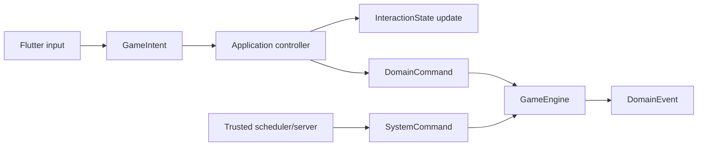

# ADR 0003: Command Boundaries

- Status: Accepted
- Date: 2026-07-12
- Implementation: In progress

## Context

The current sealed `GameCommand` hierarchy represents both authoritative game
changes and client-only interaction. It includes movement, production, combat,
and turn commands, but also taps, selection, focus, targeting modes, and panel
workflow. The serializer can encode many of those interaction commands, so an
implementation detail of the Flutter UI can enter replay or multiplayer paths.

Several commands repeat a player id even when the authenticated server session
already knows the actor. Transport metadata such as match id, tick, turn, and
request id also has different trust and compatibility rules from the domain
intent itself.

## Decision

Input is divided into three explicit categories, and domain events remain a
fourth, output-only category.

The binding invariants are:

- `GameIntent` describes presentation input such as tap, select, focus, open,
  cancel-preview, or targeting-mode changes. It is handled by application/UI
  controllers, may update `InteractionState`, and is never serialized to the
  authoritative event log or multiplayer wire protocol.
- `DomainCommand` is an immutable request to change authoritative
  `DomainState`. It is independent of Flutter, Serverpod, persistence, and
  localization and is the only client-originated command accepted by
  `GameEngine`.
- `SystemCommand` represents a trusted deterministic domain transition such as
  timeout resolution, forced submission, reset, or turn finalization that is
  not a player request. It can be created only by trusted application/server
  services and is distinct from player commands on the wire. Operational jobs
  that do not change `DomainState` remain application work, not system commands.
- `DomainEvent` records an accepted domain fact. It is not a command, UI effect,
  log message, or instruction to an adapter.
- Actor identity, match id, client request id, tick, expected turn/offset, and
  authentication evidence belong to a command envelope/context. The server
  derives actor identity from the authenticated session and rejects a payload
  that conflicts with authoritative context.
- There is one exhaustive domain-command codec in the contracts boundary.
  Unknown types, missing fields, extra unsupported variants, and partial
  mappings fail closed. Mapper completeness and round-trip tests accompany
  every new serializable command.
- A separate exhaustive trusted codec records `SystemCommand`; it is never
  exposed on a player command endpoint. The authoritative log stores a
  `RecordedCommand` envelope with player/system origin plus the complete actor
  or system reason, turn/tick, time, seed/entropy, and other engine context
  needed for deterministic replay. Replay applies both command categories
  through `GameEngine`.
- UI effects are projections of accepted transitions/events plus local
  interaction state. They do not become domain commands or events merely to
  drive animation.
- AI emits `DomainCommand` through the same public engine contract as a human
  player. It does not bypass validation with private reducer calls.

## Consequences

Replay and multiplayer logs contain only authoritative, portable intent.
Presentation can evolve without changing the wire protocol, and trusted system
actions become auditable instead of being disguised as player input. Actor
spoofing checks have one clear boundary.

Controllers must sometimes translate one `GameIntent` into a local interaction
update and later a `DomainCommand`. Existing `GameCommand` call sites and the
large serializer require staged migration. Command envelopes add types but
remove repeated transport metadata from domain values.

Rejected alternatives:

- one tagged union with an expanding serializer allowlist keeps presentation
  and authority coupled;
- serializing every user gesture creates unstable, non-portable replay data;
- trusting player ids embedded in command bodies duplicates authentication and
  invites confused-deputy bugs.

## Migration And Verification

`GameCommand` is the transitional umbrella. `TileTappedCommand`,
`CityTappedCommand`, selection/focus commands, and targeting-mode commands are
known interaction variants that must move to `GameIntent`. Authoritative
variants retain compatibility names while being moved behind the
`DomainCommand` contract. Timeout and lifecycle paths move to `SystemCommand`.
The current synthetic player commands written for timeout processing remain a
compatibility exception until the trusted system record codec and replay path
are available.

Migration proceeds by adding characterization tests for each command family,
introducing the new category at the application boundary, and removing that
variant from the authoritative serializer only after replay/network fixtures
prove it is not persisted or transmitted. Existing saves and logs remain
readable through bounded compatibility codecs. Multi-step worker and pending
action flows must first separate the complete authoritative command from the UI
wizard; they must not be reclassified solely from their current class name.

Architecture tests must prevent presentation intents from entering contracts,
event logs, or server APIs; prevent domain/system commands from importing
adapters; ratchet serializer completeness; and verify that authenticated actor
context wins over or rejects caller-supplied identity.

## Related Decisions And Documentation

- [ADR 0002: Deterministic Game Engine](0002-deterministic-game-engine.md)
- [Multiplayer protocol](../multiplayer-protocol.md)
