# ADR 0004: Versioned Multiplayer Protocol

- Status: Superseded by [ADR 0006](0006-current-version-protocol.md)
- Date: 2026-07-12
- Implementation: In progress

## Context

Shared wire DTOs currently live in `packages/aonw_core/lib/protocol`, while
Serverpod schemas generate RPC, stream, row, server, and client types. The
current top-level envelopes use `kProtocolVersion = 3` and reject every other
version. Nested command/event bodies inherit their envelope version rather than
carrying independent versions. `GameSave.schemaVersion` is a separate
persistence concern.

Version 3 deliberately retired incompatible matches during a coordinated
client/server rollout. This is safe while sessions are short-lived, but it is
not a durable strategy for long-running public matches. Generated Serverpod
types also leak past the intended API adapter in some current presentation
paths, and there is no typed minimum-client/protocol compatibility response.

## Decision

Transport-independent contracts are owned by a logical `contracts` boundary in
`aonw_core`. Serverpod is an adapter that carries those contracts; generated
Serverpod types are never the domain or application API.

```mermaid
flowchart LR
  Raw["Raw transport JSON"] --> Version["Envelope version check"]
  Version --> Upcast["Bounded upcaster chain"]
  Upcast --> Current["Current wire DTO"]
  Current --> Mapper["Contract/domain mapper"]
  Mapper --> Domain["DomainCommand / DomainState"]
  Domain --> Project["Recipient projection"]
  Project --> Encode["Selected write-version envelope"]
  Encode --> Serverpod["Serverpod transport adapter"]
```

The binding invariants are:

- Handwritten wire DTOs, codecs, protocol versions, compatibility policy, and
  upcasters belong to `aonw_core` contracts. Generated Serverpod code is
  read-only derived output and stays inside client/server adapters.
- Domain and application code do not import `aonw_server_client`, Serverpod
  runtime packages, generated rows, or generated transport requests.
- Every authoritative top-level command, event, snapshot, ACK, and match
  envelope declares a protocol version. Nested payloads inherit that version
  unless a future ADR establishes an independently deployed subprotocol.
- Protocol version and save-schema version are independent. A protocol
  upcaster cannot silently stand in for a save migration, or vice versa.
- Raw input is bounded before decoding. Supported old envelopes follow one
  central, sequential, idempotent upcaster chain to the current shape and are
  then decoded strictly. Unknown, future, malformed, or too-old versions fail
  closed.
- Until the first upcaster is implemented, exact-current-version rejection and
  coordinated retirement/migration of old matches remain the supported runtime
  policy. Scattered multi-version conditionals in DTOs are not allowed.
- Breaking field, enum, command, event, redaction, or semantic changes require
  a protocol bump. An optional additive field may remain in the current version
  only when old-new and new-old rollout fixtures prove the default is safe.
- Canonical server state may contain private identifiers and complete domain
  data. A recipient-scoped projection is created before the network boundary;
  an unprojected canonical payload never crosses that boundary and the client
  never performs security redaction. Visible offsets remain monotonic even when
  events are replaced by redacted markers.
- Before join/connect/mutation, the client declares its build, readable
  protocol range, and writable versions. Compatibility is a typed server
  response containing platform, current/minimum/latest builds, the server's
  supported range, one selected write version, and `current`,
  `updateAvailable`, or `updateRequired`. Unsupported clients are blocked before
  state access. Neither side emits a version the peer has not declared readable.
- The selected write version is explicit for the connection/request. If the
  deployment has only one outbound encoder, changing that version requires a
  minimum bridge client that can read the new version and draining older
  sessions first. Concurrent mixed-version delivery is allowed only with
  explicit, fixture-tested encoders for every selected version; an implicit
  downcast from the current DTO is forbidden.
- Generated output and migrations are regenerated in the same change as their
  source contracts, and drift is a CI failure.

## Consequences

The game gains an explicit compatibility boundary and can preserve long-lived
matches through bounded migrations. The domain remains portable across local,
server, and future transports. Recipient projection and minimum-client policy
become enforceable before mutations.

Upcasters and rollout matrices add maintenance cost. Supporting a version has
an operational and testing cost, so the supported window must be deliberate
and bounded. Some current presentation code must be moved behind API adapters.

Rejected alternatives:

- making generated Serverpod types canonical couples the domain to one tool and
  leaks persistence/transport changes across the app;
- permanent lockstep-only deployment discards active matches on every breaking
  change;
- permissive DTO readers with distributed fallbacks make compatibility
  unbounded and impossible to audit.

## Migration And Verification

Today, version 3 exact matching, coordinated rollout, recipient projection, and
generated drift checks are implemented. Upcasters, a supported-version window,
typed minimum-client policy, and a fully sealed generated-code boundary are not.

First ratchet generated Serverpod imports back toward `lib/api` and server
adapters, using a named allowlist for current presentation leaks. Add golden
fixtures for every top-level envelope, strict old/future/malformed rejection,
mapper round trips, projection, ACK/snapshot/event offsets, and generator
completeness. Then introduce the compatibility response before adding the first
old-version upcaster.

Bootstrap the compatibility handshake additively from today's version 3:
deploy a new typed compatibility method while retaining the legacy status
method; temporarily treat a missing capability declaration as legacy
read/write-v3; then release a bridge client that prefers the typed method but
falls back to the legacy method when talking to an older server. Only after the
minimum client is that bridge build may the server require declarations and
eventually remove the legacy endpoint/fallback.

For a breaking rollout: add current/next fixtures and the inbound upcaster;
deploy a server that still selects the old write version; release a bridge
client that reads both versions and writes only the server-selected version;
raise the minimum client to that bridge build and drain older sessions; then
switch the selected writer version and release clients that write the new
version. Retain old readers only for the bounded support window and raise the
minimum protocol after incompatible persisted sessions are migrated or
explicitly retired. Update `docs/multiplayer-protocol.md` with the current
runtime procedure whenever this ADR's implementation state changes.

## Related Decisions And Documentation

- [ADR 0003: Command Boundaries](0003-command-boundaries.md)
- [Multiplayer protocol](../multiplayer-protocol.md)
- [Multiplayer scale-out contract](../multiplayer-scale-out.md)
