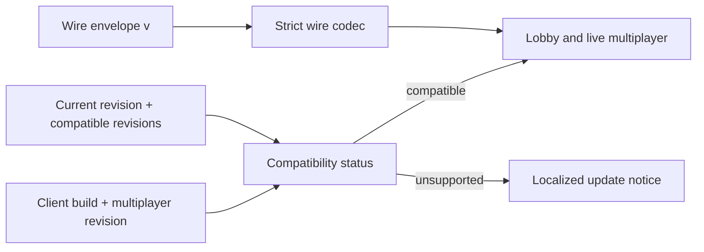

# ADR 0004: Versioned Multiplayer Protocol

- Status: Accepted
- Date: 2026-07-12
- Implementation: Implemented

## Context

Multiplayer evolves on two different schedules. A serialized command, event,
snapshot, ACK, or match envelope changes only when its wire shape changes.
Player-visible rules, projection, ordering, retry behavior, or server policy
can change without changing that JSON shape. Treating both as one exact-match
number either blocks safe rolling releases or makes compatibility implicit.

The first deployed envelopes use wire version 3. Clients released before a
compatibility handshake do not declare a functional multiplayer revision. The
existing main-menu update notice already has localized text for a client that
must wait for or install a newer release.

## Decision

ADR 0004 is the single source of truth for multiplayer compatibility. No
separate current-version ADR is maintained.

Two explicit versions are maintained:

- `kCurrentMultiplayerVersion` is the functional multiplayer contract. Every
  change to online rules, ordering, projection, retry, matchmaking, transport,
  or compatibility behavior increments it, even when the wire JSON is
  unchanged.
- `kProtocolVersion` is the serialized top-level envelope schema. It increments
  only when the wire shape or meaning can no longer be represented by the
  existing schema.

The binding invariants are:

- `kCompatibleMultiplayerVersions` is the reviewed set of older functional
  revisions the current server can safely serve. The current revision is
  always included. A revision is retained only when old and new clients have
  fixture-tested behavior for the changed surface.
- The compatibility handshake sends the client build and
  `kCurrentMultiplayerVersion`. A missing declaration is mapped only to the
  named `kLegacyUndeclaredMultiplayerVersion`, never guessed from arbitrary
  request data.
- A current or explicitly backward-compatible revision may enter multiplayer.
  An absent legacy revision that is still listed remains compatible during the
  bridge window.
- A removed, malformed-equivalent, or future multiplayer revision returns the
  existing `soon` app-status code. The client presents
  `mainMenuUpdateSoonTitle` and `mainMenuUpdateSoonBody`; transport errors are
  not used as the user-facing compatibility signal.
- Every authoritative command, event, snapshot, ACK, and match envelope carries
  `v`. Wire decoders accept only explicitly supported wire schemas and fail
  closed for missing, malformed, future, or retired schemas.
- A functional revision does not make incompatible wire schemas readable.
  Supporting an older wire schema requires an explicit bounded reader/upcaster
  and, when responses differ, an explicit encoder selected for that peer.
- Optional additive wire fields may keep the same wire schema only when absent
  defaults are safe in both rollout directions. The functional multiplayer
  revision still increments.
- Protocol version and save-schema version remain independent. Neither is an
  implicit migration for the other.
- Canonical state is recipient-projected before transport. Compatibility never
  weakens fog, audience, event ordering, offset monotonicity, or command
  idempotency.
- Shared DTOs, compatibility constants, and codecs belong to `aonw_core`.
  Generated Serverpod models remain adapter output and are regenerated in the
  same change as their source endpoint or model contract.

The bootstrap revision is multiplayer version 2. Undeclared clients represent
legacy revision 1, and revisions 1 and 2 are compatible because this change
adds only the optional status declaration. Wire envelopes remain at version 3.

## Consequences

Compatible additive releases can roll out without disconnecting existing
players, while incompatible clients receive a localized update message before
multiplayer fails. Wire migrations remain strict and auditable instead of
being hidden in a broad semantic version check.

Every multiplayer change now carries a small review cost: increment the
functional revision, decide which older revisions remain safe, update rollout
fixtures, and regenerate Serverpod output when endpoint or model signatures
change. Keeping an older revision is a tested support promise, not a default.

Rejected alternatives:

- exact-current matching for every change prevents safe compatible rollouts;
- one version for both functional behavior and wire shape forces needless
  downcasters or hides behavioral incompatibility;
- permissive readers and scattered fallbacks create an unbounded compatibility
  surface;
- maintaining a second compatibility ADR duplicates and can contradict this
  policy.

## Migration And Verification

The app-status endpoint accepts an optional multiplayer revision. Current
clients send revision 2; older clients omit it and are interpreted as reviewed
legacy revision 1. Both are compatible today. Unsupported revisions and older
application builds return `soon`, which is already rendered by the localized
main-menu update block.

For every multiplayer change:

1. increment `kCurrentMultiplayerVersion`;
2. classify the change as compatible or incompatible for each previously
   supported revision;
3. retain only proven compatible revisions in
   `kCompatibleMultiplayerVersions`;
4. bump `kProtocolVersion` as well when a wire envelope is incompatible;
5. add old/new status, codec, retry, reconnect, recipient-projection, and
   rollout fixtures appropriate to the changed surface;
6. regenerate Serverpod output when an endpoint or generated model changed;
7. update `docs/multiplayer-protocol.md` with the active revision table.

For an incompatible rollout, deploy the status-aware server before requiring
the new client. The old revision is removed from the compatible set only when
the newer client is becoming available. During the store propagation window,
old clients receive the translated update notice. Persisted matches are kept
only when their wire schema and domain semantics can be migrated explicitly;
otherwise they are retired deliberately rather than decoded heuristically.

Contract tests cover current, undeclared legacy, removed, and future functional
revisions. Codec tests cover supported and unsupported wire versions. Generated
drift, recipient projection, ACK/retry, reconnect, and architecture boundaries
remain CI gates.

## Related Decisions And Documentation

- [ADR 0001: Map And State Ownership](0001-map-and-state-ownership.md)
- [ADR 0003: Command Boundaries](0003-command-boundaries.md)
- [ADR 0005: Immutable Deployment Promotion](0005-immutable-deployment.md)
- [Multiplayer protocol](../multiplayer-protocol.md)
- [Multiplayer scale-out contract](../multiplayer-scale-out.md)
