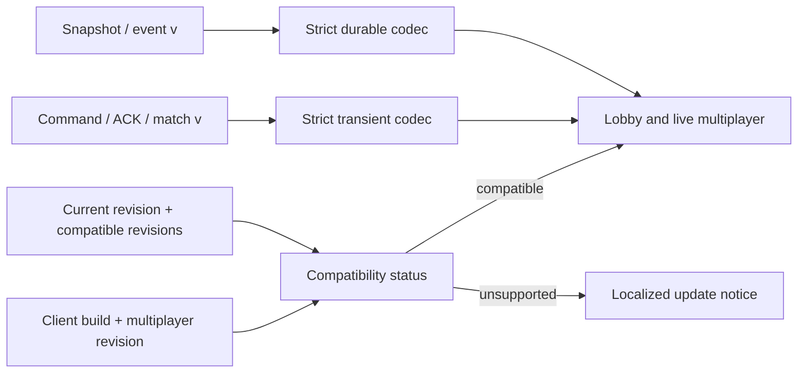

# ADR 0004: Versioned Multiplayer Protocol

- Status: Accepted
- Date: 2026-07-12
- Implementation: Implemented

## Context

Multiplayer evolves on three different schedules. Transient command, ACK, and
match envelopes change with the active peer protocol. Durable snapshot and
event envelopes change only with an explicit storage rollout. Player-visible
rules, projection, ordering, retry behavior, or server policy can change
without changing either JSON shape. Treating all three as one exact-match
number either blocks safe rolling releases or makes compatibility implicit.

The first deployed envelopes use wire version 3. Clients released before a
compatibility handshake do not declare a functional multiplayer revision. The
existing main-menu update notice already has localized text for a client that
must wait for or install a newer release.

## Decision

ADR 0004 is the single source of truth for multiplayer compatibility. No
separate current-version ADR is maintained.

Three explicit versions are maintained:

- `kCurrentMultiplayerVersion` is the functional multiplayer contract. Every
  change to online rules, ordering, projection, retry, matchmaking, transport,
  or compatibility behavior increments it, even when the wire JSON is
  unchanged.
- `kProtocolVersion` is the transient command, ACK, and match envelope schema.
  It increments when one of those peer-facing shapes or meanings becomes
  incompatible.
- `kSnapshotEventVersion` is the durable snapshot and event envelope
  schema used by storage and by standalone or nested transport. It increments
  only with an explicit expand/contract and rollback plan for stored payloads.

The binding invariants are:

- `kCompatibleMultiplayerVersions` is the reviewed set of older functional
  revisions the current server can safely serve. The current revision is
  always included. A revision is retained only when old and new clients have
  fixture-tested behavior for the changed surface.
- The compatibility handshake sends the client build and
  `kCurrentMultiplayerVersion`. A missing declaration is mapped only to the
  named `kLegacyUndeclaredMultiplayerVersion`, never guessed from arbitrary
  request data.
- A current or explicitly backward-compatible revision may enter multiplayer.
  An absent legacy revision that is still listed remains compatible during the
  bridge window.
- A removed, malformed-equivalent, or future multiplayer revision returns the
  existing `soon` app-status code. The client presents
  `mainMenuUpdateSoonTitle` and `mainMenuUpdateSoonBody`; transport errors are
  not used as the user-facing compatibility signal.
- Every authoritative command, event, snapshot, ACK, and match envelope carries
  `v`. Each decoder receives the reviewed version or bounded readable set for
  that envelope family and fails closed for missing, malformed, future, or
  retired schemas. Nested envelopes validate their own family version; during
  the current durable expansion an ACK v4 may contain any explicitly readable
  snapshot schema from v3 through v6.
- A functional revision does not make incompatible wire schemas readable.
  Supporting an older wire schema requires an explicit bounded reader/upcaster
  and, when responses differ, an explicit encoder selected for that peer.
- Optional additive wire fields may keep the same wire schema only when absent
  defaults are safe in both rollout directions. The functional multiplayer
  revision still increments.
- Protocol version and save-schema version remain independent. Neither is an
  implicit migration for the other.
- Canonical state is recipient-projected before transport. Compatibility never
  weakens fog, audience, event ordering, offset monotonicity, or command
  idempotency.
- Shared DTOs, compatibility constants, and codecs belong to `aonw_core`.
  Generated Serverpod models remain adapter output and are regenerated in the
  same change as their source endpoint or model contract.

The bootstrap revision is multiplayer version 2. Undeclared clients represent
legacy revision 1, and revisions 1 and 2 are compatible because this change
adds only the optional status declaration. Wire envelopes remain at version 3.

Revision 3 added worker automation, persisted `autoWorking` posture,
recipient-scoped snapshots, and redacted event history. Revision 4 adds durable
lobby presence, heartbeat and lease expiry, active-roster start/discovery, and
terminal lobby return. Revision 4 keeps wire envelopes at version 3 because it
uses the existing nullable-command stream message for heartbeat and keeps
presence deadlines server-only. Revisions 1-3 are not functionally compatible
with revision 4 and are excluded from the current compatibility inventory.

Revision 5 adds mandatory `clientMessageId` correlation to every command ACK.
It uses command/ACK/match schema 4 because older ACK producers cannot provide
the correlation key safely. Revisions 1-4 are excluded from the compatibility
inventory. Snapshot and event shapes did not change, so their durable schema
remains strict v3 and no database rewrite is performed. This separation keeps
running matches and replay history readable by both rollout directions and
preserves an N-1 rollback path.

Revision 6 adds authoritative road construction, persisted transport networks,
and infrastructure-aware movement rules. Revision 5 cannot represent an active
road job and would calculate different movement outcomes, so only revision 6 is
functionally compatible. Snapshot/event schema 4 is the write schema for the
new durable state. Revision 6 readers accept the bounded set `{3, 4}`: v3 means
no transport network and is migrated to v4 with save schema 4 on the next
authoritative state write. New events and new matches are written as v4.

The deploy is an expand-and-forward rollout. Before deploy, take and retain a
database backup. Deploy the revision-6 server before distributing or enabling
revision-6 clients; revision-5 clients are rejected at status and endpoint
boundaries. After the first v4 write, an N-1 server rollback is intentionally
fail-closed rather than availability-preserving: the v5 server rejects v4 and
must not be used to mutate those matches. Recover with a forward fix, or restore
the predeploy backup before starting the v5 server. Never downcast a v4 match:
doing so would erase roads or reinterpret an active road job.

Revision 7 adds quantitative oil/aluminium stockpiles, production allocation,
atomic resource trade settlement, and authoritative production rejection
codes. Snapshot/event schema 5 and save schema 5 persist stockpile accounts and
queue allocations.

Revision 8 adds the complete seven-resource strategic economy/trade surface and
a deterministic, persisted match-start resource distribution shared by local
and multiplayer games. Snapshot/event schema 6 and save schema 6 persist the
actual generated placements. Readers accept `{3, 4, 5, 6}`; writers emit v6.
Only functional revision 8 is compatible because earlier clients neither apply
the effective map nor present the same trade and production contract.

## Consequences

Compatible additive releases can roll out without disconnecting existing
players, while incompatible clients receive a localized update message before
multiplayer fails. Wire migrations remain strict and auditable instead of
being hidden in a broad semantic version check.

Every multiplayer change now carries a small review cost: increment the
functional revision, decide which older revisions remain safe, update rollout
fixtures, and regenerate Serverpod output when endpoint or model signatures
change. Keeping an older revision is a tested support promise, not a default.

Rejected alternatives:

- exact-current matching for every change prevents safe compatible rollouts;
- one version for both functional behavior and wire shape forces needless
  downcasters or hides behavioral incompatibility;
- permissive readers and scattered fallbacks create an unbounded compatibility
  surface;
- maintaining a second compatibility ADR duplicates and can contradict this
  policy.

## Migration And Verification

The app-status endpoint accepts an optional multiplayer revision. Current
clients send revision 8. Undeclared clients still map deterministically to
legacy revision 1. Revisions 1 and 2 cannot decode every worker-automation
command and persisted posture variant; revision 3 does not send lobby
heartbeats or implement lease-driven roster and terminal-return behavior;
revision 4 cannot correlate command ACKs after a timeout; revision 5 cannot
represent road jobs or infrastructure-aware movement; revisions 6 and 7 do
not implement the current strategic economy and effective-map contract. All older revisions
return `soon`, which is rendered by the localized main-menu update block.
Release clients fail closed while this check is pending and do not open or
resume multiplayer when it reports `soon`. Every authenticated multiplayer
endpoint and the streaming connection also require the declared revision and
reject missing, removed, or future revisions with
`unsupported_multiplayer_version`; the UI notice is not the security boundary.

For every multiplayer change:

1. increment `kCurrentMultiplayerVersion`;
2. classify the change as compatible or incompatible for each previously
   supported revision;
3. retain only proven compatible revisions in
   `kCompatibleMultiplayerVersions`;
4. bump the version only for the incompatible envelope family: transient
   `kProtocolVersion`, durable `kSnapshotEventVersion`, or both;
5. add old/new status, codec, retry, reconnect, recipient-projection, and
   rollout fixtures appropriate to the changed surface;
6. regenerate Serverpod output when an endpoint or generated model changed;
7. update `docs/multiplayer-protocol.md` with the active revision table.

For an incompatible rollout, deploy the status-aware server before requiring
the new client. The old revision is removed from the compatible set only when
the newer client is becoming available. During the store propagation window,
old clients receive the translated update notice. Persisted matches are kept
only when their wire schema and domain semantics remain supported or can be
migrated through a rollback-safe expand/contract plan; otherwise they are
retired deliberately rather than decoded heuristically. Revision 8 reads v3-v6
snapshot/event rows and writes v6 on new events, new matches, and the next
authoritative mutation of an older match. Mixed ACK-v4/durable-v3-v5 payloads
are valid only inside this bounded expansion.

Contract tests cover current, undeclared legacy, removed, and future functional
revisions. Codec tests cover supported and unsupported wire versions. Generated
drift, recipient projection, ACK/retry, reconnect, and architecture boundaries
remain CI gates.

## Related Decisions And Documentation

- [ADR 0001: Map And State Ownership](0001-map-and-state-ownership.md)
- [ADR 0003: Command Boundaries](0003-command-boundaries.md)
- [ADR 0005: Immutable Deployment Promotion](0005-immutable-deployment.md)
- [Multiplayer protocol](../multiplayer-protocol.md)
- [Multiplayer scale-out contract](../multiplayer-scale-out.md)
