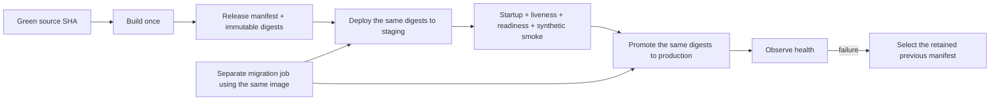

# ADR 0005: Immutable Deployment Promotion

- Status: Accepted
- Date: 2026-07-12
- Implementation: In progress

## Context

The repository has pinned toolchains, fail-closed Compose overlays, a protected Docker context, release checks, and readiness probes. The remaining host-side source pull/build path can still produce different bytes for staging and production from the same source revision.

Server startup can also apply migrations, coupling application replicas to a singleton schema mutation.

## Decision

A release is one immutable artifact set built once from a selected green source SHA and promoted unchanged.

A release manifest binds:

- source SHA and application versions;
- server image digest;
- hashes of static, mobile, and desktop artifacts;
- migration and deployment configuration revision;
- available provenance, SBOM, and signatures.

Staging and production consume the same manifest and image digest. Tags are discovery metadata, not deployment identity.

Database migration is a separate observable job using the same image. Normal application startup does not own schema mutation. Schema changes use expand/contract so the previous application remains compatible during rollback.

A deploy must name the environment and manifest explicitly. Environment configuration and secrets may differ; artifact bytes may not.

Cutover verifies startup, liveness, readiness, and synthetic smoke before traffic moves. Until multiplayer has shared live fan-out, only one API instance accepts match mutations at a time.

Rollback selects the retained previous manifest. It does not rebuild or casually reverse the migration.

## Consequences

Build-once promotion makes deployed bytes traceable to one reviewed source revision and keeps staging representative of production. It also requires manifest retention, separate migration operations, artifact storage, and explicit rollback drills.

## Current state

Implemented foundations include release gates, pinned inputs, Docker-context protection, explicit Compose overlays, configuration checks, readiness, and an environment-neutral manifest schema.

Still transitional:

- the server image can be built from source on the host;
- manifest materialization and promotion are incomplete;
- migrations are not fully separated from startup;
- canary, journaled resume, provenance, and automatic rollback are not complete.

Do not describe the current workflow as build-once promotion until these gaps are closed.

## Migration And Verification

The completed implementation must prove that one build creates one digest, staging and production use it unchanged, tag-only deploys fail, application startup cannot migrate, health failure preserves or restores the previous release, and Compose/Caddy/config revisions match the manifest.

See [build-and-deploy.md](../build-and-deploy.md) and [multiplayer-scale-out.md](../multiplayer-scale-out.md).

## Related Decisions And Documentation

- [Build and deploy runbook](../build-and-deploy.md)
- [Multiplayer scale-out](../multiplayer-scale-out.md)
- [ADR 0004: Versioned multiplayer protocol](0004-versioned-multiplayer-protocol.md)

## Rejected alternatives:

- Rebuilding independently on staging and production hosts.
- Treating a mutable image tag as deployment identity.
- Running schema migrations implicitly in every application replica at startup.
