# ADR 0005: Immutable Deployment Promotion

- Status: Accepted
- Date: 2026-07-12
- Implementation: In progress

## Context

The repository now has fail-closed Compose profiles, a default-deny server
build context, pinned base images, local/release gates, and readiness checks.
However, the current deploy path still pulls source on the host and builds a
server image there. Staging and production can therefore run artifacts built at
different times even when they refer to the same source version. There is no
release manifest that binds source SHA, server digest, static artifacts,
configuration, migrations, and rollback target.

Server startup can also apply migrations. That couples a horizontally scaled
process lifecycle to a singleton schema mutation and makes rollback harder.
The current live multiplayer contract supports one active API instance or
strict per-match affinity, so drain and rollback must preserve reconnect and
snapshot-authoritative recovery.

## Decision

A release is an immutable, verifiable artifact set built once from a gated
source identity and promoted unchanged through environments.

```mermaid
flowchart LR
  Gate["Green tag / source SHA"] --> Build["Build once in CI"]
  Build --> Manifest["Release manifest + image digest + artifact hashes"]
  Manifest --> Staging["Deploy digest to staging"]
  Staging --> Verify["Smoke / SLO / approval"]
  Verify --> Production["Promote same digest to production"]
  Production --> Observe["Observe and retain N-1"]
  Observe -->|failure| Rollback["Previous manifest/digest"]
```

The binding invariants are:

- Only an explicitly selected green tag/source SHA can create a release.
  A release gate records and verifies that exact identity before publication.
- CI builds the server image and every distributable artifact once. The server
  image is referenced by immutable `image@sha256` digest; version/SHA tags are
  discovery metadata, not deployment identity.
- A versioned release manifest binds source SHA, application versions, server
  digest, static/mobile/desktop artifact hashes, migration/config revision, and
  available provenance/SBOM/signatures. Staging and production consume that
  manifest rather than rebuilding.
- Promotion changes only environment-specific configuration and secrets. It
  never changes artifact bytes. The root deployment `.env` cannot choose the
  source revision, mutable image tag, or Serverpod run mode.
- Every mutating deploy requires an explicit environment and release manifest
  or digest. There is no implicit staging target that can hide a missing
  argument. Remote checkout and versioned Compose/Caddy configuration must
  match the manifest source revision before mutation.
- Database migration is a separate, observable one-shot job using the same
  image digest. Normal application startup has automatic migrations disabled.
  Schema changes follow expand/contract: deploy backward-compatible expansion,
  migrate/backfill, deploy readers/writers, then remove old shape in a later
  release.
- Deployment order is validate manifest/config, run the backward-compatible
  expansion migration while the old release still serves, start the
  replacement/canary outside live match mutation traffic, pass startup,
  liveness, readiness, and synthetic smoke, then mark the old release unready,
  drain it, and perform an atomic cutover. Live multiplayer smoke and SLO
  observation follow the cutover.
- Rollback selects the previously retained manifest/digest. It does not rebuild
  or reverse a schema migration; expand/contract keeps the prior application
  compatible with the expanded schema.
- Until a shared committed event bus exists, deployment preserves one active
  API instance or strict per-match affinity. Reconnect loads a recipient-scoped
  authoritative snapshot before newer offset markers. A pre-cutover canary
  must not receive real match mutations; cutover establishes one mutation
  target before the canary becomes live.
- Runtime secrets remain outside images and manifests. Root Compose plus the
  required staging/production overlay remains the runtime topology contract;
  Caddy remains the public ingress contract and Insights remains loopback-only.

## Consequences

The exact artifact tested in staging is the artifact deployed to production,
and rollback becomes selection of known bytes rather than a best-effort rebuild.
Release evidence can be audited and reproduced. Separate migrations remove
startup races and enable controlled schema ownership.

CI needs an image/artifact registry, manifest storage, retention policy,
promotion controls, and provenance. Deploy tooling becomes stricter and cannot
silently infer environment or version. Expand/contract may require temporary
dual reads/writes and multiple releases for a schema change.

Rejected alternatives:

- rebuilding per environment cannot prove byte identity and makes rollback
  non-reproducible;
- deploying mutable tags such as `latest` makes the manifest ambiguous;
- running migrations in every application process risks races and couples
  schema mutation to restarts.

## Migration And Verification

Implemented foundations are the gated release flow, pinned inputs, protected
Docker context, explicit Compose run-mode overlays, config validation,
readiness deployment gate, the strict environment-neutral manifest schema, and
separate static build/upload seams. Build-once image publication, manifest
materialization and promotion, separate migration jobs, journaled resume,
canary/automatic rollback, and provenance are not yet implemented. Current
host-side source pull/build is a transitional path, not the accepted end state.

Migrate by first publishing a digest and minimal manifest without changing the
host topology. Next make staging pull that digest with `build` disabled, split
migration from server startup, and record smoke/SLO evidence. Only then allow an
approval to promote the same manifest to production and add automatic rollback
to the retained N-1 digest.

Verification must prove: one build produces one digest; staging and production
receive the same digest; tag-only or missing-manifest deploys fail; normal app
startup cannot migrate; migration concurrency is bounded; health failure keeps
or restores the previous digest; and Compose/Caddy/config revisions match the
manifest. Existing Compose, Docker context, proxy, readiness, Serverpod drift,
integration, and release-SHA guards remain mandatory.

## Related Decisions And Documentation

- [Build and deploy runbook](../build-and-deploy.md)
- [Multiplayer scale-out contract](../multiplayer-scale-out.md)
- [Serverpod Insights runbook](../serverpod-insights-runbook.md)
