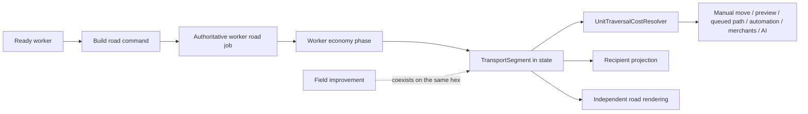

# ADR 0006: Transport Infrastructure Ownership And Traversal

- Status: Accepted
- Date: 2026-08-11
- Implementation: Implemented

## Context

Roads affect movement, rendering, fog, saves, replay, AI, and multiplayer. Treating them as field improvements would prevent a farm or mine from sharing a hex and would mix economic yield with pathfinding.

Applying a road discount in every movement caller would also let previews, queued paths, automation, merchants, AI, and authoritative commands disagree.

## Decision

Transport is an independent aggregate in authoritative state.

`TransportNetworkState` stores deterministic `TransportSegment` values keyed by hex. A segment may coexist with a field improvement and records its kind, condition, builder, and optional originating city.

The binding rules are:

- road construction is an authoritative command;
- only a ready worker may start a legal road job on passable, non-city-center, non-foreign land;
- starting the job consumes current movement;
- completion uses the worker economy phase and does not consume the worker's field-improvement charge;
- every land movement path uses `UnitTraversalCostResolver`;
- an operational road reduces a passable land entry cost but never makes blocked terrain passable;
- roads do not affect naval or air movement;
- manual movement, previews, queued paths, auto-explore, workers, merchants, and AI use the same resolver;
- recipient projections expose roads according to remembered static-map visibility;
- road rendering is separate from economic improvements.

Connectivity is derived from segments and city positions. It is not persisted as a second graph.

## Consequences

The model can add rails, pillage, repair, diplomacy-based transit, and technology discounts without changing field-improvement ownership.

The first slice supports roads and one segment per hex. City connection bonuses, rails, pillage, and repair need their own rules before implementation.

## Migration And Verification

Tests cover command legality, construction completion, deterministic serialization, schema upcast, land/air/blocked traversal, all movement call sites, recipient projection, HUD localization, and rendering.

The road state, worker job representation, durable codec, functional multiplayer revision, and cross-version fixtures must move together whenever this contract changes.

## Related Decisions And Documentation

- [ADR 0002: Deterministic game engine](0002-deterministic-game-engine.md)
- [ADR 0003: Command boundaries](0003-command-boundaries.md)
- [ADR 0004: Versioned multiplayer protocol](0004-versioned-multiplayer-protocol.md)

## Rejected alternatives:

- Modeling roads as field improvements that cannot coexist with farms or mines.
- Applying road discounts independently in each movement caller.
- Persisting a second connectivity graph alongside transport segments.
