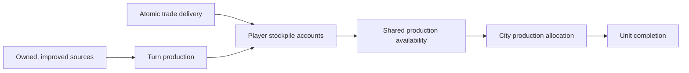

# ADR 0007: Strategic Resource Stockpiles And Production Allocation

- Status: Accepted
- Date: 2026-08-12
- Implementation: Implemented

## Context

The resource network originally modeled every production requirement as a
presence gate: controlling or importing a resource was enough to produce any
number of eligible units. This made extraction volume, stock accumulated over
time, interrupted trade, and competition between city production targets
irrelevant.

Strategic stockpiles affect saves, multiplayer projections, command
acceptance, turn ordering, trade settlement, AI planning, and production UI.
Keeping any of those rules in Flutter or in an AI-only approximation would
allow previews and authoritative simulation to disagree.

## Decision

The domain owns strategic resource economy state and all mutations. Resources
declare one of three economy modes in `ResourceCatalog`: local yield, presence
gate, or stockpiled. The first implemented stockpiled resources are oil and
aluminium; other strategic resources retain their existing presence behavior
until separately balanced.

The binding invariants are:

- an eligible source is a currently controlled territory hex with the
  configured improvement and revealed resource; `builtByCityId` is historical
  metadata, not ownership;
- extraction output is defined by `GameRuleset.resources` and credited once in
  a deterministic position in the economy turn pipeline;
- stockpile accounts store only stockpiled resource types and reject invalid or
  negative bundles;
- starting unit production obtains one authoritative
  `UnitProductionAvailability` quote, including every blocker and the refund
  from the city's current allocation;
- an accepted command debits the selected bundle atomically and persists that
  bundle on the production queue; replacing the target refunds the old bundle
  first, while selecting the same target and bundle is an identity no-op;
- a completed unit never pays again. A completed queue blocked by spawn rules
  keeps its allocation until completion or replacement;
- alternative resource costs require an explicit option in the command or the
  deterministic domain default; presentation code never invents an allocation;
- rush production pays only its gold cost and does not debit or release the
  strategic allocation;
- stockpiled trade transfers the configured quantity only when delivery is
  legal and every leg of an exchange group can settle. Payment and delivery
  are atomic; blocked routes or missing stock do not charge the importer;
- application and multiplayer acknowledgements preserve typed acceptance or a
  rejection code so clients can refresh a stale quote without closing the
  production panel;
- player projections contain only that player's stockpile. Public sources and
  agreements continue to follow their existing visibility policies;
- AI and MCTS use the same quote, reservation, production, and settlement
  semantics as manual commands.

## Consequences

Oil fields, aluminium sources, trade interruption, and competing production
orders now create real opportunity cost. A queue allocation is material already
committed to a city, not a second copy of inventory. Capturing a city transfers
its queue and committed material as spoils; destroying a city destroys the
committed material with its queue.

The UI derives a read model from canonical state. It shows stored, allocated,
available, domestic production, imports, exports, net flow, extraction sources,
and city allocations. Production choices expose all blockers and quantitative
costs. Replacement confirmation shows the release/allocation delta, and a
rejected asynchronous command leaves the panel open.

Rejected alternatives:

- deriving inventory from controlled deposits cannot represent accumulation,
  consumption, or delivery timing;
- charging at unit completion permits unlimited queues and creates ambiguous
  failure after production is already invested;
- maintaining reservations in a separate projection duplicates queue state and
  complicates capture, replacement, and persistence;
- accepting a trade payment when delivery fails makes blockades cosmetic;
- calculating availability independently in Flutter or AI creates preview and
  simulation drift.

Continuous unit upkeep, shortage movement/regeneration penalties, luxury
duplicate effects, and stockpiling iron, coal, uranium, or horses are not part
of this decision. They require separate balance and player-feedback contracts.

All seven strategic resources — iron, coal, oil, aluminium, uranium, horses,
and marble — appear in the shared economy and trade UI. Oil and aluminium use
quantitative stockpiles; the remaining resources use controlled/imported
presence until a later balance decision migrates them to stockpiles.

New matches persist a deterministic initial resource distribution. The shared
generator adds one compatible bonus, luxury, and strategic placement per start
where the map has legal capacity. It excludes authored resources, objectives,
and starting-unit hexes. Persisting placements, rather than regenerating from
the seed, keeps local saves, multiplayer, replay, and future balance revisions
on the exact same effective map.

## Migration And Verification

The stockpile economy is the only strategic-resource model. Older saves remain
readable: obsolete rule fields are ignored and missing accounts decode as
empty. When an older queue does not contain an allocation, changing its target
does not invent a refund. Command JSON carries an optional resource-option
index and remains compatible when it is absent.

Verification covers extraction ownership and technology visibility, turn
ordering, save and projection round trips, atomic allocation and refund,
alternative choices, spawn blocking, rush behavior, quantity trade and barter,
diplomacy route blocking, stale command rejection, UI pending state and
replacement deltas, AI planning, and MCTS canonical parity.

## Related Decisions And Documentation

- [ADR 0001: Map And State Ownership](0001-map-and-state-ownership.md)
- [ADR 0002: Deterministic Game Engine](0002-deterministic-game-engine.md)
- [ADR 0003: Command Boundaries](0003-command-boundaries.md)
- [ADR 0004: Versioned Multiplayer Protocol](0004-versioned-multiplayer-protocol.md)
- [Strategic Resource Economy](../game-design/strategic-resource-economy.md)
