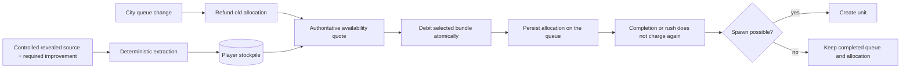

# ADR 0007: Strategic Resource Stockpiles And Production Allocation

- Status: Accepted
- Date: 2026-08-12
- Implementation: Implemented

## Context

A binary "resource present" rule cannot represent extraction volume, stored reserves, interrupted delivery, or competition between production queues.

Stockpiles affect commands, saves, multiplayer projection, turn order, trade, AI, and production UI. Those rules must not be reimplemented independently by Flutter or simulation code.

## Decision

`ResourceCatalog` assigns each resource an economy mode: local yield, presence gate, or quantitative stockpile.

Oil and aluminium currently use stockpiles. Iron, coal, uranium, horses, and marble remain presence-gated until a separate balance decision changes them.

The binding rules are:

- an extraction source is a currently controlled, revealed resource with the configured improvement;
- output is credited once at a deterministic point in turn processing;
- stockpile accounts contain only valid stockpiled resource types and non-negative quantities;
- unit production uses one authoritative availability quote;
- an accepted queue command atomically refunds the city's old allocation, validates the new option, debits stock, and stores the selected bundle on the queue;
- reselecting the same target and bundle is a no-op;
- completion and rush do not charge the resource again;
- a spawn-blocked completed unit keeps its allocation;
- trade payment and delivery settle atomically, including grouped barter legs;
- recipient state contains only the requesting player's stockpile;
- AI and MCTS use the same availability, reservation, and trade rules.

The queue allocation is committed material, not a parallel reservation table. Capturing the city transfers its queue; destroying the city destroys that committed material.

Initial strategic resource placement for new matches is deterministic and persisted. Saves and multiplayer therefore use the same effective map even after future generator changes.

## Consequences

Oil and aluminium become real production constraints and trade targets. UI read models show stored, allocated, free, production, imports, exports, sources, and city allocations from canonical state.

Continuous army upkeep, shortage penalties, luxury duplicate effects, and stockpiling the remaining strategic resources are outside this decision.

## Migration And Verification

Tests cover extraction ownership and visibility, turn order, save/projection round trips, allocation/refund, alternative costs, spawn blocking, rush, atomic trade, diplomacy blocking, stale rejection, UI pending state, AI, MCTS, and deterministic resource placement.

See [strategic-resource-economy.md](../game-design/strategic-resource-economy.md).

Any future stockpiled resource or consumption rule must update the catalog, canonical codecs, recipient projection, AI fixtures, and versioned compatibility contract in the same change.

## Related Decisions And Documentation

- [Strategic resource economy](../game-design/strategic-resource-economy.md)
- [ADR 0002: Deterministic game engine](0002-deterministic-game-engine.md)
- [ADR 0003: Command boundaries](0003-command-boundaries.md)
- [ADR 0004: Versioned multiplayer protocol](0004-versioned-multiplayer-protocol.md)

## Rejected alternatives:

- Representing every strategic resource as a binary presence flag.
- Maintaining a second reservation table separate from production queues.
- Charging resources again when production completes or is rushed.
