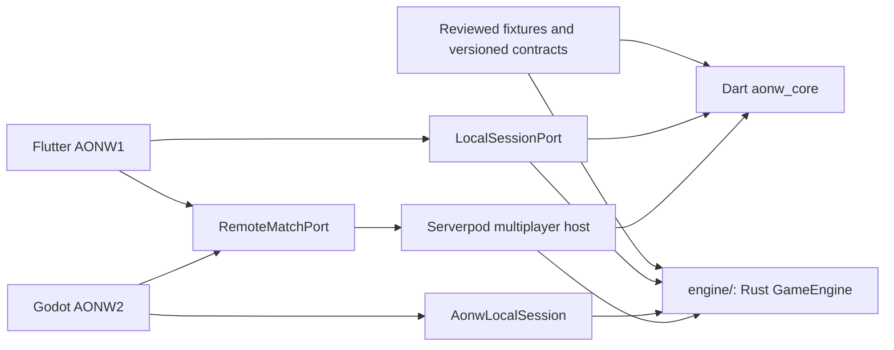

# ADR 0008: Rust Engine Ownership And Strangler Migration

- Status: Accepted
- Date: 2026-08-13
- Implementation: Planned

## Context

ADR 0001 established one authoritative world and game state, and ADR 0002
established one deterministic `GameEngine` for local play, AI, replay,
simulation, and Serverpod. Their current implementation lives in the Dart
package `packages/aonw_core` and is used by a production Flutter client and the
Serverpod backend.

The project now needs a presentation-, framework-, and adapter-independent core
that can power both the existing Flutter AONW1 client and a new Godot AONW2
client. Rust is the target implementation language for that core. The migration
must preserve ongoing Flutter fixes and releases, supported saves and
multiplayer behavior, deterministic replay, and a credible rollback path.

A second permanent rules implementation would allow behavior to drift. A
big-bang rewrite would remove the only production reference before equivalent
behavior, platform packaging, and recovery were proven.

## Decision

The successor implementation of authoritative game rules is a Rust Cargo
workspace rooted at `engine/`. It is introduced through a strangler migration
around the existing deterministic engine contract.

The binding invariants are:

- `engine/` contains the Rust domain, engine, content, contracts, runtime, AI,
  test support, and thin native/Godot adapters. It does not contain either
  presentation client.
- The existing Flutter project remains at the repository root and remains a
  complete buildable and releasable product throughout migration. Moving it to
  a final `clients/flutter/` path is deferred until after Dart Core retirement.
- The Godot presentation client is introduced separately under
  `clients/aonw2_godot/`. Game rules are not implemented in GDScript or Godot
  scenes.
- The language-neutral state, ownership, canonical-versus-recipient separation,
  immutability, determinism, command, and event invariants from ADR 0001, ADR
  0002, and ADR 0003 remain binding. Rust replaces their implementation
  language and physical owner; it does not redefine their semantics.
- `aonw_domain` and `aonw_engine` perform no filesystem, database, network,
  clock, logging, localization, Flutter, Godot, or Serverpod work. Every
  external rule input, including resolved immutable world/ruleset/content
  views and their hashes, is explicit in the engine request or context.
- Domain and engine crates forbid unsafe code. Any necessary unsafe code is
  isolated in audited boundary adapters, has explicit ownership and panic
  containment rules, and never becomes a shortcut around domain invariants.
- `packages/aonw_core` remains the production implementation and compatibility
  reference until explicit cutover gates pass. It is not removed family by
  family from a live product.
- Compatibility is ported before redesign. An intentional rule or schema
  change is reviewed separately from its cross-language port.
- A live local session or multiplayer match is pinned to one primary engine
  backend. Portable saves and replays pin behavior/schema revisions,
  ruleset/content hashes, offsets, and RNG state; producer engine/build identity
  is diagnostic metadata, not a condition of readability. Execution never
  dispatches different command families to different primary engines.
- The committed parity fixtures are an independent oracle. Tools may generate
  candidate data, but neither implementation updates or blesses expected
  results in CI.
- Flutter local play and Serverpod select a complete engine backend. Remote
  multiplayer remains a separate recipient-scoped transport/replica boundary.
  Shadow mode may evaluate a second implementation for comparison, but only the
  primary result is persisted or shown as authoritative.
- Serverpod remains the multiplayer application host and transaction owner. It
  authenticates, orders, locks, persists, assigns offsets, performs post-commit
  delivery and reconnect, and calls the selected engine for authoritative
  transitions. A durable outbox is a separate future capability, not a claim
  about the current implementation.
- Rule-sensitive recipient projection and evidence redaction become a pure Rust
  policy invoked by Serverpod. A client-side remote replica can consume only
  recipient-safe state/events and never depends on canonical `DomainState`.
- Public wire, durable snapshot/event, save, query, engine behavior, ruleset,
  content, fixture, and native ABI versions are separate compatibility axes. A
  language port alone does not change public behavior or schema versions.
- ADR 0004 continues to own the existing Serverpod wire DTOs/codecs during the
  first migration phases. A language-neutral Godot gateway or IDL requires a
  follow-up ADR, explicit protocol ownership, and the applicable
  functional/wire compatibility revision; it is not created implicitly by
  moving engine rules.
- Readers precede writers. A new Rust writer is enabled only after Rust can
  read every supported input and the rollback Dart path can read its output.
- Cutover and rollback apply only to new sessions or matches unless an explicit
  versioned migration proves otherwise. Existing work keeps its pinned engine.

This ADR supersedes the physical ownership decisions in ADR 0001 and ADR 0002.
Their language-neutral state, canonical/recipient separation, immutability,
determinism, context, transition, adapter, AI, and replay invariants are
incorporated and retained here. Their documents remain as the history and
detailed description of the current Dart implementation during migration.

## Consequences

Flutter can continue shipping while Rust is validated behind the existing
behavioral boundary. Godot receives the same rules rather than a second port,
and Serverpod can move authority through shadow and canary stages without
changing its transaction responsibilities.

The repository will temporarily contain two complete rule implementations.
This will increase CI, fixture, packaging, observability, and maintenance cost.
Fixes to already ported behavior must normally be applied to both
implementations while the rollback lane remains active.

Native clients require a stable coarse native ABI or framework adapter. Flutter
Web requires Rust/WASM or an explicit remote-only product decision before the
Dart engine can be retired. Godot and native library versions must be pinned
and released as part of immutable application artifacts.

Rejected alternatives:

- a big-bang rewrite removes production feedback and safe rollback before
  parity is known;
- permanent Dart and Rust engines create two sources of gameplay truth;
- moving the Flutter root at the start creates release-path churn unrelated to
  behavioral migration;
- placing rules in Flutter, GDScript, Serverpod endpoints, or FFI wrappers
  recreates alternative engines;
- using Dart-generated expected output as the CI oracle can certify the same
  bug in both the reference and expected data;
- a networked Rust sidecar before evidence requires it introduces a failure
  boundary inside match transactions.

## Migration And Verification

Migration proceeds through complete, gated slices. First stabilize the pure
Dart `DomainState -> DomainTransition` boundary and versioned query contract.
Then create the `engine/` workspace and a fixture runner, port state and codecs,
complete one representative vertical slice, and expand through all command
families. Local runtime, Flutter shadow execution, Godot, and server authority
follow only after the corresponding parity and platform gates exist.

Before multi-engine rollout, complete-backend modes must be implemented as
`dart_only`, `dart_primary_rust_shadow`, `rust_primary_dart_shadow`,
`rust_primary_dart_standby`, and `rust_only`. Active matches record their
backend/build pin; portable saves and replays record behavior/schema and
content compatibility metadata. A kill switch changes the default for new work
and does not switch an active match halfway through execution.

Each slice verifies complete accepted/rejected output, stable rejection codes,
canonical state and RNG digests, ordered events, rejection-without-mutation,
schema round trips, domain properties, deterministic target output, performance
budgets, and adapter behavior. CI preserves all existing Flutter, Dart, and
Serverpod gates while adding formatting, Clippy, Rust tests, dependency and
unsafe policy, fixture parity, native/GDExtension smoke, and required WASM
checks.

The Dart engine is retired only after all authoritative commands, system
commands, events, queries, saves, replay, AI, recipient projections, supported
platforms, and server recovery paths use Rust; no active server match is pinned
to Dart; supported historical offline formats have a Rust reader/upcaster or an
explicit migration/end-of-support policy; and the rollback window and drills
have completed.

The living sequence, repository layout, slice Definition of Done, and detailed
cutover gates are maintained in the
[Rust Engine Migration Plan](../rust-engine-migration.md).

## Related Decisions And Documentation

- [ADR 0001: Map And State Ownership](0001-map-and-state-ownership.md)
- [ADR 0002: Deterministic Game Engine](0002-deterministic-game-engine.md)
- [ADR 0003: Command Boundaries](0003-command-boundaries.md)
- [ADR 0004: Versioned Multiplayer Protocol](0004-versioned-multiplayer-protocol.md)
- [ADR 0005: Immutable Deployment Promotion](0005-immutable-deployment.md)
- [ADR 0006: Transport Infrastructure Ownership And Traversal](0006-transport-infrastructure.md)
- [ADR 0007: Strategic Resource Stockpiles And Production Allocation](0007-strategic-resource-stockpiles.md)
- [Documentation architecture map](../README.md#architecture)
- [Rust Engine Migration Plan](../rust-engine-migration.md)
