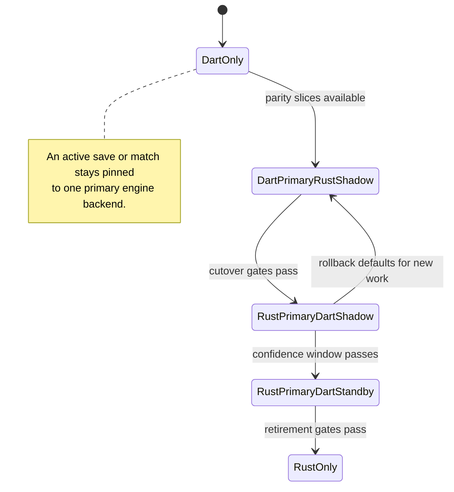

# ADR 0008: Rust Engine Ownership And Strangler Migration

- Status: Accepted
- Date: 2026-08-13
- Implementation: In progress

## Context

The production deterministic engine is implemented in Dart and serves Flutter, AI, replay, and Serverpod. The project also needs one framework-independent rules implementation for the Godot AoNW2 client and future native clients.

A permanent second engine would drift. A big-bang rewrite would remove the production reference and rollback path before parity was proven.

## Decision

The successor authoritative engine is the Rust workspace under `engine/`. It replaces Dart incrementally behind complete engine boundaries.

The language-neutral state, canonical/recipient separation, determinism, explicit context, command, event, AI, and replay rules from ADRs 0001-0003 remain binding.

The binding migration rules are:

- the shipping Flutter app remains at the repository root and stays releasable;
- `packages/aonw_core` remains the production implementation and compatibility reference until cutover gates pass;
- Godot lives under `clients/aonw2_godot/` and contains presentation, not gameplay rules;
- Rust domain and engine crates perform no filesystem, database, network, wall-clock, localization, Flutter, Godot, or Serverpod work;
- production domain and engine crates forbid unsafe code; unavoidable unsafe code is isolated and audited in adapters;
- compatibility is ported before gameplay redesign;
- one save or match is pinned to one primary engine backend;
- command families are never split between engines inside an active session;
- committed fixtures are an independent oracle and are not self-blessed by either implementation;
- shadow execution may compare a second engine, but only the primary result is persisted or displayed;
- Serverpod remains the online host, lock/transaction owner, persistence boundary, offset allocator, and delivery/reconnect service;
- rule-sensitive recipient projection moves with the Rust engine and never allows a remote client to reconstruct canonical state;
- public wire, durable state, save, query, behavior, content, fixture, and native ABI versions remain separate compatibility axes;
- readers precede writers;
- cutover defaults apply to new work unless an explicit migration proves active work can move safely.

This ADR supersedes the physical ownership decisions in ADRs 0001 and 0002, not their invariants.

## Consequences

Flutter can continue shipping while Rust is tested behind existing behavior. Godot receives the same rules instead of a GDScript port. The temporary cost is two implementations, larger CI, native packaging, fixture review, and rollback maintenance.

Flutter Web needs a supported Rust/WASM or deliberate remote-only solution before Dart retirement.

## Migration And Verification

Move through complete vertical slices: state and codecs, commands, queries, turn processing, AI, local runtime, recipient projection, Flutter, Godot, and Serverpod. Each slice compares full accepted/rejected output, state/RNG digests, ordered events, evidence, codecs, and deterministic target behavior.

Required backend modes before rollout are complete Dart, Dart-primary/Rust-shadow, Rust-primary/Dart-shadow, Rust-primary/Dart-standby, and Rust-only. A kill switch changes defaults for new work and never switches an active match midway.

Dart authority is retired only after all commands, system transitions, queries, saves, replay, AI, projections, supported platforms, and server recovery use Rust; no active server match is pinned to Dart; historical formats have a reader or explicit migration policy; and rollback drills have completed.

The living milestone plan is [rust-engine-migration.md](../rust-engine-migration.md).

## Related Decisions And Documentation

- [ADR 0001: Map and state ownership](0001-map-and-state-ownership.md)
- [ADR 0002: Deterministic game engine](0002-deterministic-game-engine.md)
- [ADR 0003: Command boundaries](0003-command-boundaries.md)
- [Rust engine migration plan](../rust-engine-migration.md)

## Rejected alternatives:

- Maintaining permanent authoritative Dart and Rust engines.
- Replacing the production Dart engine with a big-bang rewrite.
- Splitting command families between engines inside one active save or match.
