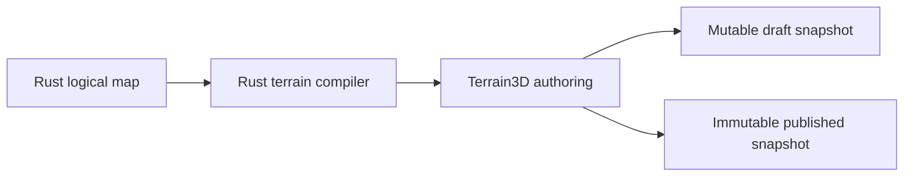

# ADR 0010: Terrain Backend For Godot Authoring

- Status: Accepted
- Date: 2026-08-22
- Implementation: In progress

## Context

The Godot client needs terrain that designers can sculpt and texture in the
editor after importing a logical AoNW map. The current `ArrayMesh` generator is
small and deterministic, but adding region storage, terrain painting, scalable
level of detail, brush history, and import/export tooling would make AoNW own a
second terrain editor.

Terrain3D 1.0.2 provides editor authoring, region resources, float heightmaps,
raw R16 import with an explicit range, and terrain level of detail. A spike on
the repository-pinned Godot 4.7.1 build also proved region persistence,
undo/redo through the Godot history API, CPU ray intersection, and alignment of
reference and grid points to edited heights.

## Decision

Terrain3D is the only terrain backend for the Godot client:

- the repository pins the official `v1.0.2-stable` release archive and its
  SHA-256; the downloaded addon remains outside Git;
- `make bootstrap` installs the verified addon and the project keeps its plugin
  enabled; Godot editor, runtime, and test targets fail when it is absent or
  does not match the pin;
- the desktop-only client uses Godot's Forward+ rendering method rather than
  the macOS OpenGL compatibility shader path, and Terrain3D world-background is
  disabled so only imported map regions are rendered;
- imported maps will persist height and paint data as Terrain3D regions;
- mutable working regions are copied into hash-addressed, verified snapshots;
  draft and published collections are separate, and only their small current
  pointers are replaced atomically;
- the authoring application session depends directly on `Terrain3DData`,
  applies rasterized authoring-profile limits, and participates in Godot
  undo/redo; there is no generic backend abstraction;
- the session depends on a small persistence port. A manual editor composition
  root creates the filesystem adapter, compiled-artifact reader, session, and
  passive presentation surface; application and infrastructure do not import
  each other or presentation;
- reference artwork, hex grid, and picking sample the Terrain3D surface after
  deformation;
- `maxCitySlope` remains explicit, validated metadata rather than a fake
  publication rule. It becomes enforceable only after Rust defines canonical
  city placement; current publication enforces the generated height envelopes;
- one terrain-space transform converts logical hex, absolute world, raster,
  and Terrain3D-local coordinates. `worldOriginMeters` therefore works for
  non-zero X/Z origins, while the reference transform is applied before its
  final Terrain3D height is sampled instead of moving an already draped mesh;
- logical terrain, movement, yields, commands, and every other gameplay rule
  remain in Rust. Terrain3D and GDScript own only authoring and presentation.

The current generated `ArrayMesh` terrain is migration debt. The next terrain
authoring slice must replace it; it is not an optional backend or runtime
fallback. Ordinary meshes may still represent non-terrain overlays, models,
and editor helpers.

## Consequences

Designers get native sculpting, texture painting, region persistence, and LOD
without AoNW maintaining equivalent editor tooling. Runtime and CI gain one
native dependency of about 42 MB, so bootstrap and cache correctness become
part of the supported toolchain.

Terrain3D upgrades require an explicit compatibility review. The client cannot
open or test terrain scenes until the pinned addon has been bootstrapped. This
is intentional: silently rendering a different mesh path would hide broken or
missing authored terrain.

Godot 4.7 currently prints shutdown-only `EditorDock` and icon resource leak
diagnostics after unloading Terrain3D in an immediately terminated headless
editor. The editor exits successfully and the separate runtime contract tests
are clean. Keep this visible as an upstream compatibility risk and re-evaluate
it on every Godot or Terrain3D update; it must not justify a fallback backend.

## Comparison

| Criterion | Terrain3D | Extend the current `ArrayMesh` |
| --- | --- | --- |
| Authoring | Built-in sculpting, painting, regions, and editor history | AoNW would need to build and maintain all authoring tools |
| Testability | Native dependency, controlled by an exact pin and headless contract tests | Simple pure mesh tests, but every new editor feature needs custom coverage |
| LOD | Terrain clipmap LOD is part of the backend | Chunking, seams, streaming, and LOD would be AoNW code |
| Maintenance | Upstream upgrades and compatibility reviews | Permanent ownership of renderer and terrain-editor internals |

The simpler unit-test surface of `ArrayMesh` does not offset the authoring and
maintenance scope. Exact dependency checks plus focused integration tests keep
the Terrain3D boundary observable without duplicating its implementation.

## Update And Rollback

To update Terrain3D:

1. change `.terrain3d-version` to the reviewed stable version;
2. add the official archive SHA-256 to `tool/terrain3d_checksums.txt`;
3. run `make bootstrap` and `make godot-check` on every supported editor
   platform;
4. review the upstream license, GDExtension compatibility, region persistence,
   EXR/R16 behavior, undo/redo, overlays, and picking before committing the pin.

The installer moves an unverified or superseded local addon into ignored
`.toolchains/terrain3d-backups/` before installing. To roll back, restore the
previous pin and checksum from Git and run `make bootstrap`; authored region
resources must pass the previous-version smoke before the rollback ships.

## Migration And Verification

`make terrain3d-check` verifies the installed version, source archive checksum
marker, required native extension and license, and that the plugin is enabled.
`make godot-check` then compiles the terrain profiles and runs an editor/plugin
smoke plus headless tests for EXR, R16, bounded region save/load, regional
clamp, independent publish validation, metadata, undo/redo, overlay alignment,
base-regeneration safety, immutable publication, complete artifact-identity and
region-hash verification, draft reopen, non-zero world-origin round trips,
translated/rotated/scaled reference draping, and picking on a deformed surface.

## Related Decisions And Documentation

- [ADR 0008: Rust engine ownership and strangler migration](0008-rust-engine-ownership-and-strangler-migration.md)
- [ADR 0011: Logical map workbench and generation](0011-logical-map-workbench-and-generation.md)
- [Godot client](../../clients/aonw_godot/README.md)
- [Rust engine migration](../rust-engine-migration.md)
- [Terrain3D v1.0.2-stable](https://github.com/TokisanGames/Terrain3D/releases/tag/v1.0.2-stable)

## Rejected Alternatives

- Extending the generated `ArrayMesh` terrain with custom sculpting, painting,
  chunk persistence, and LOD.
- Keeping Terrain3D optional and falling back to the old terrain mesh.
- Committing Terrain3D native binaries and editor files to the repository.
