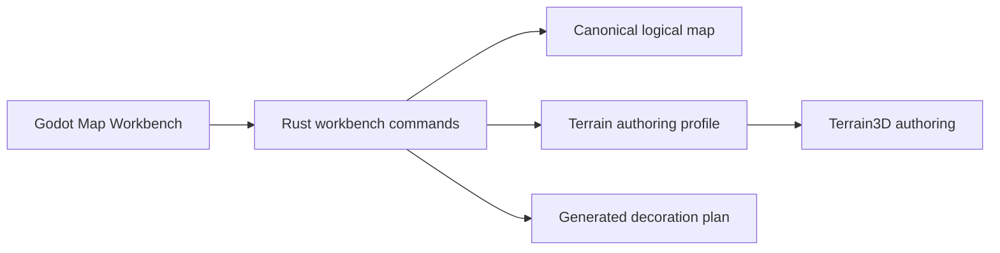

# ADR 0011: Logical Map Workbench And Procedural Generation Boundary

- Status: Accepted
- Date: 2026-08-22
- Implementation: Implemented

## Context

The first Godot Map Workbench slice authors Terrain3D for logical maps that
already exist in shared content. AoNW also needs a future `New Map` flow,
logical terrain/resource/height painting, deterministic procedural generation,
and generated visual details such as trees and rocks.

Implementing these rules in GDScript would create another map domain. Mixing
generated and manual Godot nodes would also make regeneration destructive.

## Decision

Rust remains the sole owner of logical map construction, editing, validation,
canonical JSON and `contentHash`. Logical map authoring uses a dedicated
framework-neutral workbench protocol rather than the gameplay session
protocol.



The workbench provides `blankV1` and `continentalV1`. A strict
`MapGenerationSpec` contains the map identifier, odd-q dimensions, default
zoom, metric hex radius, seed, generator identifier and generator version.
Rust produces four documents:

```text
map.json
terrain_authoring.v1.json
map_generation.v1.json
generated_decorations.v1.json
```

`map_generation.v1.json` records the complete spec and hashes of the spec,
logical map, terrain profile and generated-decoration plan. The blank generator
emits an empty decoration plan. `continentalV1` uses fixed-point coherent noise
and a versioned seed to generate logical elevation, biomes and resources plus
visual tree, rock, water and detail placements, without putting presentation
instances into the logical map.

Godot receives exact document strings from Rust. The filesystem adapter writes
the returned `map.json` and `terrain_authoring.v1.json` replacements with
rollback on a failed write or terrain compilation. GDScript may not construct
canonical map fields or decide whether a logical terrain/resource/height edit
is legal. `InspectMapTile`, `SetTileTerrain`, `SetTileResources` and
`SetTileHeight` are strict operations on this workbench boundary.

Every edit reconstructs the validated Rust aggregate, produces a new
`contentHash`, and rebuilds the metric authoring profile against that exact map
revision. An open Terrain3D authoring session may migrate to the new identity
only when its raster geometry is unchanged. Its manual final data is then
saved unchanged under the new identity; publication still validates it against
the new constraints.

A reference atlas bound to the previous map hash is stale by definition. The
authoring scene remains usable without it, disables the overlay explicitly,
and never rewrites the atlas manifest to claim a false identity.

Authored scenes contain separate `GeneratedWorld` and `ManualWorld` nodes.
Regeneration may replace only `GeneratedWorld`. Manual nodes and the manual
Terrain3D final remain outside the generated artifact lifecycle.

Logical height `0..=5` remains gameplay content. Metric base/min/max and final
Terrain3D samples remain separate authoring concepts. The standard v1 profile
derives metric envelopes from logical height and the selected metric hex
radius.

## Consequences

The current UI opens existing maps, exposes direct 3D viewport brushes for
terrain, resources and logical height, and creates complete blank or
procedural maps through a `New Map` form. New directories are staged and published as a
complete set, existing maps are never overwritten, and failed Terrain3D
compilation rolls the new directory back. A successful creation immediately
prepares and opens its Terrain3D authoring scene without requiring a 2D atlas.

Procedural placements are loaded only when bound to the current map hash and
rendered as one `MultiMesh` per decoration kind. Rebuilding or invalidating the
plan clears only `GeneratedWorld`; `ManualWorld` and manual Terrain3D data are
left untouched.

A seed participates in generation provenance even when `blankV1` produces the
same empty logical map for different seeds. Procedural generator versions may
use it while retaining deterministic replayability and explicit migrations.

## Migration And Verification

- Two executions of the same spec are byte-for-byte identical.
- Generated map and terrain documents pass their authoritative Rust decoders.
- A 40x30 generated map respects the existing content limits.
- Godot obtains all documents through the native Rust workbench bridge.
- `New Map` persists all four documents or none, rejects an existing map ID,
  compiles Terrain3D, and opens the resulting authoring scene.
- Tile edits change the map hash, refresh the terrain profile hash and reject
  invalid coordinates, values, duplicates and unknown wire fields.
- A logical revision migration preserves manual Terrain3D samples when raster
  geometry is unchanged.
- Dependency checks reject canonical map-field writers in GDScript authoring.
- Godot scene tests require distinct generated and manual world containers.

## Related Decisions And Documentation

- [ADR 0008: Rust engine ownership and strangler migration](0008-rust-engine-ownership-and-strangler-migration.md)
- [ADR 0010: Terrain backend for Godot authoring](0010-terrain-backend-for-godot-authoring.md)
- [Rust engine migration](../rust-engine-migration.md)
- [Godot Map Workbench](../../clients/aonw_godot/README.md)

## Rejected Alternatives

- Implementing canonical map editing and validation in GDScript.
- Storing generated trees, rocks, and details as unversioned Godot scene state.
- Letting procedural regeneration replace manually authored Terrain3D data.
