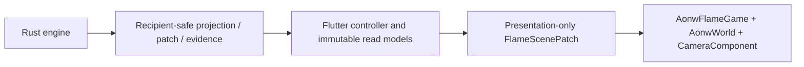

# ADR 0012: Flame Renderer For Successor Flutter

- Status: Accepted
- Date: 2026-08-23
- Implementation: In progress

## Context

ADR 0009 permits one independent Flutter successor under
`clients/aonw_flutter/` while the root Dart application remains frozen. The
successor already has a Flutter shell, Rust-backed session, an accessible HUD,
and a `CustomPainter` map viewport. That renderer was an effective bootstrap,
but it is not the final presentation runtime for the game map.

The viewport needs one explicit world and camera lifecycle, stable visual
component identity, diff-driven rendering, input coalescing, and presentation
effects that do not become a second source of gameplay rules. The product owner
selected Flame as that runtime.

## Decision

The Flutter client uses Flame as the only renderer for its 2D
gameplay viewport:

- Flutter continues to own the application shell, routing, HUD, forms,
  dialogs, localization, focus, semantics, and accessibility.
- Flame owns only the gameplay viewport: world/camera lifecycle, picking,
  visual components, animation, and VFX.
- Flame components do not receive repositories, FFI sessions, wire DTOs, or
  domain commands. They emit framework-neutral presentation intents.
- Rust remains the sole owner of canonical state, legal actions, costs,
  pathfinding, fog, combat outcomes, turn processing, and persistence.
- The initial dependency baseline is exactly `flame 1.38.0` with
  `flame_test 2.3.0`, reproduced by the client lockfile.
- `CustomPainter` and `InteractiveViewer` remain the production oracle during
  FM0-FM4. FM5 performs one atomic production cutover and removes the old
  renderer. A permanent runtime renderer switch is not allowed.
- Forge2D, `flame_tiled`, collision-per-hex, and a second application router
  are outside this decision unless a later measured requirement justifies a
  separate ADR.

This decision supersedes only the final `CustomPainter` renderer target in the
historical successor plan. It does not supersede ADR 0008 or ADR 0009.

## Consequences

The client gains Flame lifecycle and component testing without moving product
navigation or accessibility into the canvas. The migration keeps a behavioral
oracle until cutover, but no released build retains two production renderers.

Presentation state must cross a narrow write-only boundary. New gameplay work
cannot use Flame as a service locator or infer engine rules from visible map
state. Renderer upgrades require a reviewed dependency diff, client tests, a
real-native smoke test, performance comparison, and a rollback commit.

## Dependency Qualification

The pinned Flame packages use the MIT License, which is compatible with this
repository's MIT license and existing third-party notice policy. Both require
Dart `>=3.11.0 <4.0.0` and Flutter `>=3.41.0`; the client constraint
`^3.11.4` and audited Flutter `3.44.2` satisfy those floors. The runtime graph
adds only Flame's declared `collection`, `meta`, `ordered_set`, and
`vector_math` dependencies on top of Flutter. The exact resolved graph remains
reviewable in `clients/aonw_flutter/pubspec.lock`; no physics, tiled-map, audio,
or router package is pulled into FM0.

## Migration And Verification

Implementation follows FM0-FM5 in
`.codex/aonw-flutter-client-development-plan.md`:

1. pin dependencies, freeze oracles, and harden boundaries;
2. add the empty `GameWidget`, `AonwWorld`, and `CameraComponent` lifecycle;
3. move static map layers;
4. move camera, picking, and unified input;
5. move units, routes, and presentation effects;
6. cut over atomically and delete the old renderer.

Each checkpoint runs `make flutter-client-check`, relevant
`flame_test`/widget/device tests, dependency and freeze guards, and records the
exact toolchain and rollback commit in the client progress log.

## Related Decisions And Documentation

- [ADR 0008: Rust Engine Ownership And Strangler Migration](0008-rust-engine-ownership-and-strangler-migration.md)
- [ADR 0009: Dart Feature Freeze And Parallel Successor Clients](0009-dart-feature-freeze-and-parallel-successor-clients.md)
- `.codex/aonw-flutter-client-development-plan.md`
- `.codex/aonw-client-development-progress.md`

## Rejected Alternatives

- Keeping `CustomPainter` as the final renderer.
- Copying the architecture or components of the frozen root Flame client.
- Moving the complete Flutter application shell into Flame overlays.
- Maintaining a permanent `CustomPainter`/Flame production feature flag.
- Reimplementing engine rules in Flame components for lower apparent latency.
