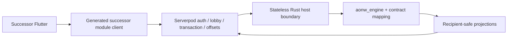

# ADR 0013: In-Process Rust Host For Successor Multiplayer

- Status: Accepted
- Date: 2026-08-29
- Implementation: In progress

## Context

The successor Flutter client completed its current-only local product flow on
the Rust engine. Its next slice is authenticated multiplayer with durable
command correlation, reconnect, and recipient-safe resynchronization.

The existing Serverpod service already owns useful transport infrastructure:
authentication, lobby presence, database transactions, durable offsets, and
stream reconnect. Its gameplay endpoint, generated client, snapshots, and
reducers still depend on the frozen `packages/aonw_core` Dart engine. Making the
greenfield client consume that protocol would reintroduce a second gameplay
authority and a transitive legacy dependency.

Serverpod supports independently generated modules and typed streaming methods.
This lets the successor protocol have its own server/client packages and tables
while still running inside the authenticated Serverpod process.

## Decision

Successor multiplayer is a current-only Serverpod module backed by one
stateless, in-process Rust native library:

- The module generates a dedicated client package that has no dependency on
  `aonw_core` or the root Flutter application.
- Serverpod derives the actor from the authenticated session. Player command
  payloads contain no trusted actor identity.
- Serverpod owns authentication, matchmaking, locks, database transactions,
  idempotency records, durable event offsets, delivery, and reconnect.
- Rust owns canonical validation, rules, rejection precedence, deterministic
  transitions, events, evidence, state digests, and every recipient projection.
- The Rust host is stateless and reentrant. Each call receives a strict bounded
  current canonical state, immutable content, trusted actor/context, and one
  current command or system transition. It returns an all-or-nothing outcome.
- The host calls `aonw_engine` and contract mapping directly. It does not retain
  `aonw_local_runtime`, open a session per command, or use the Flutter/Godot ABI.
- The initial boundary is an in-process native library built and packaged with
  the Serverpod artifact. A sidecar is not implemented in parallel.
- The native boundary has explicit payload limits, ownership, panic containment,
  build identity, and fail-closed startup verification.
- New successor matches are Rust-authoritative from creation to completion and
  never switch backend. The frozen Dart multiplayer path remains isolated for
  the old client until its separate retirement decision; it is not a fallback,
  reader, shadow, or adapter for successor matches.
- Existing multiplayer version axes remain because independently deployed
  server and clients are real consumers. No additional behavior/state/save
  version is introduced by the native host. Before the first deployed successor
  schema, only the current schema is accepted.
- Gameplay payloads crossing Dart are opaque current documents except for
  transport metadata needed for transaction, correlation, offset, audience, and
  delivery. Dart never reconstructs canonical state or evaluates a game rule.
- Chat, social data, account data, operational telemetry, and gameplay recipient
  projections retain separate privacy boundaries.

## Consequences

The successor can reuse mature Serverpod authentication and streaming without
depending on the old Dart engine. Stateless calls fit Serverpod concurrency and
make transaction retry explicit, while avoiding a second network service and
its deployment lifecycle.

The cost is a dedicated module/client package, a server Native Assets build,
current successor tables, and extraction of reusable recipient projection from
the local runtime into a framework-independent Rust boundary. The Serverpod
container must carry and verify the correct native artifact for its target.

The old and successor online paths may coexist operationally, but no match and
no client session crosses between them. Rollback for a successor deployment is
a reviewed Rust/server deployment or forward fix, never execution by Dart.

## Migration And Verification

Implementation proceeds as vertical checkpoints:

1. extract a reusable current recipient projection boundary and add a stateless
   Rust host contract with strict positive/negative tests;
2. package the native library for Serverpod and verify build identity at startup;
3. add the isolated Serverpod module, current tables, transaction/idempotency
   ledger, and one command through PostgreSQL;
4. add typed streaming, duplicate/out-of-order handling, reconnect, and exact
   recipient resync;
5. add the Flutter network session state machine and lobby/match UI only after
   the real server slice exists;
6. exercise lobby to command to reconnect/resync against the test server.

The acceptance gate checks authenticated actor ownership, rollback on internal
error, exact durable offsets, idempotent retry, process restart, projection
privacy, native artifact identity, and absence of `aonw_core` in every successor
package dependency graph.

## Related Decisions And Documentation

- [ADR 0003: Command Boundaries](0003-command-boundaries.md)
- [ADR 0004: Versioned Multiplayer Protocol](0004-versioned-multiplayer-protocol.md)
- [ADR 0008: Rust Engine Ownership And Strangler Migration](0008-rust-engine-ownership-and-strangler-migration.md)
- [ADR 0009: Dart Feature Freeze And Parallel Successor Clients](0009-dart-feature-freeze-and-parallel-successor-clients.md)
- `.codex/aonw-rust-engine-development-plan.md`
- `.codex/aonw-flutter-client-development-plan.md`

## Rejected Alternatives

- Connecting the successor Flutter client to the existing Dart gameplay
  endpoint or generated client.
- Calling `aonw_local_runtime` once per server command.
- Keeping both an in-process library and a sidecar abstraction before either is
  required.
- Switching an active successor match to Dart after a Rust failure.
- Creating another internal engine behavior or state version for the host.
