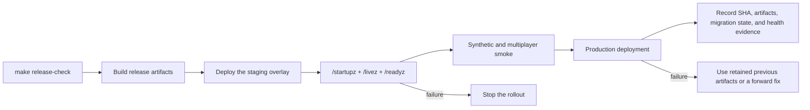

# Build and deploy runbook

Use the Make targets from the repository root. They are the shared contract between local work, CI, and release automation. Real hosts, keys, service accounts, signing material, and `.env` files do not belong in Git.

[ADR 0005](adr/0005-immutable-deployment.md) describes the target build-once promotion model. The current release flow still contains transitional host-side build steps, and this is the currently implemented workflow; do not describe those as immutable promotion.



## Before a release

```sh
make bootstrap
make release-check
```

## Release options

| Option | Default | Allowed values | Description |
| --- | --- | --- | --- |
| `DEPLOY_ENV` | `staging` | `staging`, `prod` | Backend deployment environment. |
| `DEPLOY_ALL_IOS_MODE` | `best-effort` | `off`, `best-effort`, `required` | iOS archive policy. |
| `DEPLOY_ALL_STEAMWORKS` | `0` | `0`, `1` | Enable the Steamworks upload. |
| `DEPLOY_ALL_GOOGLE_PLAY` | `0` | `0`, `1` | Enable the Google Play action. |
| `DEPLOY_ALL_GOOGLE_PLAY_MODE` | `closed` | `closed`, `internal`, `alpha`, `beta`, `production` | Google Play destination track. |
| `DEPLOY_ALL_GOOGLE_PLAY_VALIDATE_ONLY` | `0` | `0`, `1` | Validate the Play upload without publishing. |
| `DEPLOY_ALL_ITCH` | `0` | `0`, `1` | Enable itch.io uploads. |
| `ITCH_TARGET` | empty | `user/game`, `empty` | Required destination when itch.io is enabled. |
| `STEAM_INCLUDE_LINUX` | `0` | `0`, `1` | Include Linux in the Steam depot. |
| `ITCH_INCLUDE_LINUX` | `0` | `0`, `1` | Include Linux in itch.io uploads. |
| `DOWNLOAD_INCLUDE_LINUX` | `0` | `0`, `1` | Include Linux in public downloads. |
| `STEAM_WINDOWS_SOURCE` | `auto` | `auto`, `local`, `github`, `existing` | Windows artifact source. |
| `STEAM_LINUX_SOURCE` | `auto` | `auto`, `local`, `github`, `existing` | Linux artifact source. |
| `VERSION_BUMP` | `patch` | `patch`, `none` | Marketing-version policy. |
| `NEW_VERSION` | empty | `x.y.z`, `empty` | Optional marketing-version override. |
| `NEW_BUILD` | empty | `integer greater than current`, `empty` | Optional monotonic build override. |
| `DEPLOY_ALL_PLAN_FORMAT` | `human` | `human`, `json`, `artifact-json` | Planner output format. |

`release-check` runs the repository quality gate, generated-code and migration drift checks, Compose validation, PostgreSQL-backed server smoke, and critical E2E journeys.

Useful focused checks:

| Change | Command |
| --- | --- |
| Dart/Flutter code | `make ci` |
| Serverpod schema or deployment | `make serverpod-ops-check` |
| Generated inputs | `make generated-code-check` |
| Docker build context | `make docker-context-check` |
| Compose overlays | `make compose-check` |

When generator inputs change, regenerate only the affected output, review it, and commit it:

```sh
flutter pub run build_runner build
(cd packages/aonw_core && dart run build_runner build)
flutter gen-l10n
(cd server && dart pub global run serverpod_cli:serverpod_cli generate)
(cd server && dart pub global run serverpod_cli:serverpod_cli create-migration)
make generated-code-check
```

## Local backend

```sh
cp .env.example .env
# Replace every replace-with-* value.
make local-start
make local-multiplayer-smoke
make local
```

Local endpoints:

- API: `http://localhost:8080`
- Flutter Web: `http://localhost:7357`

Stop the stack with `make local-down`. Remove local database volumes only when a clean reset is intended:

```sh
docker compose -f compose.yml --profile dev down -v
```

## Static sites

Build the Flutter web client with an explicit API target:

```sh
flutter build web --wasm --release \
  --dart-define=AONW_API_BASE_URL=https://api.aonw.net
```

Stage the public homepage, architecture atlas, statistics page, and download metadata with:

```sh
make build-homepage
```

Generate the public AoNW Engine landing page and complete Rust API documentation
from the current local `engine/` workspace with:

```sh
make build-engine-docs
```

The documentation deployment command publishes the exact local engine version
being worked on, without committing, stashing, or changing those files.

Deployment targets require their remote values at invocation time. Example:

```sh
make deploy-web \
  WEB_DEPLOY_SSH_KEY=/path/to/key \
  WEB_DEPLOY_USER=deploy \
  WEB_DEPLOY_HOST=example.com \
  WEB_DEPLOY_DEST=/srv/aonw/demo
```

Use `make deploy-homepage` with the equivalent homepage destination. Verify the relevant `make health-*` targets after upload.

Publish the current local Rust documentation with:

```sh
make deploy-engine-docs \
  WEB_DEPLOY_SSH_KEY=/path/to/key \
  WEB_DEPLOY_USER=deploy \
  WEB_DEPLOY_HOST=example.com \
  ENGINE_DOCS_DEPLOY_DEST=/path/to/aonw/build/engine-docs
```

The first deployment also requires `engine.aonw.net` to resolve to the existing
Caddy host and the updated Compose/Caddy configuration to be running. Later
documentation refreshes need only `make deploy-engine-docs` with the same remote
values. The upload is isolated from the homepage and demo directories.

## Server deployment

Staging and production must use the matching Compose overlay:

```sh
# staging
make up PROFILE=staging
docker compose -f compose.yml -f compose.staging.yml --profile staging up -d --build

# production
make up PROFILE=prod
docker compose -f compose.yml -f compose.prod.yml --profile prod up -d --build
```

The overlays own `SERVERPOD_RUN_MODE`; do not set it in the root deployment `.env`. Omitting or mixing overlays is expected to fail closed.

Keep Serverpod ports private behind Caddy or another trusted reverse proxy. Public deploys must pass:

- `/startupz` — startup completed;
- `/livez` — process is alive;
- `/readyz` — PostgreSQL and Redis dependencies are ready.

`/readyz` is the deployment gate. A running container with failed readiness is not a successful release.

The server image uses a default-deny build context. After changing Docker inputs, maps, migrations, or `.dockerignore`, run `make docker-context-check`; do not broaden the context to an entire workspace to fix one missing file.

## Release entry points

| Target | Purpose |
| --- | --- |
| `make deploy-all-plan` | Validate inputs and print the planned release without mutation. |
| `make deploy-all` | Run the coordinated release flow. |
| `make deploy-downloads` | Publish stable public download filenames. |
| `make steam` | Build desktop Steam packages. |
| `make itch` | Prepare and upload itch.io packages. |
| `make android-deploy` | Build and upload the Android release. |

Run `make help` for current arguments. The Makefile, not this document, is authoritative for every optional variable.

## Rollback

For the current workflow, keep the previous server image/artifacts and a tested database backup. Do not reverse a schema migration casually. Prefer a forward fix when the previous application cannot read data written by the new schema.

The accepted end state is promotion by immutable digest and release manifest, with migrations run as a separate job. Until that is implemented, record the source SHA, produced artifacts, migration state, and health evidence for each release manually.
