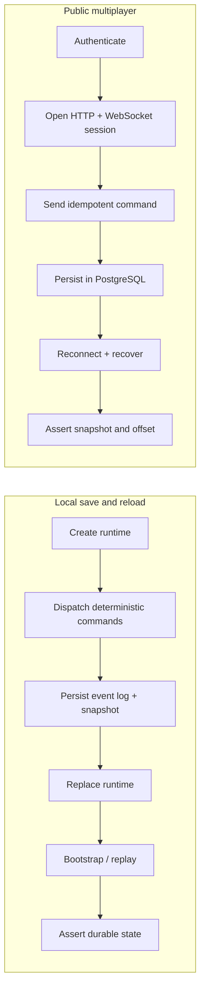

# Critical end-to-end journeys

Two stateful journeys protect boundaries that unit tests do not cover completely.

| Journey | Real boundary | Test |
| --- | --- | --- |
| Local save and reload | use cases, command transport, event log, snapshot store, fresh runtime | `test/game/local_game_persistence_flow_test.dart` |
| Public multiplayer | auth, JWT refresh, PostgreSQL, generated client, WebSocket stream, idempotent command, reconnect | `tool/serverpod_critical_e2e.dart` |



Both journeys use deterministic commands and assert durable state. They do not treat widget internals, fixed delays, or injected authentication as evidence.

## Commands

```sh
make local-game-e2e-test
make serverpod-critical-e2e-test
make critical-e2e-test
```

The Serverpod journey needs a provisioned `aonw_test` database. The release-safe wrapper creates an isolated PostgreSQL project and runs the complete server smoke:

```sh
tool/run_postgres_smoke.sh
```

The harness binds all test listeners to IPv4 loopback, creates fresh auth secrets, selects isolated ports, and tears down the exact child process on failure.

## Failure ownership

- failure before local runtime replacement: creation, dispatch, or persistence;
- failure after replacement: bootstrap or replay;
- auth/HTTP failure: session boundary;
- ACK/history mismatch: idempotency or storage;
- reconnect mismatch: snapshot projection, catch-up, or token rotation.

Add focused tests for narrower behavior, but keep these journeys at the real persistence and transport boundaries.
