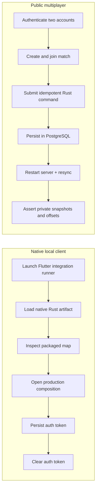

# Critical end-to-end journeys

Two stateful journeys protect boundaries that unit tests do not cover completely.

Canonical entry points:

- `clients/aonw_flutter/integration_test/inspect_map_native_test.dart`
- `tool/run_serverpod_critical_e2e.sh`
- `tool/run_postgres_smoke.sh`
- `tool/allocate_loopback_port_triplet.dart`
- `test/tool/allocate_loopback_port_triplet_test.dart`
- `packages/aonw_server_client/tool/critical_e2e.dart`
- `server/test/support/critical_e2e_server.dart`
- `server/test/support/critical_e2e_server_config.dart`
- `server/test/support/critical_e2e_loopback_io_overrides.dart`
- `server/test/critical_e2e_server_config_test.dart`
- `server/test/critical_e2e_loopback_io_overrides_test.dart`

| Journey | Real boundary | Test |
| --- | --- | --- |
| Native local client | Flutter integration runner, packaged Native Assets boundary, Rust map inspection, production composition, and secure token storage | `clients/aonw_flutter/integration_test/inspect_map_native_test.dart` |
| Public multiplayer | auth, JWT refresh, PostgreSQL, generated client, two accounts, idempotent Rust command, restart and private resync | `packages/aonw_server_client/tool/critical_e2e.dart` |



The local journey exercises the packaged native artifact and platform storage;
the online journey exercises deterministic commands and durable recipient
state. Neither treats widget internals, fixed delays, or injected
authentication as evidence.

## Commands

```sh
make flutter-client-device-test
make serverpod-critical-e2e-test
make critical-e2e-test
```

This is the default sequence for critical journeys:

- The public HTTP Serverpod surface is covered by `tool/run_serverpod_critical_e2e.sh` and verified by `serverpod-critical-e2e-test`.
- The harness uses fresh per-run secrets and a cryptographic per-run nonce during database and token initialization.
- The run is bounded, proxy-free, and fails closed when one of the required listeners or processes cannot be launched.
- The database URL must stay local and isolated: `aonw@localhost:$AONW_TEST_DATABASE_PORT/aonw_test`.
- The run maps all three wildcard binds to IPv4 loopback, and each process has a uniquely named Compose project for isolated teardown.

The Serverpod journey needs a provisioned `aonw_test` database. The release-safe wrapper creates an isolated PostgreSQL project and runs the complete server smoke:

```sh
tool/run_postgres_smoke.sh
```

The harness binds all test listeners to IPv4 loopback, creates fresh auth secrets, selects isolated ports, and tears down the exact child process on failure.

Operationally this includes:

- `clients/aonw_flutter/integration_test/inspect_map_native_test.dart`
- `tool/allocate_loopback_port_triplet.dart`
- `test/tool/allocate_loopback_port_triplet_test.dart`
- `server/test/support/critical_e2e_server_config.dart`
- `server/test/support/critical_e2e_loopback_io_overrides.dart`
- `server/test/critical_e2e_server_config_test.dart`
- `server/test/critical_e2e_loopback_io_overrides_test.dart`

## Failure ownership

- local client failure: native artifact loading, session creation, projection, or command dispatch;
- auth/HTTP failure: session boundary;
- command-outcome/history mismatch: idempotency or storage;
- restart/resync mismatch: recipient projection, catch-up, or token rotation.

Add focused tests for narrower behavior, but keep these journeys at the real persistence and transport boundaries.
