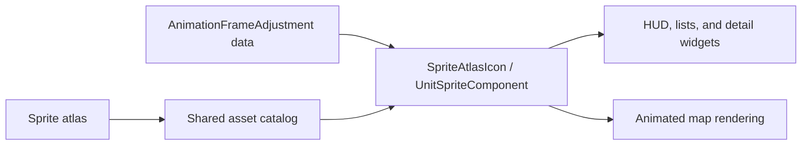

# Asset icon rendering

UI widgets use shared asset catalogs and `SpriteAtlasIcon`; they do not calculate private crops, offsets, or atlas coordinates.

| Asset | Entry point |
| --- | --- |
| Units | `UnitSpriteIcon` |
| Cities | `CitySpriteIconCatalog` / `CitySpriteIcon` |
| Buildings | `BuildingSpriteCatalog` |
| Technologies | `TechnologySpriteCatalog` |
| Field improvements | `FieldImprovementSpriteIconCatalog` |

The catalog returns the source frame and adjustment id. `SpriteAtlasIcon` applies editor-saved crop, offset, and scale data. Animated map units use the same `AnimationFrameAdjustment` values through `UnitSpriteComponent`; rendering layers position or mirror the component but do not add another crop.

Default icon geometry is centered with `BoxFit.contain`. A background treatment may use another fit/alignment, but it still receives its frame from the catalog.

The right `Action` segment intentionally uses larger, masked thumbnails. That is a presentation variant, not a reason to bypass catalog geometry.

Keep these tests green when changing asset code:

- `sprite_atlas_catalog_test.dart`
- `sprite_asset_geometry_test.dart`
- `game_hud_test.dart`
- `hud_action_deck_test.dart`
