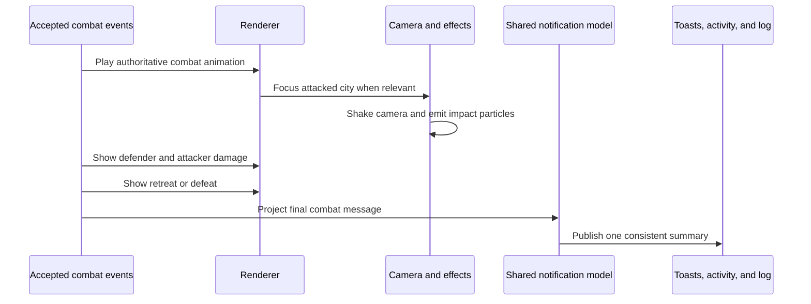

# Combat feedback

Post-combat feedback answers what actually happened. It uses accepted combat events and transient pre-command state; it does not introduce another combat result model.

## Presentation order

1. play the authoritative combat animation;
2. focus the active player's attacked city when relevant;
3. apply camera shake and city-impact particles;
4. show defender and attacker damage;
5. show defeat or retreat after a short separation.

Reduced-motion handling may change timing, not event ownership or final state.

## Shared message

Toasts, activity history, and the combat log use one notification model. The compact summary presents defender damage/result first and attacker retaliation second. Technical details may include final HP, retaliation, RNG roll, and modifier labels.

A defeated unit may already be absent from the new state. `GameEventNotification.previousState` is therefore allowed as transient UI context for names, icons, and player assignment. It is not saved or sent as domain state.

The map layer may show floating text, particles, camera effects, and return pins. Persistent strategic memory remains in notifications, logs, diplomacy, and state—not in a cross-turn renderer alert.

Preview behavior is documented in [combat-preview.md](combat-preview.md).
