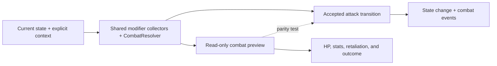

# Combat preview

Combat preview is an informational projection of the real instant-combat resolver. It spends no movement, changes no state, and emits no events.

## Visibility

A prediction is shown only when:

- attack targeting is active;
- the attacker is controlled, ready, and able to attack;
- a visible enemy is in range;
- the ruleset uses instant combat.

When several targets are available, the informational default is deterministic: lowest distance, then column, row, and unit id. It is not an automatic target selection for the command.

## Calculation

Preview uses the same sources as attack resolution:

- derived unit stats and current HP;
- attacker and defender modifier collectors;
- terrain, city, technology, and veterancy modifiers;
- deterministic combat RNG;
- retreat destination rules;
- `CombatResolver`.

The UI shows defender and attacker HP before/after, effective attack/defense, retaliation, and the expected result: survive, retreat, or defeat.

Retreat is possible only for a surviving mobile combat unit below the configured threshold with a legal adjacent destination. A lethal hit never becomes a retreat. Occupying escape hexes therefore prevents withdrawal.

There is no preview-specific balance. Change combat rules and preview together by keeping both on the shared resolver. Regression tests should compare preview output with the accepted transition for the same state and context.
