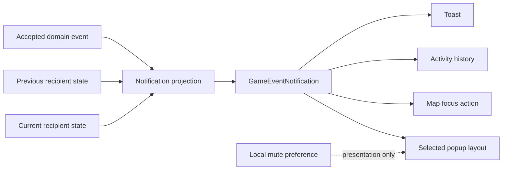

# Event notifications and popups

Notifications provide one event-to-message model for toasts, activity history, focus actions, and selected popups. A popup may have its own layout and local mute preference without changing the domain event.

## First contact

`CivilizationMetEvent` is projected by comparing the previous and current recipient state. Contact occurs when the active player first sees a rival unit or remembers a rival city through fog of war.

The game does not persist a second "known civilizations" aggregate for this UI. The popup mute preference is local and keyed by save and player in `SharedPreferences`; it is not multiplayer state.

The contact notification:

- names the nation, leader, and player;
- appears in the toast and activity feed;
- can focus the first known city or unit;
- is delivered through the same projection path for local play, AI turns, and live multiplayer updates.

## Wonders

Wonder completion uses normal city-event notifications. `CityBuiltWonderEvent` reports the winner; `WonderProductionRefundedEvent` reports losing queues after invested production returns to overflow.

Technology completion keeps its dedicated popup and local "do not show again" preference. Do not add UI preference fields to save or protocol state.
