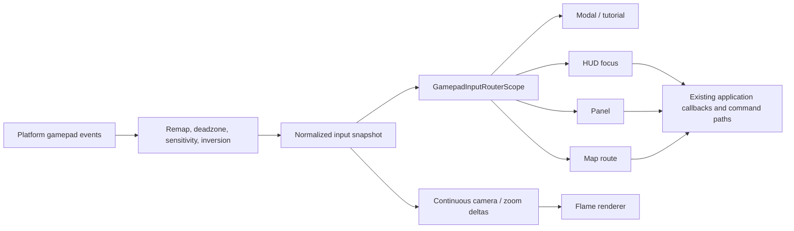

# Gamepad controls

Gamepad input is normalized before it reaches the game screen. Platform-specific button codes do not enter gameplay, save, or wire state.

## Default mapping

| Input | Action |
| --- | --- |
| D-pad / left stick | Move map cursor, menu focus, or the selected item in an open panel. |
| Right stick | Pan camera. |
| LT / RT | Zoom out / in. |
| A | Confirm the focused control or tap the selected hex. |
| B / Back | Close the topmost popup/panel or cancel the current interaction mode. |
| X | Toggle movement mode; in research, switch recommendation/tree view. |
| Y | Inspect the selected hex or open focused details. |
| R3 | Enter bottom-toolbar focus; while HUD focus is active, move one HUD section right. |
| L3 | Move one HUD section left. |
| LB / RB | Previous / next pending action, or panel/HUD navigation where captured. |
| Start | Primary turn action, matching Space. |

The D-pad/left stick moves the tactical cursor without recentering the camera. Camera movement remains on the right stick, zoom triggers, and explicit focus commands.

## Routing

`GamepadInputRouterScope` dispatches discrete actions to the highest-priority eligible route. Modal popups, tutorial cards, panels, HUD focus, and the map therefore do not all react to one button press.

The Flame renderer consumes only continuous camera/zoom deltas. Selection, confirmation, cancellation, production, research, and unit actions call the existing application callbacks and command paths.

HUD focus is local presentation state. Open popups capture controller input so navigation does not move the map behind them.

## Settings

Options can disable controller input, change deadzone and camera sensitivity, invert camera Y, remap buttons/axes, or reset defaults. Mapping is applied before the normalized input snapshot is created, so every route sees the same configured contract.

Keep the in-game manual synchronized with changes to confirm/cancel, cursor, camera, and turn-flow shortcuts.
