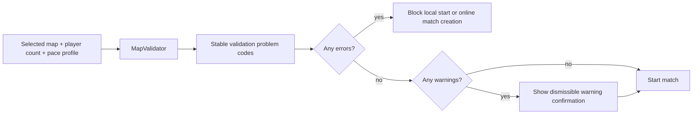

# Map validation

`MapValidator` rejects unusable setups and warns about poor pacing before a match starts. It reports problems; it does not generate or repair maps.

## Severity

- **Error** — normal play should not start.
- **Warning** — the setup is legal but may not fit the selected pace.

The lobby validates the selected map, current player count, and pace profile. Errors block local start and online match creation. Warnings remain dismissible.

## Checks

The current validator covers:

- supported player count;
- non-empty map and sufficient passable land;
- legal settler start sites;
- enough passable first-ring tiles and city-control candidates;
- nearby food for the opening;
- global food, strategic, and luxury density;
- start separation;
- oversized maps or distant contact for short presets.

Thresholds live with `MapValidationRules`; do not duplicate them in UI or this document. Problem codes are stable API for tests and localized presentation.

The standard bundled maps have validator coverage for their supported player counts. A large map may still produce a short-game warning without being invalid.

## Limits

The validator currently uses hex distance rather than full path distance between starts and does not balance yields symmetrically per player. Naval-only starts and automatic editor painting need separate rules.

Update map fixtures and lobby tests whenever a validation code or threshold changes.
