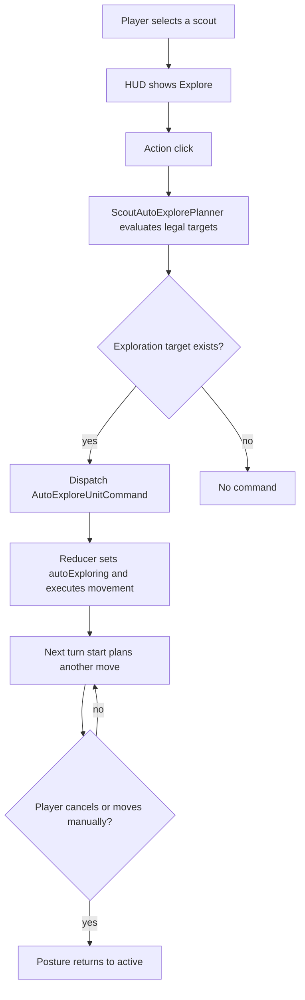
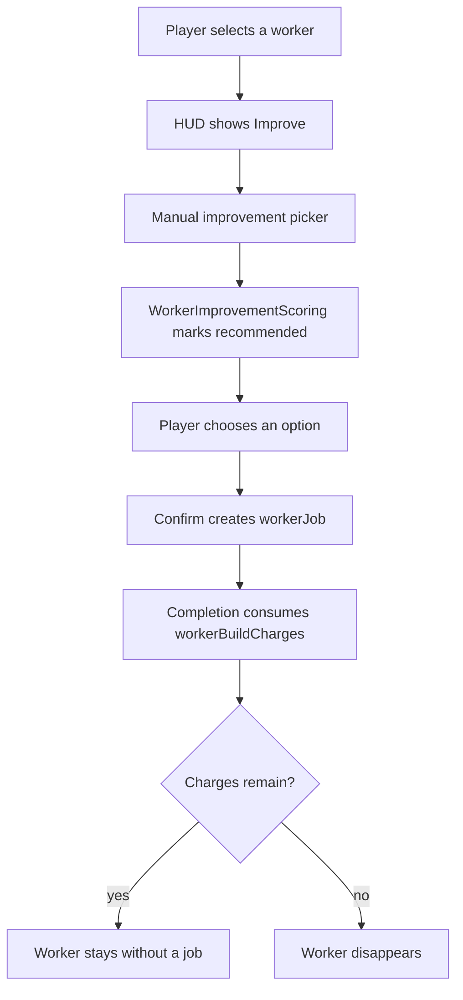

# Mobile QoL Automation

This document describes opt-in automatic action rules. Automation should reduce
mobile micromanagement without taking turn control away from the player.

## General Rules

| Rule | Meaning |
| --- | --- |
| Opt-in | The player always clicks an explicit action to enable automation. |
| Explicit cancellation | An active unit mode can be interrupted by using the active action again or issuing a manual movement command. |
| Legal commands | Automation ultimately produces normal movement effects and does not bypass pathfinding. |
| Save state | Persistent unit modes are stored explicitly in `GameUnit.posture`. |
| Current contracts | New actions use current domain commands and avoid compatibility branches. |
| Readable no-op | If no meaningful legal action exists, the system issues no command and shows light local feedback. |

## Scout Auto-Explore

Auto-explore applies only to scouts. After clicking `Explore`, the scout makes
the first legal exploration move and enters `UnitPosture.autoExploring`. At the
start of later turns it plans the next move by itself until the player cancels
or issues manual movement.

| Element | Decision |
| --- | --- |
| Unit | `GameUnitType.scout` |
| UI | `Explore` action when a scout is selected |
| Start command | `AutoExploreUnitCommand` |
| Unit state | `UnitPosture.autoExploring` |
| Range | Only hexes the scout can enter this turn |
| Goal | Reveal as many unknown hexes as possible |
| No target | No command, no state change, local HUD message |
| Cancellation | Active `Explore` sends `CancelUnitActionCommand`; manual movement resets posture to `active` |

### Start Conditions

| Condition | Requirement |
| --- | --- |
| Unit type | scout |
| Movement points | `movementPoints > 0` |
| Queued path | No active movement queue |
| Unit work | `isWorking == false` |
| Posture | Unit is not fortified |
| Target legality | Pathfinder must return a plan and `plan.canMoveNow == true` |

### Candidate Scoring

The resolver evaluates every legal destination hex and simulates scout vision
after movement. A candidate is considered only if it reveals at least one new
hex.

| Parameter | Current value | Balance role |
| --- | ---: | --- |
| `minimumNewlyDiscoveredHexes` | `1` | Blocks empty auto-moves over already discovered terrain |
| `newlyDiscoveredHexScore` | `1000` | Main priority: new hexes matter more than movement cost |
| `visibleHexScore` | `2` | Light tie-breaker for wider vision |
| `movementCostScore` | `10` | Prefers using movement this turn when reveal is similar |
| `distanceFromStartScore` | `1` | Lightly pushes the scout toward a farther exploration front |

Tie-break order:

1. higher score,
2. more newly discovered hexes,
3. higher movement cost this turn,
4. deterministic lower column and lower row.

## Auto-Explore Flow

## Worker Improvement

Workers have one manual `Improve` path that opens a legal-improvement picker
for the current tile. The automatic shortcut that chose the best improvement
was removed from the menu so the player makes the choice explicitly.

| Element | Decision |
| --- | --- |
| Unit | `GameUnitType.worker` |
| UI | `Improve` action opens improvement selection |
| Legality | `WorkerImprovementRules.evaluate(...)` |
| Ranking | `WorkerImprovementScoring.scoreFor(...)` |
| Charges | `WorkerImprovementChargeRules.defaultWorkerCharges = 1` |
| Result commands | `StartWorkerActionSelectionCommand`, `SelectWorkerImprovementCommand`, `ConfirmWorkerImprovementCommand` |
| Work completion | After finishing an improvement, worker loses 1 charge; at 0 it disappears |

### Start Conditions

| Condition | Requirement |
| --- | --- |
| Unit type | worker |
| Movement points | `movementPoints > 0` |
| Queued path | No active movement queue |
| Unit work | `workerJob == null` and `workerAssignment == null` |
| Posture | Unit is not fortified |
| Tile legality | At least one legal improvement exists on the current hex |
| Technology | Required technologies are unlocked for the worker owner |

### Scoring

The panel scores legal improvements on the current hex. Score comes from shared
`WorkerImprovementScoring`, so the manual list and future AI systems use the
same yield model.

| Order | Rule |
| --- | --- |
| 1 | Show legal and blocked options |
| 2 | Mark the best legal option as `recommended` |
| 3 | Allow the player to manually choose another legal option |

## City Founding

City founding has two different UI states. Before confirming controlled-hex
selection, the settler uses draft mode and `Cancel` sends
`CancelCityFoundingCommand`. After confirmation, when the unit already has an
active `cityFoundingJob`, the bottom toolbar shows the same single `Cancel`
button used by exploration, worker jobs, and other active unit actions. That
button sends standard `CancelUnitActionCommand`, which clears `cityFoundingJob`
without adding a separate cancellation path.

## What This Stage Does Not Do

| Out of scope | Reason |
| --- | --- |
| Multi-turn autopilot | Would require saved state and cancellation rules |
| Auto-explore for ships | Requires separate water and map rules |
| Worker movement to the best hex | Would be a separate pathfinding planner with new cancellation rules |
| Sentry mode | Different semantics: waiting and waking on threat |
| Fog-rule changes | Auto-explore should use existing visibility, not change it |

## Worker Recommendation Contract

Worker recommendations use core `WorkerImprovementScoring`, and scoring reads
the base hex yield from `CityTileYieldRules`. Tuning worker-improvement weights
therefore affects the manual recommendation in the `Improve` panel.

## Fortify As Sentry

A separate `Sentry mode` is not needed in the first Slice 8 scope because the
existing `Fortify` action already has the intended waiting semantics.

| Element | State |
| --- | --- |
| UI | `Fortify` action on a unit |
| Command | `FortifyUnitCommand` |
| Entering mode | Movement points drop to 0, posture becomes `fortified`, queued path is cleared |
| No enemy | Unit stays without movement and heals 1 HP/turn |
| Visible enemy | Unit wakes, returns to `active`, and regains full movement |
| Cancellation | Using the active `Fortify` action again cancels posture through standard cancel action |

Future work should not add a second action with the same responsibility. Any
improvement should focus on copy/tooltip clarity or fortified-state visibility,
not a new domain mode.

## No-Op Feedback

Auto-explore has local feedback when the planner finds no legal command.
Worker `Improve` does not need a separate no-op toast because the manual panel
shows legal and blocked options with reasons.

| Element | Rule |
| --- | --- |
| Layer | Presentation/HUD only |
| Save state | No change |
| Event log | No entry |
| Domain command | Not sent |
| Activity log | No entry |
| Lifetime | Short HUD toast, auto-dismissed |

Messages:

| Action | Title | Reason |
| --- | --- | --- |
| `Explore` | `No exploration route` | Scout has no movement that reveals new tiles this turn |

Successful auto-actions clear previous local feedback and continue through the
standard command path.

## Further Balance Direction

| Problem to watch | Possible adjustment |
| --- | --- |
| Scout moves too chaotically | Lower `movementCostScore`, add direction preference away from empire center |
| Scout ignores nearby ruins/POI after they are added | Add separate POI score before normal reveal |
| Auto-explore does nothing too often | Allow movement to frontier hexes with `newlyDiscoveredHexes == 0` when adjacent to hidden space |
| Worker recommendation points to farms too often | Lower food weight or add city/deficit context |
| Player still does not understand no-op auto-actions | Clarify blocker-specific reasons in the message without adding domain events |
