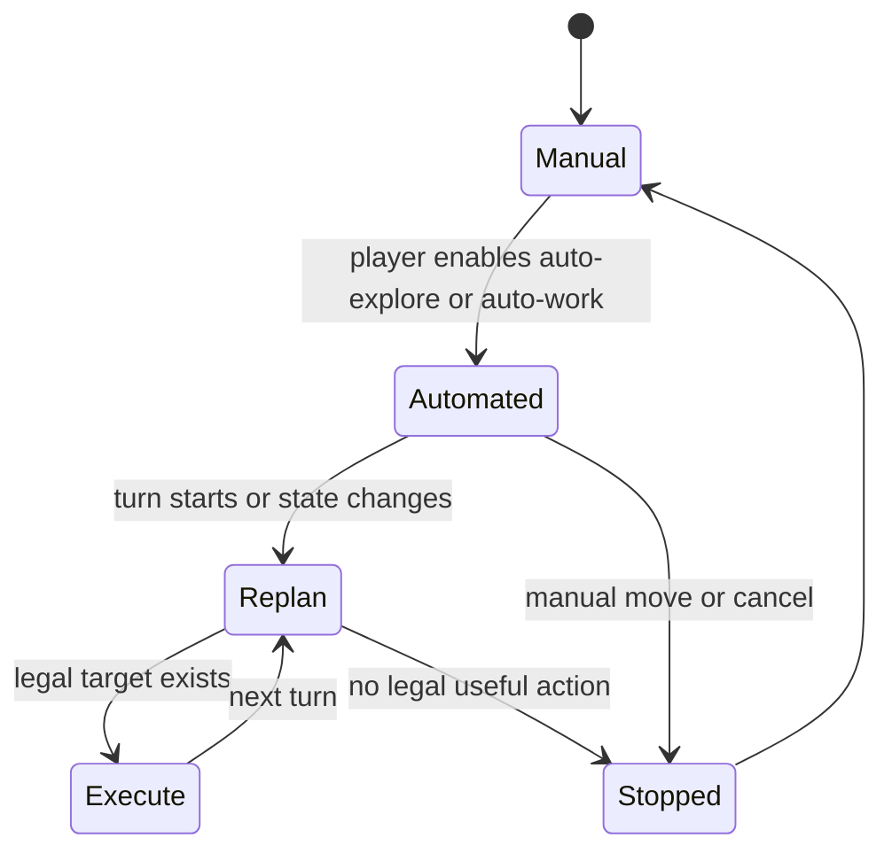

# Mobile automation

Automation is opt-in and reduces repetitive input. It never bypasses command legality or hides a private plan outside canonical state.

```mermaid
stateDiagram-v2
  [*] --> Manual
  Manual --> Automated: player enables auto-explore or auto-work
  Automated --> Replan: turn starts or state changes
  Replan --> Execute: legal target exists
  Execute --> Replan: next turn
  Replan --> Stopped: no legal useful action
  Automated --> Stopped: manual move or cancel
  Stopped --> Manual
```

## Shared rules

- the player explicitly enables an automatic mode;
- manual movement or the active cancel action stops it;
- persistent modes use `GameUnit.posture` or an authoritative worker assignment/job;
- pathfinding, fog, technology, territory, occupancy, and movement costs are the same as for manual commands;
- no legal action means no state change and a short local HUD message.

## Scout auto-explore

`AutoExploreUnitCommand` applies only to scouts. The planner evaluates legal destinations reachable this turn and prefers the move that reveals the most new tiles. Tie-breakers are deterministic.

A successful command sets `UnitPosture.autoExploring`. At later turn starts the scout replans from current state. It stops when the player cancels, moves manually, is no longer legal, or no move reveals new terrain.

## Worker auto-work

`AutomateWorkerCommand` searches all controlled hexes of the player's cities.

Order of work:

1. reachable legal build targets, ranked by path cost and the shared worker recommendation;
2. if none exist, a reachable free completed improvement that can accept a persistent assignment.

The worker replans each turn so border, route, occupancy, and technology changes cannot leave it following stale client state. Destinations already reserved by another automated worker are excluded.

Manual **Improve** and automated planning share `WorkerImprovementRecommendation` and legality rules. Completion consumes a build charge; the default worker has one charge and disappears after its improvement. A permanent assignment consumes no charge and contributes the normal assignment bonus until cancelled.

## City founding and fortify

City founding uses a connected selection frontier. Only legal neighbors of the center or current connected selection can be added; removing a bridge also removes disconnected choices.

Existing `FortifyUnitCommand` already provides sentry-like waiting: the unit stays, heals, and wakes when a visible enemy appears. Do not add a second posture with the same responsibility.

## Feedback

When no exploration route or worker target exists, the presentation shows a short message. No command/event-log entry is created merely to explain a no-op.
