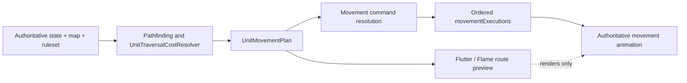

# Movement and route preview

Authoritative movement plans and costs come from `aonw_core` today and from the Rust engine after cutover. Flutter/Flame renders a `UnitMovementPlan`; it does not recalculate reachability.

## Cost model

Entry cost is based on the destination tile. There is no exit cost.

| Terrain | Land movement |
| --- | --- |
| Grassland, plains, coast | 1 |
| Desert, tundra | 2 |
| Snow | 3 |
| Forest, jungle, wetlands, hills | rough-feature increment according to the normalized profile |
| Mountain, ocean, lake | blocked |

Naval units use the water-domain rules. Roads and other infrastructure are applied through the shared traversal resolver.

## Exhausting step

A unit may enter one legal step whose cost exceeds its remaining balance when it still has movement, then ends at zero. It may not continue beyond that boundary step. The step must still be traversable within the unit's per-turn capacity rules.

Direct moves, queued routes, bounded reachability, ETA, and merchant movement use the same rule.

## Presentation

`UnitMovementPlan.canReachStepThisTurn` is the only source for route coloring:

| State | Rendering |
| --- | --- |
| Reachable this turn | primary route/marker |
| Future turn | warning route/marker |
| Travelled queued prefix | muted history |
| Merchant route | trade palette |

A queued unit at zero movement keeps the current tile as plan origin and renders every remaining step as future. Destination markers inherit the semantic route color; they do not add a fixed "reachable" accent.

## Ownership

Movement cost, pathfinding, feasibility, and command resolution live in the engine. Preview layers only map the returned plan to geometry and pixels. Adapter parity tests cover local, server, and engine paths.
