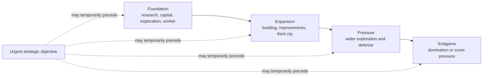
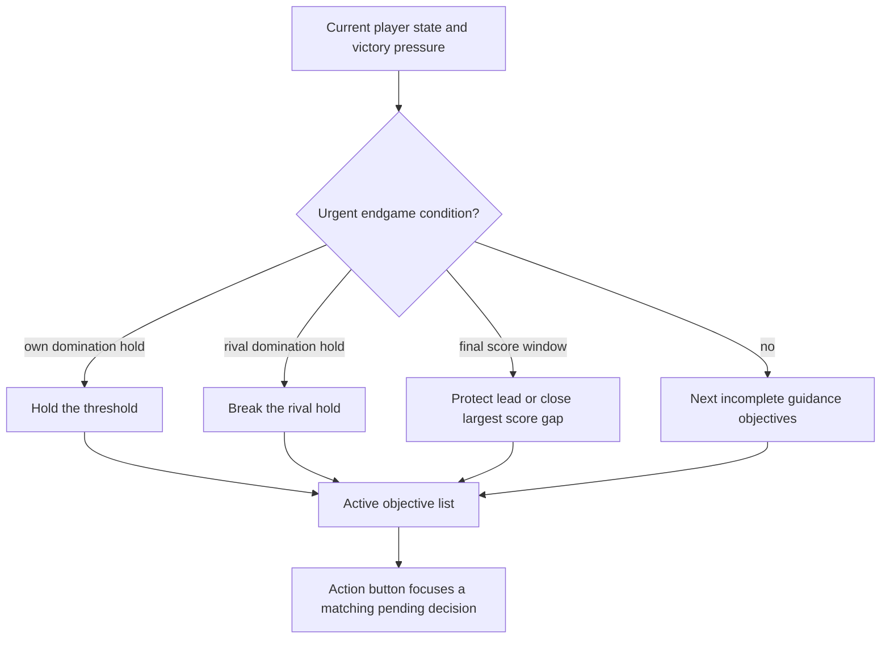

# Objective chain

Objectives provide a short answer to "what should I do next?" without becoming a quest system.

## Tracks and phases



| Phase | Purpose |
| --- | --- |
| Foundation | Research, first city, exploration, worker, first improvement, second city. |
| Expansion | First building, more improved tiles, third city. |
| Pressure | Wider exploration and a credible defensive force. |
| Endgame | Domination hold/threat or score-cap pressure. |

`guidance` objectives fill the normal list. One urgent `strategic` objective may appear before them when a domination countdown or final score window can decide the match.

Domain definitions contain stable id, phase, track, target, tone, and target-scaling policy. Titles, hints, rewards, and micro-tooltips stay in localization through `GameObjectiveLabels`.

## Selection



`GameObjectiveTracker.activeObjectivesForPlayer(...)` calculates progress, removes completed goals, and returns the next small set.

Endgame ordering follows the condition that can finish first:

- own domination hold: hold the threshold;
- rival domination hold: break it;
- final score window: protect a sole lead or overtake the leader;
- otherwise continue normal guidance.

If score pressure is active, `ScorePressureAdvisor` compares the shared score breakdown and names the largest gap: city, population, territory, buildings, units, technology, improvements, or gold. It is advice, not an automatic action.

## Action button

The objective panel explains why a decision matters. The bottom `Action` button remains the only navigation/execution entry point. It may prefer a matching pending decision—worker, settler, combat unit, city production, or research—but it never chooses production, movement, or research for the player.

## Pace

Only objectives marked as pace-scaled use:

```text
max(1, ceil(baseTarget * objectiveTargetMultiplier))
```

Goals whose copy names an exact count remain fixed until their text is parameterized. Domination and score targets come from victory rules and current state rather than a general objective multiplier.

Objectives currently grant no mechanical rewards. The victory HUD remains the detailed source for score, control, and countdown values.
