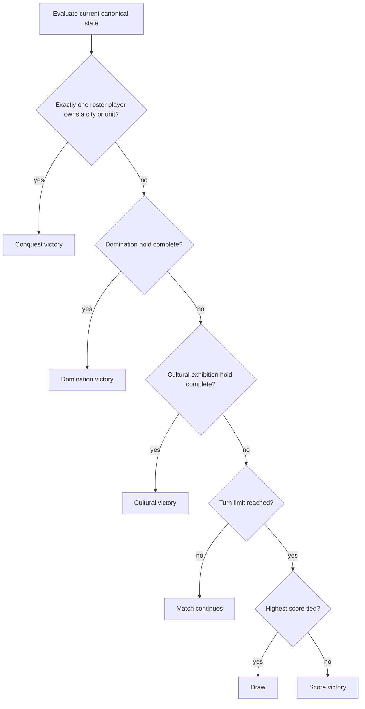

# Scoring and outcomes

`GameOutcomeDetector` owns match completion. UI summaries, objectives, AI diagnostics, and telemetry read the same result and score breakdown.

## Resolution order

1. **Conquest** — exactly one roster player still owns any city or unit.
2. **Domination** — a player has held the required share of valid map tiles for the configured number of full turns.
3. **Cultural** — a player has stored the required artifacts and held the exhibition state for the configured turns.
4. **Score** — a capped game reaches its turn limit and one player has the highest score.
5. **Draw** — the score cap is reached with a tie for highest score.

Unlimited games have no score fallback. There is no hidden score tie-breaker.

## Domination

The denominator contains passable map tiles; ocean, lake, and mountain do not count. The numerator is the unique valid territory controlled by a player's cities.

The streak advances only after a complete turn at or above the threshold and resets immediately below it. Pace profiles own the required percentage and hold duration.

The HUD warns about a rival only when their hold is imminent according to the configured remaining-turn policy. Objectives translate the same state into **hold domination** or **break rival domination**.

## Score

`EmpireScoreCalculator` returns the total and component breakdown for cities, population, territory, buildings, technologies, improvements, gold, map objectives, and units. Exact weights live in the calculator/rules; do not copy them into presentation code.

In the final score window, the objective panel may show the largest gap to the leader or the margin that protects a lead. Advice changes guidance only; it does not change weights or outcome rules.

## Feedback

A completed game shows a blocking outcome overlay from the active player's perspective. It names victory, defeat, draw, or game over; identifies the condition; and shows the relevant score, domination, or cultural values.

While the overlay is active, hot-seat handoff and AI autopilot stop. The current exit action returns to the menu through the normal close/save path.

`DominationThresholdReachedEvent` is emitted when a player starts a hold streak. It drives the critical notification and activity entry; it does not decide the outcome by itself.
