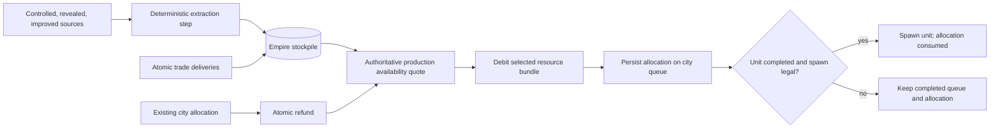
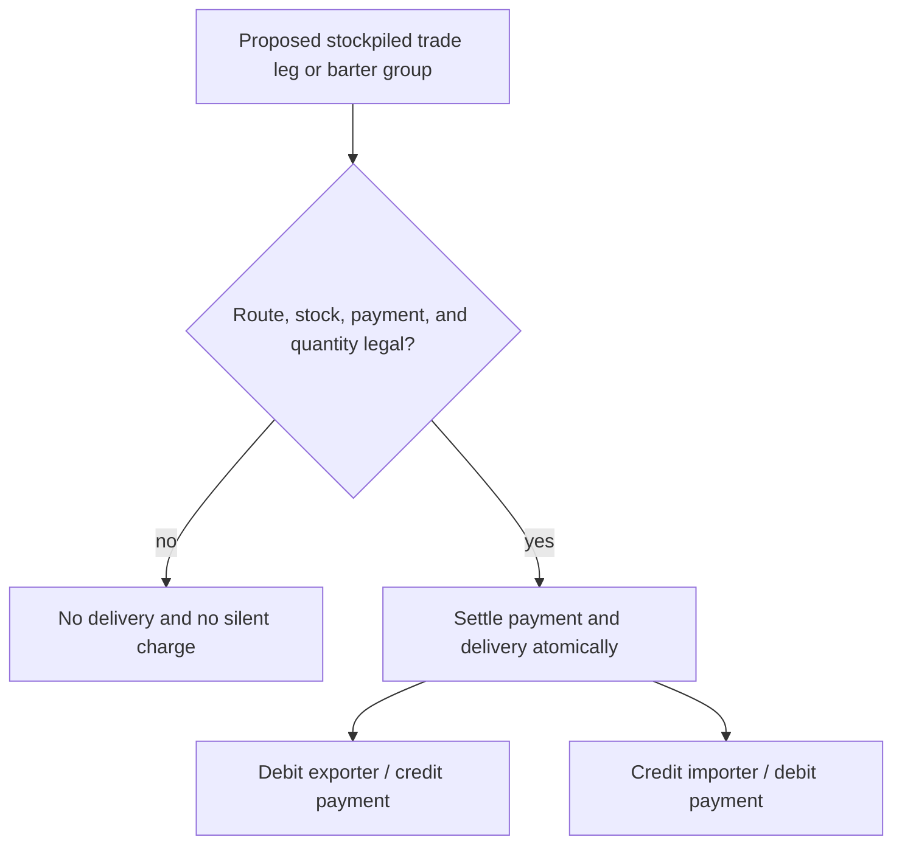

# Strategic resource economy

The domain owns resource production, stock, queue allocation, and trade settlement. UI and AI consume the same quotes and flows.

## Economy modes

`ResourceCatalog` declares the mode explicitly:

- local tile/city yield;
- empire presence gate;
- quantitative stockpile.

Oil and aluminium currently use stockpiles. Iron, horses, coal, uranium, and marble remain presence-gated until a separate balance change migrates them.

## Turn flow

A valid source is a controlled, revealed resource with the required improvement. Extraction is credited before trade settlement. A newly completed improvement contributes from the next eligible extraction step.

Production costs are allocated when a unit enters a city queue:

- replacing a target refunds its stored allocation before validating the new quote;
- the selected bundle is debited and persisted atomically;
- reselecting the same target and bundle is a no-op;
- completion and rush do not charge the resource again;
- a spawn-blocked completed unit keeps its committed allocation.

Exact source output and unit costs live in `GameRuleset.resources` and unit-production definitions.

## Trade

A stockpiled trade leg settles only when route, exporter stock, importer payment, and quantity are all legal. Payment and delivery are atomic. Reciprocal barter legs in one exchange group settle together or not at all.

War or another route blocker prevents delivery without silently charging the importer. Missing payment terminates the exchange according to the trade rules.

## Read models

The empire resource view reports stored, allocated, free, production, imports, exports, sources, and city allocations. City production rows use `UnitProductionAvailability`, show every blocker and alternative bundle, and keep the panel open when an asynchronous command is rejected.

AI and MCTS use the same availability and settlement semantics. They may add heuristic value, but not another inventory model.

Continuous fuel upkeep, shortage combat/movement penalties, and luxury stability effects are separate future decisions.
