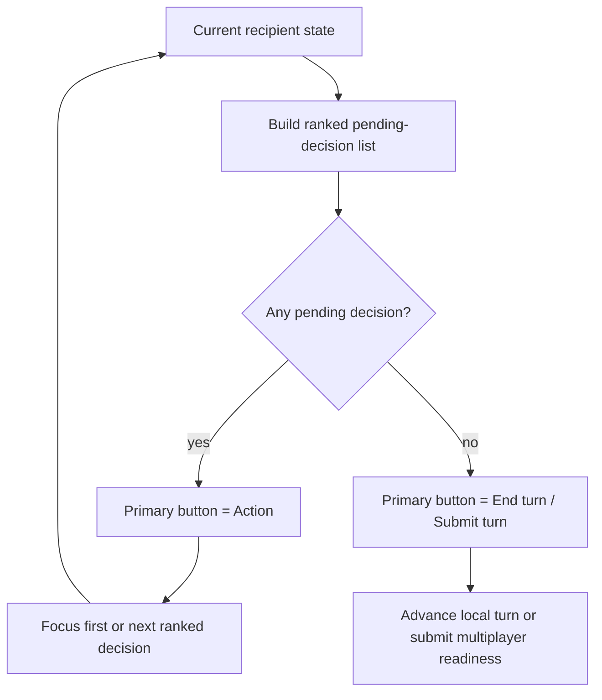
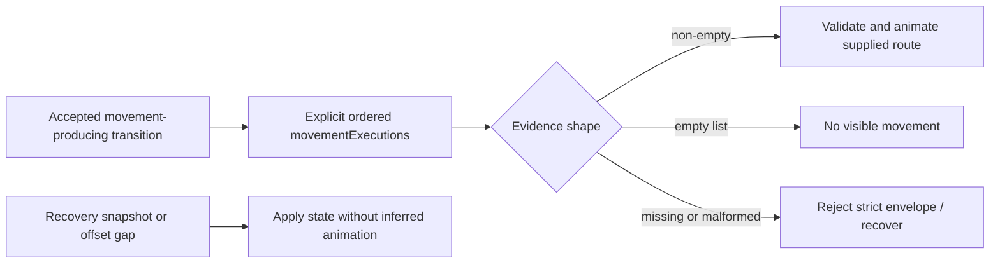

# Turn flow and action focus

Turn start and the manual **Action** button use the same pending-decision list for different purposes.

| Flow | Behavior |
| --- | --- |
| `FocusTurnStartActionCommand` | Selects the highest-ranked first decision; it does not cycle from stale selection. |
| `FocusNextPendingActionCommand` | Cycles through remaining decisions from the current position. |

## Ranking

1. ready combat units, with visible contact first;
2. ready workers and settlers;
3. other units requiring a decision;
4. cities without production;
5. missing research selection.

Queued, working, fortified, or automated units are skipped when their posture means they do not need a manual decision.

Selecting a map target moves the camera and shows a short full-hex focus cue. The cue is renderer state only; reduced-motion mode keeps it static for the same duration.

## Action versus end turn

The primary bottom button shows **Action** while a pending decision exists. It focuses the next item instead of ending the turn. When no decision remains it becomes **End turn** or the multiplayer submit action.

Its thumbnail and counter come from the same pending list. Asset geometry follows [asset-icon-rendering.md](asset-icon-rendering.md). A score objective may bias the first matching focus target, but the command still does not execute the decision.

## Movement evidence

Every accepted movement-producing transition carries explicit ordered `movementExecutions`.

- non-empty evidence is validated and animated in the supplied global order;
- `[]` means no movement visible to that recipient;
- missing or malformed evidence invalidates the strict envelope;
- recovery snapshots, stale events, and offset gaps apply state without inferred animation;
- `UnitMovedEvent` remains notification/history data and does not create a duplicate renderer move.

Recipient projection omits an entire route when revealing any segment would leak hidden movement. The owner may receive the complete chain.

Reconnect starts from the latest projected snapshot and does not replay movement already represented by that state. The protocol guarantees route and order, not identical wall-clock animation timing across devices.
