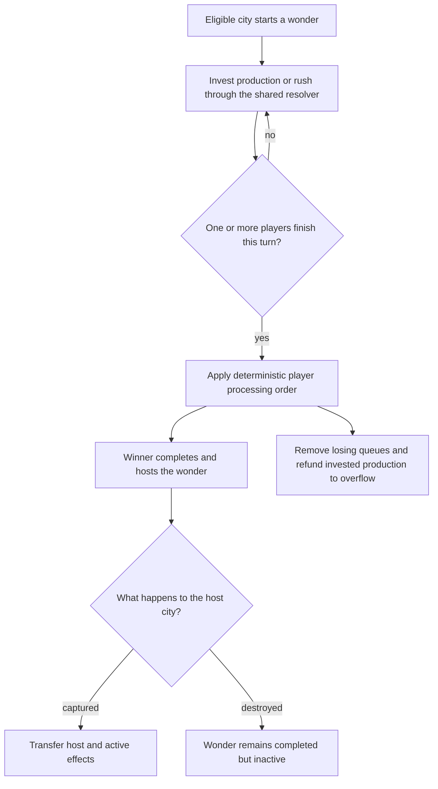

# World wonders

Wonders are globally unique production targets. They are not ordinary city buildings because they need worldwide ownership, race resolution, host-city state, and empire-wide effects.

## Ownership

`WonderRegistry` records the player that completed each wonder, while the host city stores the wonder itself. The registry blocks future production globally.

Capturing the host city transfers active effects. Destroying it leaves the wonder completed and unavailable, but inactive because no city hosts it.

## Production

A city may start a wonder when:

- it is not already completed;
- the technology and host requirements are met;
- the player has no other wonder in production;
- the city is not already producing a wonder.

Normal and rush completion use the same `WonderCompletionResolver`. If several players finish in one turn, established deterministic player processing order selects the winner. Losing queues are removed and invested production returns to their city overflow.

## Effects

`WonderEffectResolver` is the single source for standing and completion effects. Consumers include city economy, science, stability, turn processing, UI forecasts, and AI.

Supported effect shapes include empire/host yields, science, gold/production multipliers, stability, a free technology, completion gold, and production overflow. The current catalog lives in `wonder_catalog.dart`; do not repeat its costs and bonuses in UI or docs.

## Boundaries

- `WonderProductionTarget` and `StartWonderCommand` use normal command/save/wire paths.
- completion and refund events use normal notification/activity paths;
- gamepad choices use stable `wonder:<name>` keys;
- AI scores only wonders that pass the same availability policy;
- adding direct wonder score requires an explicit scoring change.

Catalog changes require simulation/telemetry and serialization tests, especially for race refunds, capture, host destruction, and stacking effects.
