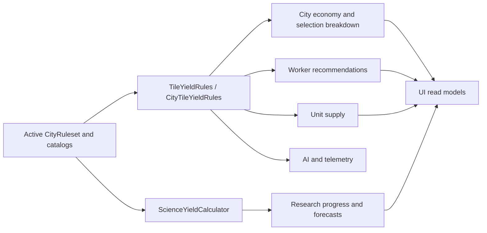

# Yield unification

City economy, tile inspection, worker recommendations, AI, and supply must use one active ruleset instead of private value tables.

## Sources of truth

| Value | Owner |
| --- | --- |
| Terrain, river, resource, improvement, and city-center yield | `CityRuleset` |
| Stored artifact yield | `WorldArtifactType` |
| Building science | building effects plus `ScienceYieldCalculator` |
| Worker recommendation | `WorkerImprovementRecommendation` and shared scoring |
| Unit supply | `CityUnitSupplyRules` using the same city economy inputs |

`TileYieldRules` and `CityTileYieldRules` read the injected ruleset. For a tile without an improvement, their base result must agree.

Science is deliberately separate from `TileYield`. `ScienceYieldCalculator` combines city base science, technologies, specialization, buildings, and project output without mixing research into food/production/gold/defense.

## Worker recommendations

Manual **Improve** and automated worker planning share legality, scoring, and deterministic tie-breaks. The heuristic may weight food, production, gold, defense, resource specialization, and base tile value, but the underlying yield comes from city economy rules.

A worker's build charge is consumed only when construction completes. Cancellation or an illegal job does not spend it. A persistent assignment uses the normal assignment bonus and no build charge.

## Supply and selection

Unit supply uses the same city economy, stored-artifact context, and map cap in gameplay, production UI, AI, and telemetry. Callers must pass the complete context rather than silently omitting artifact food.

City selection projects raw yield, stability-adjusted economy, and the matching source breakdown together. Do not combine a fresh breakdown with cached economy from another state.

## Change rule

When tuning a value, change the ruleset/catalog and its tests. If a UI needs a strategic assessment different from real city yield, name it as a separate score; do not create a second value table and label it yield.
