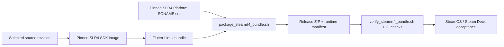

# Linux Steam runtime

The supported Linux release target is x86-64 Steam Linux Runtime 4 (SLR4). Builds are produced in the pinned SDK image and checked against the pinned Platform image; a developer workstation is not the compatibility contract.

## Packaging

`.github/workflows/linux-steam-build.yml` captures the Platform SONAME set, builds the Flutter bundle in the SDK, and calls `tool/linux/package_steamrt4_bundle.sh`.



The packaged app includes only dependencies missing from the Platform, plus the required GStreamer plugins, scanner, GLib schemas, GTK data, notices, and runtime manifest. The launcher scopes library and plugin paths to the bundle before starting `aonw-bin`.

Desktop authentication uses the system browser. WebKitGTK is intentionally not part of startup.

## Commands

Preferred build:

```sh
make steam-linux STEAM_LINUX_SOURCE=github
```

For SDK debugging:

```sh
make steam-runtime-contract
make steam-linux-local AONW_STEAMRT4_SDK=1
```

`steam-linux-local` rejects a generic host. Run it inside the pinned SDK environment.

## Automated checks

CI validates the exact ZIP artifact:

- native dependencies resolve under SLR4;
- no WebKitGTK or JavaScriptCore dependency is introduced;
- required audio plugins and GLib schemas are present;
- bundled WAV and MP3 assets decode through GStreamer;
- the app stays alive under Xvfb without `/dev/input`.

No-controller startup is a supported state and must not crash the process.

## Steam Deck acceptance

Before promotion, test the stable SteamOS release in Gaming and Desktop modes:

- cold launch and menu navigation;
- built-in Steam Virtual Gamepad;
- external controller and hotplug;
- speakers, headphones, and output-device changes;
- suspend/resume followed by input and audio;
- external-browser login and persisted session.

Record the SteamOS/client build, game build, Steam Input template, and controller connection type with the release result.

For startup failures, inspect the bundle with `tool/linux/verify_steamrt4_bundle.sh`. Do not install host packages on a player's system as the release fix.
