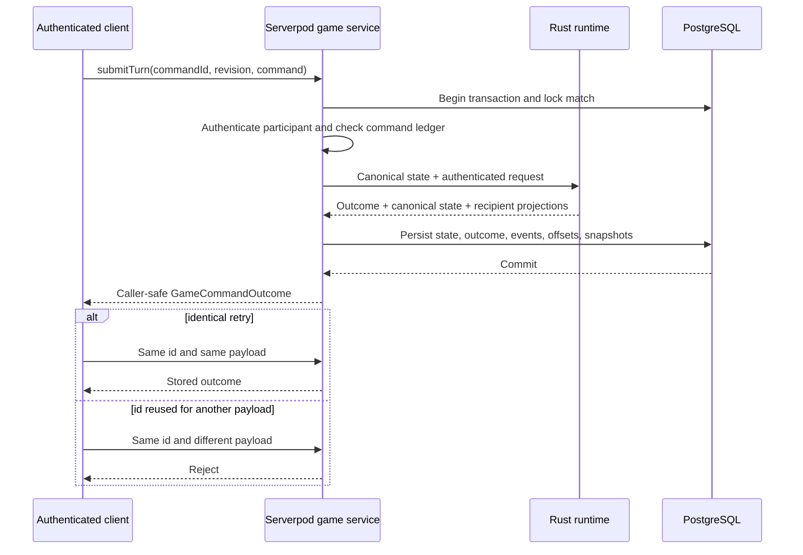

# Multiplayer protocol

The generated Serverpod client exposes authenticated game operations over HTTP.
PostgreSQL owns match membership, canonical Rust state, recipient snapshots,
events, command outcomes, and monotonic offsets. Rust is the only gameplay
authority; Dart validates the authenticated request, executes the database
transaction, and persists the Rust result.

## Code map

| Area | Location |
| --- | --- |
| Flutter network session | `clients/aonw_flutter/lib/game/` |
| Generated auth and game client | `packages/aonw_server_client/` |
| Serverpod game endpoint and transactions | `server/lib/src/game/` |
| Dart-to-Rust host | `packages/aonw_server_native/` |
| Rust request and response contracts | `engine/crates/aonw_contracts/src/server.rs` |
| Authoritative game runtime | `engine/crates/aonw_server_runtime/` |
| Native ABI | `engine/crates/aonw_server_native/` |

## Endpoint contract

`GameEndpoint` requires an authenticated Serverpod session and provides five
operations:

| Operation | Purpose |
| --- | --- |
| `createMatch` | Create canonical Rust state, persist the owner and return the owner's private view. |
| `joinMatch` | Add an authenticated participant and return a private resync payload. |
| `listMatches` | Return only matches visible to the authenticated account. |
| `submitTurn` | Apply an idempotent command in Rust and persist every recipient projection atomically. |
| `resync` | Return the caller's latest private snapshot plus events newer than its applied offset. |

Every state-changing request carries exact content and protocol identity. The
server rejects unknown fields, incompatible identity, invalid canonical state,
unauthorized actors, stale revisions, and reused command ids with different
payloads.

## Command flow



The command id is the idempotency identity. Event offsets and state revisions
remain separate monotonic values. A failed transaction publishes no partial
canonical state or recipient projection.

## Recovery and recipient projection

`resync` is the authoritative recovery operation. It returns the latest
snapshot projected for the authenticated participant and the caller-visible
events newer than that snapshot's applied offset. The client replaces its
network state from this payload; it never reconstructs canonical state from
another participant's history.

Rust returns one projection for every participant affected by an accepted
command. Dart verifies the exact recipient set before writing any result.
Private units, routes, commands, and coordinates therefore cannot cross the
network boundary through create, submit, retry, or recovery paths.

## Changing the protocol

An online behavior or wire-shape change must:

1. update the exact Rust contract and its strict validation;
2. update the Serverpod YAML models and regenerate server and client output;
3. add Rust runtime and ABI tests for accepted and rejected inputs;
4. add server transaction tests for authorization, idempotency, persistence,
   recipient isolation, and restart recovery;
5. update the single initial schema when the persisted model changes;
6. update the Flutter network-session fixtures before deployment.

Run:

```sh
make generated-code-check
make serverpod-ops-check
tool/run_postgres_smoke.sh
```
