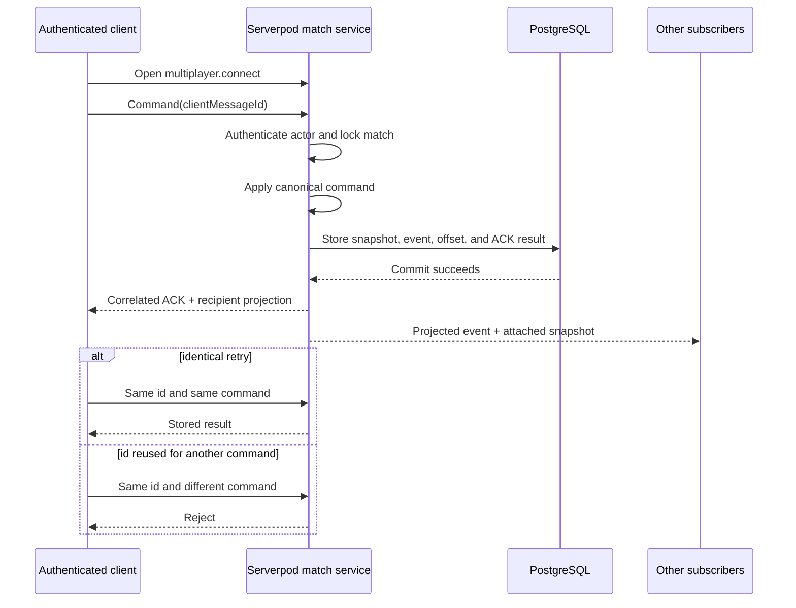
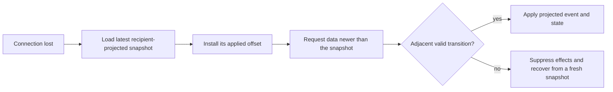

# Multiplayer protocol

Flutter uses generated Serverpod endpoint methods for lobby and recovery operations, and a bidirectional Serverpod stream for a live match. PostgreSQL is authoritative for match state, snapshots, events, and offsets.

## Code map

| Area | Location |
| --- | --- |
| Flutter session and transport | `lib/api/` |
| Shared commands, events, snapshots, and versions | `packages/aonw_core/lib/protocol/` |
| Generated client | `packages/aonw_server_client/` |
| Server endpoints and match services | `server/lib/src/multiplayer/` |
| Compatibility decision | [`adr/0004-versioned-multiplayer-protocol.md`](adr/0004-versioned-multiplayer-protocol.md) |

## Current versions

| Contract | Current value | Compatibility |
| --- | ---: | --- |
| Functional multiplayer revision | 9 | Only revision 9 is accepted. Active functional revision is 9. |
| Command, ACK, and match schema | 4 | Strict. |
| Snapshot and event write schema | 7 | Readers accept schemas 3 through 7. |

Read the constants from `packages/aonw_core/lib/protocol/protocol_version.dart` before changing this table.

## Command flow



1. The authenticated client opens `multiplayer.connect` and owns the outbound message stream.
2. Every command carries a `clientMessageId`.
3. The server authenticates the actor, locks the match, applies the canonical command, and stores the new snapshot and event before delivery.
4. The sending stream receives a correlated ACK. Other subscribers receive the projected event and attached snapshot.
5. A retry with the same id and identical command returns the stored result. Reusing the id for a different command is rejected.

ACK identity is the `clientMessageId`, not the event offset. Late or unknown ACKs must not complete a newer command.

## Ordering and recovery



- Offsets are monotonic.
- Clients apply only valid adjacent live transitions.
- Reconnect installs the latest recipient-projected snapshot first, then requests data newer than that snapshot.
- Snapshot recovery is authoritative. The client never reconstructs canonical state by replaying another player's event history.
- A stale event, offset gap, or mismatched attached snapshot suppresses presentation effects and triggers state recovery.

## Recipient projection

Canonical state and events are filtered for the authenticated player before crossing the network boundary. Hidden commands, units, routes, and coordinates must not leak through recovery or history APIs.

Movement animation uses explicit `movementExecutions` carried by the event or ACK:

- a non-empty list is the exact ordered route visible to the recipient;
- `[]` explicitly means no visible movement;
- a missing, null, or malformed field is an invalid strict envelope;
- the client never infers movement from a snapshot delta.

Exact route and order are authoritative. Local animation start time is not synchronized across clients.

## Lobby membership and presence

A roster seat and a live transport connection are different concepts.

| State | Meaning | Default deadline |
| --- | --- | --- |
| `connecting` | Joined, but no authorized stream yet | 20 seconds |
| `connected` | At least one stream is active | heartbeat every 10 seconds, 30-second lease |
| `reconnecting` | Last stream closed; seat may be recovered | 10 seconds |
| `offline` | No live connection in a running match | membership remains |

Start is allowed only when the required human roster exists and every human member is `connected`. Closing one of several streams for the same user does not change presence.

Lease expiry is lifecycle-specific:

- hosted guest: remove the seat;
- hosted owner: abandon the open lobby;
- quickplay member: remove the member and re-evaluate the queue;
- running participant: mark offline and retain recovery rights.

Explicit leave is immediate. Presence deadlines are persisted and reconciled by server maintenance; widget timers are not authoritative.

## Turn and inactivity deadlines

When every human participant is offline, the turn timeout is paused. The first returning human restarts the turn clock with a full timeout.

Separately, a running match is abandoned after 12 hours without human activity. Accepted human commands and connection-state changes count as activity; automated turn processing and AI do not.

## Changing multiplayer

Every online behavior change must:

1. increment the functional multiplayer revision;
2. decide whether any older revision remains safe;
3. bump only the envelope family whose shape became incompatible;
4. add status, codec, retry, projection, reconnect, and rollout fixtures for the changed surface;
5. regenerate Serverpod output when endpoint or generated model signatures change;
6. deploy the status-aware server before requiring the new client.

Run:

```sh
make generated-code-check
make serverpod-ops-check
tool/run_postgres_smoke.sh
```
